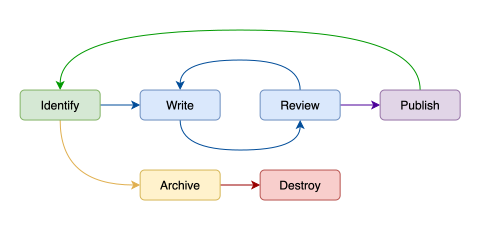

<flow name="How to Write (Good) Documentation" category="DOC/DEV" spid="foam" description="Guide that aims to alleviate the stress of writing documentation by providing a set of clear standards and best-practices, as well as a few handy tips and tricks for understanding your audience and writing effective articles." keywords="push documentation,knowledge"/>

# How to Write (Good) Documentation
<i>By Aurora Ryder</i>

Good documentation is an essential part of any respectable software, but it can be quite difficult to write (especially when one's audience is inexperienced or non-technical). Worse, not everyone agrees on what makes  documentation "good" or "bad".

This article aims to alleviate the stress of writing documentation by providing a set of clear standards and best-practices, as well as a few handy tips and tricks for understanding your audience and writing effective articles.

## Getting Started
As with any other task, when writing documentation you will generally need to do a bit of preparation beforehand. Specifically, you should be able to answer "who", "what", "where", "when", "why" and "how":

- **Who** Is your audience? Are they clients or developers, trainees or veterans? Do they expect a formal document or a fun one?
- **What** "type" of documentation are you writing? Is it a how-to or usage guide? What level of detail do you need to go into and what are the most important concepts or instructions you need to convey?
- **Where** will your documentation "live" once you've written it? Documentation with no clear home is easily lost.
- **When** will your documentation become relevant and when will it need to be updated? As with software, all documentation has a lifecycle that needs to be kept in mind while writing.
- **Why** is this documentation needed? Thinking critically about *why* you are writing a given bit of documentation will often help you identify key concepts, common issues, or confusion that your document will need to address.
- **How** familiar are you and your audience with the topic? Do you need to do a bit of "studying-up" before you start writing? Can you identify common problems and provide solutions? Will you be referencing concepts or terminology that your audience may not be familiar with?

<hint category="warning">
If you do not have answers to all of these questions **don't start writing**! You may end up having to rework major sections of your document. If you are not sure how to answer the above questions, fear not— the following sections are here to help.
</hint>

---

### Identifying your Audience

More often than not, whomever has requested the documentation you are writing either *is* your target audience or *knows* who is, so don't be afraid to ask! That being said, knowing who will be reading your documentation is only part of identifying your audience, the next step is figuring out what information is relevant to them and what style/tone they are expecting your document to be in.

Once again, this is something that you should ask whomever you are writing the documentation for, but as a general rule...

#### Clients expect...
Clear, non-technical explanations and step-by-step instructions that anticipate potential problems and offer immediate solutions. Clients do not appreciate technical jargon or code and they are generally unconcerned with "how" or "why" a system works in a particular way. When writing for clients, favour high-level overviews, use screenshots whenever possible, and emphasize system strengths. Aim for a semi-formal or formal tone and grammatical perfection. 

<hint category="success">
Remember: good documentation is also good marketing — clients who find our system easy to use and understand are more likely to recommend it to others.
</hint>

#### Engineers expect...
Concise, straight-forward documents that focus on what a system does and how/why a given task is performed. Engineers do not appreciate meandering or "flowery" text and are generally looking for either in-depth explanations or easy references for technical concepts or functionality. When writing for engineers, favour organization over decoration, use bullet points and diagrams as needed, and emphasize the pros, cons, and consequences of implementation details. Aim for a practical, semi-formal tone and clearly detail what concepts and terminology you are expecting the reader to be familiar with, already.

<hint category="hint">
Keep in mind: engineers often require at least two documents per topic — one to explain new concepts and terminology, and another that exposes implementation details and provides a step-by-step guide for building, breaking, or changing the system.
</hint>

#### Product teams expect...
A blend between client and engineering documentation that provides step-by-step instructions on how to use, demo, and administrate a system. Product teams — like clients — do not appreciate technical jargon or code and are generally looking for tutorials or easy references that can be used to quickly resolve client issues. When writing for product teams, favour how-to-style explanations, use screenshots and examples whenever possible, and emphasize solutions to common issues or industry pain points. Aim for a practical, semi-formal tone and provide clear roadmaps for system usage and workflow optimizations.

<hint category="warning">
Don't forget: product teams are the bridge between clients and engineers — if a system or document does not make sense to the product team, there is a good chance that the client will not understand it, either.
</hint>

#### Writing for a mixed audience
When writing documentation for an audience that does not fit neatly into one of the above categories, aim to be understood by the least-informed audience member and provide supplementary resources as required. For example, if you are are writing documentation that will be used by both clients and engineers, prioritize the client's understanding in the body of your text and move technical details to isolated sections such as collapsible tabs or appendices

---

### Choosing a Documentation "Type"
When someone asks you to write documentation, it is important that you understand what form of content they are expecting; are they looking for step-by-step instructions? A general overview? How much technical detail should be present? To answer these questions, it can be useful to use the Diátaxis system (also called the Grand Unified Theory of Documentation) which divides documentation materials into the following four types:

#### 1. Tutorials
Are **learning-oriented**, practical materials that provide readers with a clear goal and the means to achieve it. Tutorials are meant to *teach* the reader— they are not instruction manuals, they are lessons that help the reader build confidence and competence in a given area. Tutorials are notoriously difficult to write as they assume that the reader is a complete beginner and must provide them with enough information and actionable steps that they may use and follow subsequent documentation articles with no issue.

In other words, tutorials are the first materials that your users will interact with and as such, must provide a baseline for what knowledge and skills your user is expected to have by the time they read any other form of documentation, while also assuming that the reader knows absolutely nothing about absolutely everything.

<hint category="warning">
A poorly-written tutorial can (and will!) turn users away from your system, so be prepared to revise these often and do not rush the process; sometimes a bad tutorial is worse than no tutorial at all.
</hint>

#### 2. How-to Guides
Are **goal-oriented**, actionable instructions for solving a problem or performing a given task. How-to guides are meant to *direct* the reader and may assume that they have the baseline knowledge required to interact with a given system. How-to-guides tend to be fairly straightforward to write provided they are addressing a specific problem, but can quickly become unwieldy if they are tackling multiple issues at once. For example, a "*How-to make a BLT sandwich*" article is easier to write and more digestible for the reader than an article titled "*How-to cook*".

<hint category="hint">
You may notice that despite having "*How to*" in the title, this article is **not** a How-to Guide. As an exercise in understanding— what would *you* classify it as?
</hint>

#### 3. Explanations
Are **understanding-oriented** discussions of a given topic. Explanations tend to supply background or tertiary knowledge to the user and are not necessarily directly linked to any particular part of a system. They provide context and can answer the "whys" of a system (why this design/solution, why this procedure/protocol, why is this useful/relevant) but are not concerned with the practicalities of *how*.

In other words, explanations are discussion pieces that can be read "at one's leisure" — they will not teach you how to use a system, but they will give you a greater understanding of why it exists.

Explanations can be a bit tricky to write as they do not answer a specific question and tend to exist as snippets of context scattered throughout other materials, rather than unified documents. Articles that discuss the philosophy of an approach, architecture decision or design records, and documents outlining the historical context of an idea/invention are all good examples of explanations.

#### 4. References
Are **information-oriented**, technical materials that describe the inner-workings of a system and how to operate it. References are utilitarian, straight-to-the-point documents that describe things like APIs, functions and methods, key classes or variables, supported or restricted behaviour, etc.. References describe the correct usage of the system but they do **not** teach the reader how to accomplish a given task. References tend to be fairly straightforward to write as they are derived directly from the system or software they are referring to, however, they are generally insufficient documentation on their own and are typically accompanied by at least one other type of material.

#### Summary
The following table provides a quick summary of each of the four documentation types and their purpose to help you determine which form(s) would be most applicable to the material(s) you are creating.

|  | Tutorials | How-to Guides | Explanations | References |
|------|------|------|------|------|
|   Orientation   |   Learning   |   Goals   |   Understanding   |   Information   |
|   Purpose   |   Starting point for beginners   |   Instructions for completing a task   |   Discussions that provide context   |   Descriptions of technical tools/interfaces and how to operate them correctly   |
|   Form   |   Lessons, small projects, interactive examples   |   Sets of steps or directions   |   Articles, asides, or blog posts   |   Specifications, command lists, language/library catalogs   |
|   Goal   |   Teach   |   Direct   |   Explain   |   Describe   |
| Required Experience | None | Some (provided by tutorials) | Varies, often none | Varies, never none |
| Audience(s) | All | All | Varies by topic | Varies (rarely Clients) |

If you have further questions about the Diátaxis system, or need advice for writing a particular type of document, consider visiting one of the following external resources:

[Official Diátaxis website](https://diataxis.fr/), [Diátaxis as explained by Divio](https://docs.divio.com/documentation-system/), [Brigham Young University article on Diátaxis](https://ux.byu.edu/test-article)

---

### Finding a S.A.F.E. Place for your Documentation
An important but often overlooked part of writing "good" documentation is determining where the materials will live once they have been created. All too often genuinely useful resources find their way into hidden or inaccessible places where they are quickly forgotten. This results in wasted time on the part of the author, confusion and frustration on the part of the reader, and an inevitable duplication of work when the resources are recreated.

As such, while all organizations will choose to store their documentation differently, as a general rule ensure that your documentation lives somewhere **S**tructured, **A**ccessible, **F**requented, and **E**xplainable (**S.A.F.E.**).

#### Structured
Whether it be a folder of folders or an alphabetized list, documentation should always live somewhere that is logically structured. Most organizations have an established structure and set of naming/saving conventions for files within its ecosystem, but in the event that yours does not, here are a few tips and tricks that can help you get started:

- **Group by topic not type** - tempting though it may be, avoid grouping all of your tutorials, how-tos, or other forms of documentation together. In an ideal system, each folder contains only and all those materials related to a single topic.
- **Permission by audience** - in the event that internal and external documentation shares a repository, be sure to permission documentation by who is allowed to see what. It is unprofessional and inconvenient to be displaying developer guides or API references to non-technical clientele.
- **Use tags whenever possible**  - if your storage system supports it, it is a good idea to apply relevant tags to your documentation as this makes it easier for users, search engines, and LLMs alike to quickly find the files they need.
- **Use titles as filenames** - if your documentation is stored in an environment that allows you to edit both the title and the filename, keep the two in sync. This makes it easy to locate specific documents and mitigates the risk of document duplication.
- **Order logically** - should you have control over the order documentation files are stored and displayed in, order them in a way that makes logical sense. Put "beginner" or introductory documents first and ensure that topics or terms are introduced before they are used.
- **Keep it clean** - periodically review existing documentation and ensure that old or unused files are removed or updated as soon as possible. Avoid duplication or redundancy and enforce applicable conventions as needed.
- **Version when possible** - it is a good idea to indicate both what version of a particular piece of documentation is currently available, and what version the system was when the relevant documentation was written, as it is incredibly frustrating for your reader to find out mid-process that the documentation they were referring to is for an older version of the system they're using!

#### Accessible
Documentation *must* be accessible to its target audience. Private repositories or local directories are useful for drafts, but final copies should not require members of the audience to make individual access requests.

It may be useful, therefore, to consider saving your documentation in the same repository (but not directory) that the system it pertains to is stored in. This may require the creation of an in-app reader, but it allows you to keep your code base and documentation in one place and ensures that in the event of a company dissolution or merger, you and your clients do not lose access to the materials required to operate the system.

Similarly, you may consider creating a dedicated repository, page, or platform for your documentation. In any case, please note that "accessible" does not mean "unprotected" — avoid hosting proprietary or trade-secret documents in open-access environments, and ensure that only those who *need* access to the documentation *have* it. 

#### Frequented
No matter how accessible or organized your documentation's "home" is, if it is not a location your audience is naturally inclined to visit, they never will. For example, consider the process that is required to check one's credit score— technically, if you have access to credit then you also have access to your credit score, but checking that score can have negative consequences. In this case you can *access* the information, but you cannot *frequent* the location it is stored in.

Similarly, should you decide to store your documentation in the same repository as your code base, but do not provide your end users with a UI to access it, odds are they will not go digging through program files to find the documentation they need.

Documentation needs to live somewhere that is frequently and easily accessed by its target audience or the process for doing so will quickly become more trouble than it's worth. *In other words, if your documentation requires documentation on how to access it, put it somewhere else.*

#### Explainable
Explainability will evolve naturally from a strong adherence to the other **S.A.F.E.** principles, but put simply: store your documentation with intention. You should always be able to explain...

- How you decided this was the best way to store your documentation
- Why this is the best solution for your organization
- What your storage solution is good at and what it is bad at
- How the storage structure is maintained and who is responsible for it
- What the lifecycle of a given file looks like
- Whether or not the storage structure is final or open to change
- What parts of the structure are non-negotiable or context-dependant
- Who has authority over the storage system and approves or rejects structural changes
- Who has authority over the content of each document and approves or rejects new materials

Documentation should be managed with the same rigour and attention to detail that you apply to any other part of your system as it is fundamental to the success of both your team and your clientele. When gauging how explainable your documentation's "home" is, think about what information a new contributor would need to have and how you would ensure that the materials they create are stored in a way that adheres to your organization's standards.

In other words, if you cannot easily explain how your documentation is stored, accessed, and maintained, then the materials you create are not **S.A.F.E.** and are likely to become unusable, inaccessible, or forgotten.

---

### Documentation Lifecycles
A common mistake authors make when writing documentation is to forget that the materials you are creating are living documents that require periodic updates. Documentation does not follow a straight path from creation to destruction, rather its lifecycle is one of cyclic reinvention.

Take a look at the image below. This diagram describes the lifecycle of a "healthy" or "good" piece of documentation.

First, we **identify** a topic or problem that requires documentation, then we start **writing** it. Once we've finished, we send the documentation off to the appropriate **reviewers**. Your first draft is rarely your final copy, so we then take our **reviewers** feedback into consideration and **rewrite** as needed. Once all parties sign off on the finished version, we **publish** the documentation to the appropriate audience(s) and move on to the next task.

Now, inevitably your documentation will become invalid or outdated in some way and you will need to do some revision. When this happens, we  once again **identify** what needs to be reworked and either restart the cycle by **rewriting** the documentation, or **archive** it until it has become certifiably obsolete.

<hint category="hint">
Note that in this context to **archive** something is to store it in a secondary location that is still accessible to those who need it, but does not pollute the primary storage environment with materials whose contents are incorrect or unsupported. This is useful for things like documentation describing newly deprecated features or older versions of a system that are still in use.
</hint>

Notice that we only **destroy** documentation that has first been **archived**. As with any other aspect of a system, "good" documentation should have an end-of-life plan that provides its audience with meaningful alternatives and addresses all dependencies. Just as you would not blindly remove the supports from a bridge, you must not carelessly **delete** documentation that someone else may be depending on. Indeed, some organizations choose not to **delete** any of their documentation at all— a valid option if you have the resources for it.

#### How often is "periodically"?
While exactly how often you should review a piece of documentation to ensure it is still up-to-date varies based on a number of things (who uses it, what it concerns, when major updates are performed, etc.), as a general rule, you should review existing documentation...

- When the feature/functionality it refers to has been updated
- When UI changes may noticeably impact screenshot or videos
- When multiple audience members indicate an issue or area of confusion
- When your system undergoes a major version upgrade or significant changes
- When your organization adds additional language support or accessibility options
- When your organization changes its documentation standards or storage structure
- When your organization changes its branding or theme

#### Rework, redo, or remove?
When a piece of documentation is discovered to be out-of-date or incorrect, the next step is to determine what should be done to address the issue. For the purposes of this article...
- **Reworking** documentation involves changing specific sections while leaving the majority of the material untouched.
- **Redoing** documentation involves creating a new material and keeping little to none of the original content.
- **Removing** documentation involves marking the documentation as deprecated and **archiving** it.

Which path to take is ultimately a judgement call on the part of you or your superior, but the table below provides some general guidelines that may assist you.

| When... | Rework | Redo | Remove |
|------|------|------|------|
|   Most, if not all, content is incorrect   |      |   X   |   X   |
|   Specific sections/images are incorrect  |   X   |      |      |
|   Newer or logically equivalent documentation exists   |      |      |   X   |
|   Content/delivery standards have changed   |      |   X   |   X   |
|   Stylistic/visual standards have changed   |   X   |      |      |
|   Localization or accessibility changes are required   |    X   |      |      |

Notice that when documentation needs to be **redone**, the older version should be **removed**.

<hint category="success">
Put simply: if it will be faster to **rework** sections of the documentation than it would be to **redo** it entirely, do not waste effort on starting from scratch. Likewise, if **reworking** existing materials will require significant changes or restructuring, **redo** and **remove** rather than wasting effort.
</hint>

---

### Knowing "Why?"
As mentioned previously, knowing *why* a given bit of documentation is required can help you determine what topics/problems it needs to cover, who is in the target audience, and which "type" of documentation would be most appropriate. Now, oftentimes we assume that we know "why" a piece of documentation is required (whomever requested it has likely told us why they want it), but as is often the case with clients of any sort, what they *ask* for and what they *need* may be different things.

For example, let's pretend that you write the documentation for a digital art program, and a superior sends you the following message:

<i> 
> "Our clients are complaining that it takes too long to draw squares because they're drawing each line by hand rather than using our square tool. Can you make a tutorial on how to use the square tool, please?"
</i>

If we break down what the superior asked for, they want a **tutorial for clients about using the square tool**. Recall from the *Choosing a Documentation "Type"*, however, that tutorials are

<i>
> "...learning-oriented, practical materials that provide readers with a clear goal and the means to achieve it ... they assume that the reader is a complete beginner [who knows] ... absolutely nothing about absolutely everything."
</i>

In this case, our client is capable of using the system independently to achieve the desired result (albeit inefficiently). In other words, our client is **not** a beginner and they do **not** need a **tutorial** — they need a **how-to guide**.

Even that, however, may be inaccurate. Compare the purposes of a **how-to guide** and a **reference**:

| Type | Purpose |
|------|------|
|   How-to Guides   |   Instructions for completing a task   |
|   References   |   Descriptions of technical tools/interfaces and how to operate them correctly   |

---

### Gauging Experience
