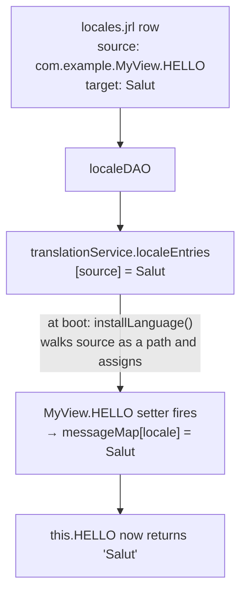

# FOAM i18n — Advanced & Runtime

The companion to the [beginner guide](./i18n.md). The beginner guide covers declaring strings in model code (`messages:`, inline `label: { en, fr }` maps). This guide covers the **runtime translation system**: `Locale` rows in `locales.jrl`/`localeDAO`, the language picker, source-key conventions, automated extraction, the Translation Console, and the message-override lifecycle.

## How `messageMap` and `localeDAO` relate

`messageMap` and `localeDAO` are two separate places translations live, and they do **not** sync automatically:

- **`messageMap`** — the defaults declared in code. Read through the class constants (`this.MY_MSG`, `Class.MY_MSG`).
- **`localeDAO`** — `Locale` rows loaded at runtime (from a `locales.jrl`, or edited live in the Translation Console). Read into `translationService.localeEntries`, and used directly via `translationService.getTranslation()` / `Element.translate()`.

They meet at boot. If a `Locale` row's source key matches a message's class path (e.g. `com.example.MyView.MY_STRING`), the boot step (`installLanguage()`) copies that row's text into the message's `messageMap`. So `this.MY_MSG` can return a `localeDAO` value instead of its coded default — but only in a running app that goes through boot, not in a plain test or script. See the [message-override lifecycle](#message-override-lifecycle) for the exact path.

## Adding Locale Rows

Add `Locale` rows when you need to translate framework-driven strings such as menu labels, DAO controller titles, or other strings looked up by source key. `Locale` rows live in a `locales.jrl` journal (framework defaults in `foam3/src/foam/i18n/{en_us,fr_fr,pt_pt}/locales.jrl`; app rows in `journals/locales.jrl`):

```javascript
p({
  class:  'foam.i18n.Locale',
  locale: 'fr',
  source: 'settings.label',
  target: 'Paramètres'
})
```

## Language Availability (the language picker)

Language availability is **separate** from translation coverage. `LanguageChoiceView` only lists `Language` rows where `enabled` is `true`.

FOAM seeds the languages in `foam3/src/languages.jrl`:

```javascript
p({ class: 'foam.core.auth.Language', code: 'en', name: 'English' })
p({ class: 'foam.core.auth.Language', code: 'en', name: 'English', variant: 'US' })
p({ class: 'foam.core.auth.Language', code: 'fr', name: 'French',     nativeName: 'Français',  enabled: true })
p({ class: 'foam.core.auth.Language', code: 'pt', name: 'Portuguese', nativeName: 'Português', enabled: false })
p({ class: 'foam.core.auth.Language', code: 'pt', name: 'Portuguese', nativeName: 'Português', variant: 'BR' })
```

Because `enabled` defaults to `true`, `en`, `en-US`, `fr`, and `pt-BR` all appear in the picker, while `pt` (base) is hidden because it ships with `enabled: false`. For any language that is already enabled, you don't need to touch `languages.jrl` at all — just add its `Locale` rows, and the picker and translation cache pick up both the language and its translations.

To add a language not in the list, add a `Language` row (in `foam3/src/languages.jrl` or an app journal). You do not need to set `enabled` — it defaults `true`:

```javascript
p({
  class:      'foam.core.auth.Language',
  code:       'de',
  name:       'German',
  nativeName: 'Deutsch'
})
```

To disable a previously seeded language, add a row that sets `enabled: false` on it. The row must re-state the language's id fields (`code`, plus any `variant`) so it updates the same record rather than creating a new one:

```javascript
p({ class: 'foam.core.auth.Language', code: 'pt', name: 'Portuguese', enabled: false })
```

Re-enabling is symmetric: write the same row with `enabled: true`. This is what you need when a language was left off — either seeded that way (like `pt` above) or disabled by an earlier runtime edit — since the language DAO merges the seed journal with any runtime updates, and the `enabled: true` row flips it back on.

### The language dropdown pipeline

```text
languages.jrl -> build/journals/languages.0 -> languageDAO -> LanguageChoiceView -> foam.locale
```

`LanguageChoiceView` queries `languageDAO` for enabled languages, renders those choices, stores the selected language on the `USER` record, triggers a reload, and writes `localStorage.localeLanguage`. On boot, FOAM initializes `foam.locale` from `localStorage.localeLanguage` when it is present; after client load, `ApplicationController` can also align `foam.locale` with the user's persisted language.

## Action Label Localization

Action labels are plain strings; FOAM does **not** run them through `Element.translate()` automatically. There are two ways to localize one:

**1. Render-time message override (one-off custom view).** Define a message and pass it as the action's `label`/`ariaLabel` when you render it:

```javascript
messages: [
  { name: 'SIGN_IN_ACTION_LABEL', messageMap: { en: 'Sign In', fr: 'Se connecter' } }
],

// In render():
.start(this.SIGN_IN_ACTION, {
  label:     this.SIGN_IN_ACTION_LABEL,
  ariaLabel: this.SIGN_IN_ACTION_LABEL
})
```

For the simplest cases you can also use an inline `label: { en, fr }` map on the action itself (see the [beginner guide](./i18n.md#inline-localized-labels)).

**2. Boot-installed `Locale` rows (class-owned actions).** Add `locales.jrl` rows keyed by the action constant; application boot installs them onto the action constant before the view renders:

| UI String | Source Key |
|---|---|
| Action label | `Class.ACTION.label` |
| Action aria label | `Class.ACTION.ariaLabel` |
| Action tooltip | `Class.ACTION.toolTip` |

```javascript
p({
  class:  'foam.i18n.Locale',
  locale: 'fr',
  source: 'com.example.ui.LoginView.SIGN_IN_ACTION.label',
  target: 'Se connecter'
})
```

## Locale Record Key Conventions

Common source key shapes are:

| Kind | Source Key |
|---|---|
| Message axiom | `Class.MESSAGE_NAME` |
| Property label | `Class.PROPERTY.label` |
| Action label | `Class.ACTION.label` |

Use the fully qualified model id for class-owned keys. FOAM's extraction scripts (see [Automated String Extraction](#automated-string-extraction)) build these keys with `o.id + '.' + foam.String.constantize(axiom.name)` and append suffixes such as `.label` for properties and actions.

## Choosing the Right Pattern

| The string is… | Use | Editable at runtime? |
|---|---|---|
| declared on your own model or view | `messages`/`messageMap` (or an inline `label: { en, fr }` map) for the default; add a `Locale` row to override it | Default is code; the `Locale` override is data |
| framework-driven, looked up by a source key — menu label, DAO browse/create title, class action label/tooltip | a `Locale` row in `localeDAO` keyed by that source key | Yes |

## Menu Internationalization

Menus are stored in `menuDAO`, but the translated text is stored separately in `localeDAO`. The common navigation views render menu labels with:

```javascript
e.translate(menu.id + '.label', menu.label);
```

So the translation source is based on the menu id, not the English label text.

```javascript
p({
  class:  'foam.i18n.Locale',
  locale: 'fr',
  source: 'reports.label',
  target: 'Rapports'
})
```

DAO-backed menus also translate controller titles and create buttons with these runtime keys:

| UI String | Source Key |
|---|---|
| Menu label | `menuId.label` |
| DAO browse title | `menuId.browseTitle` |
| DAO create button/title | `menuId.createTitle` |
| Custom create controller title | `menuId.handler.createControllerView.view.title` |

Example:

```javascript
p({ class: 'foam.i18n.Locale', locale: 'fr', source: 'users.label', target: 'Utilisateurs' })
p({ class: 'foam.i18n.Locale', locale: 'fr', source: 'users.browseTitle', target: 'Utilisateurs' })
p({ class: 'foam.i18n.Locale', locale: 'fr', source: 'users.createTitle', target: 'Nouvel utilisateur' })
```

The standard nav is `ResponsiveTopNav` plus the **side menu (`VerticalMenu`)**, which renders each item through `AbstractMenu.renderMenuItem` → `e.translate(menu.id + '.label', menu.label)`, so labels translate for free. If you write a **custom** menu view, do the same or its `Locale` row won't take: `e.translate(menu.id + '.label', menu.label)` when adding to an element, or `translationService.getTranslation(foam.locale, menu.id + '.label', menu.label)` when the label is a view property.

## Automated String Extraction

FOAM provides scripts in `scripts.jrl` that extract strings from loaded models and create Locale entries for translation. The `ExtractStringAxiom` script:

1. Iterates through loaded used and unused models
2. Extracts `messages` entries and creates Locale objects
3. Extracts property labels and values
4. Creates placeholder translations (e.g., appending ' fr' for French)

Use extracted rows as a starting point, then verify the runtime source key used by the view. The separate menu extraction script emits keys such as `menuId.handler.config.browseTitle`, while the active DAO controller views look up `menuId.browseTitle` and `menuId.createTitle`.

## Translation Management

Use the `TranslationConsole` to manage translations at runtime. It shows strings surfaced through the translation hooks, lets you search those rows, and updates `localeDAO` when a row is edited.

The three common translation tools have different jobs:

| Tool | Job | What it does not do |
|---|---|---|
| `localeDAO` / `admin.data/localeDAO` | Storage and admin CRUD for saved `Locale` rows | Discover which strings a page actually uses |
| `foam/i18n/scripts.jrl` extraction scripts | Bulk-create candidate `Locale` rows from loaded model metadata, menus, properties, actions, sections, and messages | Prove that a string appears on the current page or cover every dynamic/runtime-only string |
| `TranslationConsole` | Runtime page-level discovery and quick editing | Replace `localeDAO` as source of truth or replace batch extraction |

`TranslationConsole` answers a different question from the extraction scripts: rather than guessing from model metadata, it records the strings a screen actually uses as you walk it — by hooking `I18NString` access (the internal marker FOAM puts on user-facing strings like property labels).

Use this workflow when testing a screen:

1. Open the `TranslationConsole`.
2. Navigate the app path you want to verify so runtime strings are discovered.
3. Select the locale.
4. Click `Load saved translations` to overlay saved `localeDAO` rows for that locale.
5. Edit `Translation` and click `Save for selected locale`.

If your translation process is fully batch/admin-driven, the console is optional. If you need page-level QA and quick fixes while walking the app, the console is the runtime workbench over `localeDAO`.

## Message Override Lifecycle

This diagram covers **only** the boot-time message-override path — how a `locales.jrl` row replaces a `messageMap` default so `this.MY_MSG` returns the translated value. The other runtime path (direct `Element.translate()` / `translationService.getTranslation()` lookups for menus, DAO titles, and action labels) bypasses boot entirely and reads `localeEntries` at render time.



## Source References

The load-bearing, non-obvious runtime behavior:

- `MessageAxiom` installs class getters/setters: `foam3/src/foam/i18n/Messages.js:121-134`.
- `MessageAxiom` resolves `messageMap[foam.locale]`, then `messageMap[foam.language]`, then `messageMap.en`: `foam3/src/foam/i18n/Messages.js:90-104`.
- `MessageAxiom` setter writes runtime assignments back into `messageMap`: `foam3/src/foam/i18n/Messages.js:128-132`.
- Inline `label: { en, fr }` maps are coerced by the `String` property `adapt`: `foam3/src/foam/lang/types.js:47-62`.
- `localeDAO` is backed by the `locales` journal: `foam3/src/foam/i18n/services.jrl:22-39`.
- Client `translationService` is `ClientCacheTranslationService`: `foam3/src/foam/i18n/services.jrl:48-64`.
- `ClientCacheTranslationService` loads `Locale` rows into `localeEntries`: `foam3/src/foam/i18n/ClientCacheTranslationService.js:93-110`.
- Application boot calls `installLanguage()` after `translationService.initLatch`: `foam3/src/foam/core/controller/ApplicationController.js:486-488`.
- `installLanguage()` resolves each `Locale.source` as a global JS path and assigns the translated value: `foam3/src/foam/core/controller/ApplicationController.js:575-597`.
