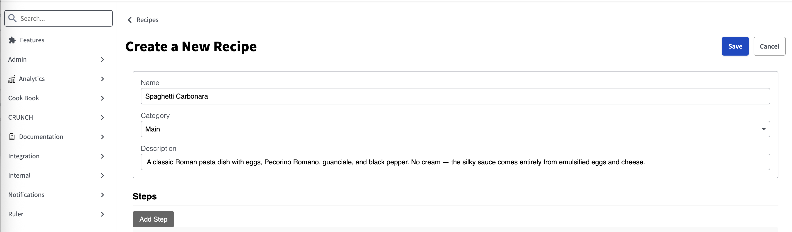
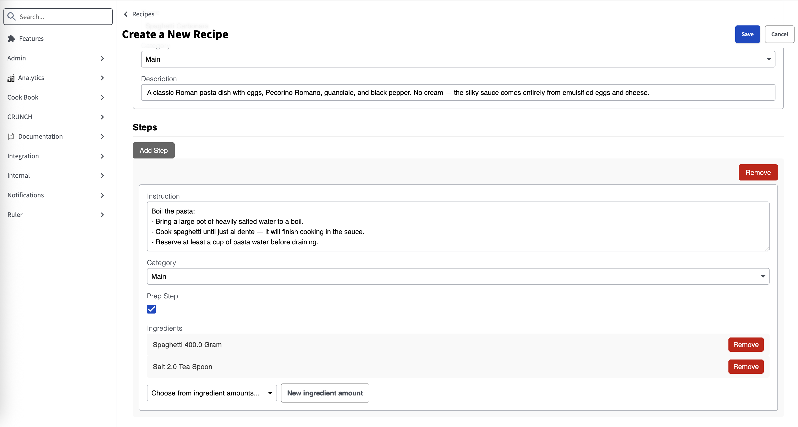
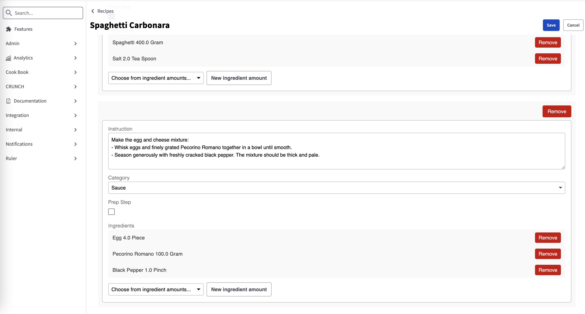
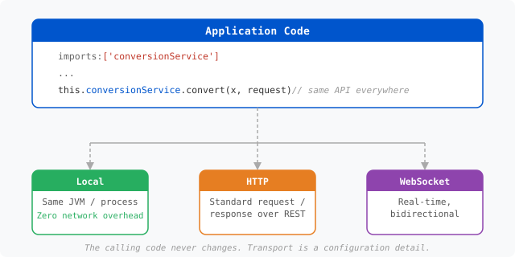
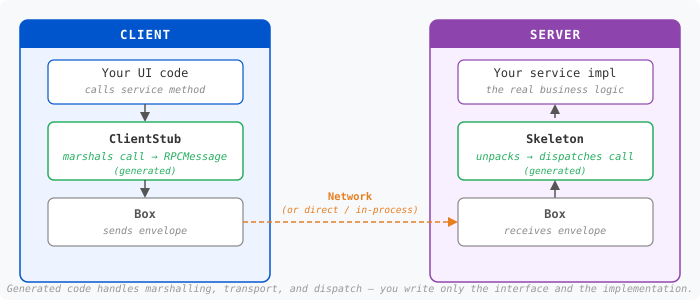
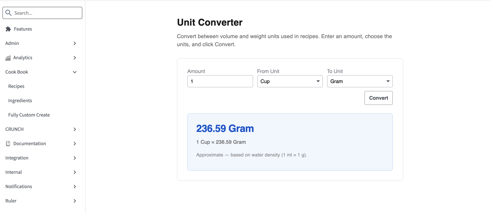

<!-- START doctoc generated TOC please keep comment here to allow auto update -->
<!-- DON'T EDIT THIS SECTION, INSTEAD RE-RUN doctoc TO UPDATE -->
**Table of Contents**  *generated with [DocToc](https://github.com/thlorenz/doctoc)*

- [Intro](#intro)
- [Initial Setup](#initial-setup)
- [Generate Application](#generate-application)
  - [Application Structure](#application-structure)
  - [FOAM Model - Recipe.js](#foam-model---recipejs)
    - [Understanding FOAM Models](#understanding-foam-models)
      - [Context (the `X` object)](#context-the-x-object)
      - [`requires` — classes this model will instantiate](#requires--classes-this-model-will-instantiate)
      - [`imports` — services/values pulled *from* the context](#imports--servicesvalues-pulled-from-the-context)
      - [`requires` vs `imports` at a glance](#requires-vs-imports-at-a-glance)
  - [FOAM Journals](#foam-journals)
    - [What's in the `journals/` Directory](#whats-in-the-journals-directory)
    - [FOAM DAO Service](#foam-dao-service)
    - [Menu Navigation](#menu-navigation)
- [Running Application](#running-application)
- [Testing](#testing)
  - [Running Tests](#running-tests)
  - [Creating Modeled Test Cases](#creating-modeled-test-cases)
    - [Server-Side Tests (Java)](#server-side-tests-java)
    - [Client-Side Tests (JavaScript)](#client-side-tests-javascript)
  - [Test Organization](#test-organization)
    - [Directory Structure](#directory-structure)
    - [Registering Tests](#registering-tests)
    - [Adding Tests to the POM](#adding-tests-to-the-pom)
    - [Understanding POM Flags](#understanding-pom-flags)
  - [Running Tests from the Application UI](#running-tests-from-the-application-ui)
  - [Test Configuration](#test-configuration)
- [Modify FOAM Recipe Model](#modify-foam-recipe-model)
  - [Adding Enum and Autogenerated IDs](#adding-enum-and-autogenerated-ids)
  - [Default Table Columns and Filters](#default-table-columns-and-filters)
  - [Journal Merging](#journal-merging)
- [Relationships](#relationships)
  - [Scaffolding the Supporting Models](#scaffolding-the-supporting-models)
  - [Reference vs Relationship](#reference-vs-relationship)
  - [Defining Relationships](#defining-relationships)
  - [One-to-Many Relationships (1:*)](#one-to-many-relationships-1)
  - [Many-to-Many Relationships (*:*)](#many-to-many-relationships-)
  - [Registering the New Services](#registering-the-new-services)
  - [Updating the POM](#updating-the-pom)
  - [Adding Menu Navigation](#adding-menu-navigation)
  - [Build and Verify](#build-and-verify)
- [Custom Views](#custom-views)
  - [The FOAM UI Library](#the-foam-ui-library)
  - [Layer 1: Elements](#layer-1-elements)
    - [`start()` and `end()`](#start-and-end)
    - [`tag()`](#tag)
    - [`add()`](#add)
    - [DOM Building Methods at a Glance](#dom-building-methods-at-a-glance)
    - [Element Configuration Methods](#element-configuration-methods)
      - [`addClass()`](#addclass)
      - [`attrs()`](#attrs)
      - [`on()`](#on)
      - [`style()`](#style)
    - [CSS Scoping with `^`](#css-scoping-with-%5E)
  - [Layer 2: Views](#layer-2-views)
    - [Reactive Slots](#reactive-slots)
    - [When the Stock UI Isn't Enough](#when-the-stock-ui-isnt-enough)
      - [Why the defaults fall short](#why-the-defaults-fall-short)
      - [Two options](#two-options)
    - [Customizing the IngredientAmount View](#customizing-the-ingredientamount-view)
      - [The problem with the default reference view](#the-problem-with-the-default-reference-view)
      - [A picker for `ingredient`: `targetProperty`](#a-picker-for-ingredient-targetproperty)
      - [Browse: the table and `tableCellFormatter`](#browse-the-table-and-tablecellformatter)
      - [A picker for `alternative`](#a-picker-for-alternative)
  - [Layer 3: Controllers (Comics)](#layer-3-controllers-comics)
  - [The Generated CRUD Screen: Detail and Create](#the-generated-crud-screen-detail-and-create)
    - [Detail: view and edit modes](#detail-view-and-edit-modes)
    - [Configuring the DAOController from the menu](#configuring-the-daocontroller-from-the-menu)
  - [The Recipe Screen: Putting It All Together](#the-recipe-screen-putting-it-all-together)
    - [The ingredient amounts picker for a step: `RecipeStepIngredientAmountsView`](#the-ingredient-amounts-picker-for-a-step-recipestepingredientamountsview)
    - [Working state on `Recipe`: `editSteps` and `loadedStepIds`](#working-state-on-recipe-editsteps-and-loadedstepids)
    - [`RecipeView`](#recipeview)
      - [`init()` — following context](#init--following-context)
      - [`render()` — composing recipe fields and step cards](#render--composing-recipe-fields-and-step-cards)
        - [① `self` vs `this`](#%E2%91%A0-self-vs-this)
        - [② ExpressionSlots: `dynamic()`](#%E2%91%A1-expressionslots-dynamic)
        - [③ Recipe fields via `SectionedDetailView`](#%E2%91%A2-recipe-fields-via-sectioneddetailview)
        - [④ `callIf` — conditional DOM](#%E2%91%A3-callif--conditional-dom)
        - [⑤ Slot chaining: `data$editSteps`](#%E2%91%A4-slot-chaining-dataeditsteps)
      - [The payoff: composition over complexity](#the-payoff-composition-over-complexity)
- [NanoServices](#nanoservices)
  - [How It Works: The Stub/Skeleton Pattern](#how-it-works-the-stubskeleton-pattern)
    - [What Gets Generated](#what-gets-generated)
  - [Define Request and Response Models](#define-request-and-response-models)
  - [Define the Service Interface](#define-the-service-interface)
  - [Implement the Server Side](#implement-the-server-side)
  - [Register the Service](#register-the-service)
- [Putting It All Together](#putting-it-all-together)
  - [Wiring It as the Default Landing Page](#wiring-it-as-the-default-landing-page)
- [Where to Go from Here](#where-to-go-from-here)
- [Appendix](#appendix)
  - [FOAM Model Reference](#foam-model-reference)
    - [Properties](#properties)
      - [Property Class Requirement](#property-class-requirement)
      - [Property Definition (Abridged from Property.js)](#property-definition-abridged-from-propertyjs)
      - [Property Extensibility](#property-extensibility)
      - [Property Subclasses: Commonly Used Types](#property-subclasses-commonly-used-types)
      - [Object and Reference Properties](#object-and-reference-properties)
      - [Property Examples](#property-examples)
      - [Collection Properties](#collection-properties)
      - [Creating Custom Property Types](#creating-custom-property-types)
      - [Property Features](#property-features)
      - [Library Refinements](#library-refinements)
    - [Methods](#methods)
    - [Listeners](#listeners)
    - [Actions](#actions)
  - [Source-to-Sink Architecture](#source-to-sink-architecture)
    - [The Sink Interface](#the-sink-interface)
    - [Source-to-Sink Flow](#source-to-sink-flow)
    - [Common Built-in Sinks](#common-built-in-sinks)
      - [ArraySink - Collect Results](#arraysink---collect-results)
      - [Count - Count Matching Objects](#count---count-matching-objects)
      - [GroupBy - Group Results](#groupby---group-results)
      - [Map - Transform Results](#map---transform-results)
    - [Streaming Architecture](#streaming-architecture)
    - [Custom Sinks](#custom-sinks)
    - [Sink Delegation](#sink-delegation)
    - [DAO Composition vs Sink Delegation](#dao-composition-vs-sink-delegation)
    - [Practical Example](#practical-example)
    - [Summary](#summary)
  - [Journal Merging In-Depth](#journal-merging-in-depth)
    - [Static vs Runtime Journals](#static-vs-runtime-journals)
    - [Development vs Production Deployment](#development-vs-production-deployment)
    - [How Journal Concatenation Works](#how-journal-concatenation-works)
    - [Journal Directory Conventions](#journal-directory-conventions)
    - [Practical Example: The Demo User](#practical-example-the-demo-user)
    - [Using the -J Flag](#using-the--j-flag)
    - [Creating Your Own Deployment Configuration](#creating-your-own-deployment-configuration)
    - [Feature Flags and Conditional Compilation](#feature-flags-and-conditional-compilation)
    - [Exporting Runtime Data to Static Journals](#exporting-runtime-data-to-static-journals)
    - [Journal Precedence Summary](#journal-precedence-summary)
  - [U2/U3 Element Method Reference](#u2u3-element-method-reference)
    - [DOM Building](#dom-building)
    - [CSS and Styling](#css-and-styling)
    - [Attributes](#attributes)
    - [Events](#events)
    - [Control Flow](#control-flow)
    - [Visibility](#visibility)
    - [Context](#context)
    - [Property Rendering](#property-rendering)
    - [Tooltips](#tooltips)
    - [Component Lifecycle](#component-lifecycle)
    - [Views and Data Binding](#views-and-data-binding)
    - [ControllerMode and DisplayMode](#controllermode-and-displaymode)
    - [Advanced](#advanced)

<!-- END doctoc generated TOC please keep comment here to allow auto update -->

# Intro

This tutorial will guide you through creating of a new project using FOAM. FOAM stands for "Feature-Oriented Active Modeller", and it is a framework converting high-level software specifications, called "models", into useful executable software components, called "features". FOAM is cross-language and cross-platform, meaning that it can be used as JS, Java and Swift, and for both client and server software.

The tutorial will cover the initial setup and an application creation by creating a cooking recipe database. The tutorial assumes that you 
already have <code>Java</code>, <code>Node.js</code> and <code>Maven</code> installed in your environment. If you need to install these, helpful tips can be found in the [FOAM installation instructions][foam-install]. This tutorial also assumes that if you are using a Windows device, you are using WSL.

> 💡 **Important:** Note that you do not need to build FOAM in isolation for the tutorial. We will do this step when we add FOAM as a git sub-module to our project.

By following this tutorial you will be able to:
1. Scaffold a working full-stack web application in minutes
1. Describe your data once and get storage, validation, and UI for free
1. Query, filter, and persist data without writing database boilerplate
1. Connect related data — lists, lookups, and many-to-many joins — automatically
1. Build reactive UIs where the screen stays in sync with the data without manual DOM updates
1. Generate complete browse, create, and edit screens from your data model and customize only what needs to differ
1. Add server-side business logic as lightweight, reusable services

This tutorial is best suited for FOAM beginners as well as experienced FOAM developers who wish to understand the underlying architecture in more depth.

> 📦 **Companion repository.** The fully built application from this tutorial is available at [github.com/foam-foundation/FOAM-Recipes](https://github.com/foam-foundation/FOAM-Recipes). You can clone it to run the finished app, compare your work, or get unstuck when something does not match. That said, we strongly encourage you to build the project step by step rather than reaching for the finished code first — the understanding you build by working through each concept, making mistakes, and seeing things break and recover is not something you get by reading a completed codebase. The companion repo is a safety net, not a shortcut.


# Initial Setup

If you are starting from scratch the best way to start is with an empty github repository you own. You can find more information on how to create a new github repository [here][github-docs-repo]. 
After you created a github repo for your project, the first step is to clone it into your development environment:

```
git clone <git URL for your repository>
cd <project root>
```

Alternatively you can work with a local project that you can add remote tracking to at later time. 

```
mkdir <project root>
cd <project root>
git init
```

FOAM is included directly from its repository. The example below uses a git sub-module, which is one common way to bring it in. Go to the [FOAM Repository][foam-repo] and grab the repository's URL. The example uses SSH — if you haven't set up SSH keys with GitHub yet, see the [GitHub SSH guide][github-ssh]:

```
# using SSH
git submodule add git@github.com:foam-foundation/foam3.git
git submodule update --init --recursive --rebase --force
```

The FOAM build depends on a few generic npm packages. Install them with:

```
#cd into the foam3 sub-module directory
cd foam3/
./build.sh --install
```

# Generate Application

With the repository cloned, the sub-module linked, and the npm dependencies installed, everything is in place. We are now ready to generate our application skeleton.

The easiest way to create a FOAM application is to use the project generator, which scaffolds the application structure and the main application model for you. From the *foam3* directory, run:

```
# from foam3 directory
./build.sh -T+setup/Project --appName:Recipe --package:com.foamdev.cook --adminPassword:badpassword
# cd back to your root directory
cd ..
```

| Argument | Description |
|----------|-------------|
| `-T+setup/Project` | Runs the built-in project scaffolding task |
| `--appName:Recipe` | The name of the application to generate and its top-level model class |
| `--package:com.foamdev.cook` | The Java-style package namespace for all generated source files |
| `--adminPassword:badpassword` | The initial password for the generated admin user — change this before any real deployment |

## Application Structure

Your application directory should now look similar to this:

```
/deployment
  /demo
  /test
/journals
/foam3
/src
pom.js
build.sh
.gitignore
.gitmodules
```

Let's examine a few key files before we run our application. 

One of the generated files is *build.sh* with the following content:

```
#!/bin/bash
node foam3/tools/build.js "$@"
```

This script is your entry point to the FOAM build tools — every build, test, and generator command you run throughout this tutorial goes through it. Before you use it, make sure that the script has executable privileges:

```
chmod +x build.sh
```

The next file to take a look at is the Project Object Model (POM) file for our project, named `pom.js`. The `.js` extension is intentional — rather than a static XML descriptor, this is a live JavaScript file that FOAM evaluates at build time to produce the traditional `pom.xml` that build tools expect. Writing it in JavaScript means you can use variables, functions, and conditions to express build configuration that XML simply cannot. The file should have the following content:

```
foam.POM({
  name: 'recipes',
  excludes: [ '*' ],
  projects: [
    { name: 'foam3/pom'},
    { name: 'src/com/foamdev/cook/pom'},
    { name: 'journals/pom' }
  ],
  licenses: `
    // Add your license header here
  `,
  envs: {
    version: '1.0.0',
    // javaMainArgs: 'spid:recipes'
  },
  tasks: [
    function javaManifest() {
      JAVA_MANIFEST_VENDOR_ID = 'cook.foamdev.com';
    }
  ]
});

```

Let's look briefly at the purpose of each of the elements in this file:

<table>
<thead>
<tr>
<th width=20%>Name</th>
<th width=80%>Description</th>
</tr>
</thead>
<tbody>
<tr>
<td width=20% align="left">name</td>
<td width=80% align="left">The name of your project. Will be used for naming certain files and directories created by the build process.</td>
</tr>
<tr>
<td width=20% align="left">excludes</td>
<td width=80% align="left">By default the FOAM build will recurse sub-directories, unless they are included in excludes. The directories listed
are standard directories that we want FOAM build to ignore. The <b>*</b> turns off all defaults. The build will only include projects listed
in the projects below.</td>
</tr>
<tr>
<td width=20% align="left">projects</td>
<td width=80% align="left">Points to pom files for other projects or sub-projects. At the very minimum, you need to include the foam3/pom to include foam. You can break your project into multiple pom files, or just have one top-level pom.</td>
</tr>
<tr>
<td width=20% align="left">licenses</td>
<td width=80% align="left">An array of license notifications. When the build creates a deployment .js file, it will include all declared licenses at the top.</td>
</tr>
<tr>
<td width=20% align="left">envs.version</td>
<td width=80% align="left">The version attached to built files. Update it on each release so browsers don't serve stale cached assets.</td>
</tr>
<tr>
<td width=20% align="left">tasks</td>
<td width=80% align="left">Tasks are build hooks that allow the pom to modify build properties.  In this case when the build is creating the Java JAR Manifest file, this pom sets the vendor id property.</td>
</tr>
</tbody>
</table>


You can learn more on the pom file and possible customization options by reading the full [FOAM POM specification][foam-pom-spec].

## FOAM Model - Recipe.js

The most interesting file that is generated for us is the model file Recipe.js in the src/com/foamdev/cook directory. The file contains the key entity for our recipe database application. We will adjust the content of this file as we develop our application. However, if you just generated the project, the file will have the following content:

```
foam.CLASS({
  package: 'com.foamdev.cook',
  name: 'Recipe',

  implements: [
    'foam.core.auth.CreatedAware',
    'foam.core.auth.LastModifiedAware'
  ],

  tableColumns: [
    'name',
    'description'
  ],

  searchColumns: [
    'name',
    'description'
  ],

  properties: [
    {
      class: 'Long',
      name: 'id',
      createVisibility: 'HIDDEN',
      updateVisibility: 'RO'
    },
    {
      class: 'String',
      name: 'name',
      required: true
    },
    {
      class: 'String',
      name: 'description'
    }
  ],

  methods: [
    function sampleMethod() {
      return 'Hello World!';
    },
    function toSummary() {
      return this.name;
    },
    function toString() {
      return this.toSummary();
    }
  ]
});

```

Here we defined a model for class <code>Recipe</code> that is in the <code>com.foamdev.cook</code> package and has two properties,
<code>name</code> and <code>description</code>, a few sample methods. The model derives
from two interfaces, <code>foam.core.auth.CreatedAware</code> and <code>foam.core.auth.LastModifiedAware</code> whose default implementation adds the timestamp and last modified properties.

### Understanding FOAM Models

A FOAM model is a high-level specification that FOAM compiles into executable code for multiple languages (JavaScript, Java, Swift). The `foam.CLASS()` declaration defines everything about a class in one place — its data, behavior, relationships, and metadata. Every model produces a class that extends **FObject** (Feature Object), FOAM's universal base class. FObject is what gives all modeled objects their superpowers out of the box: automatic getters/setters, reactive property change notification, JSON serialization, cloning, comparison, and hashing — without writing any of that yourself.

> 🤖 **A note on LLM-assisted development.** Because a FOAM model is a complete, structured specification — data, behavior, validation, and UI hints all in one declaration — it is an ideal target for prompt-driven generation. Describe your model in plain English, and an LLM can produce the full `foam.CLASS()` definition. Because that definition compiles to both JavaScript and Java, one prompt yields a working full-stack implementation rather than scaffolded boilerplate in each language separately.

Here's the anatomy of a FOAM class definition:

```javascript
foam.CLASS({
  package: 'com.example.project',     // Java-style package namespace
  name: 'MyModel',                    // Class name
  extends: 'foam.core.BaseModel',     // Single inheritance (optional)
  implements: [                       // Interfaces/traits (optional)
    'foam.core.auth.CreatedAware',
    'foam.core.auth.LastModifiedAware'
  ],
  requires: [                         // Dependencies for context-aware creation
    'foam.dao.ArraySink',
    'com.example.project.OtherModel'
  ],
  imports: ['userDAO', 'currentUser'], // Inject from context
  exports: ['selectedItem'],           // Export to child context

  properties: [ ... ],                 // Data members
  methods: [ ... ],                    // Instance methods
  listeners: [ ... ],                  // Pre-bound callback methods
  actions: [ ... ]                     // User-triggered operations
});
```

**Key Model Sections:**

| Section | Purpose |
|---------|---------|
| `package` + `name` | Fully qualified class identifier |
| `extends` | Single parent class inheritance |
| `implements` | Mix in interfaces/traits for shared behavior |
| `requires` | Declare dependencies for context-aware object creation |
| `imports` / `exports` | Context-based dependency injection |
| `properties` | Typed data members with validation, defaults, and reactivity |
| `methods` | Instance functions; can have both `code` (JS) and `javaCode` |
| `listeners` | Methods pre-bound to `this`; safe to use as callbacks |
| `actions` | User-triggered operations with UI integration |

Underneath, these sections share one concept: everything inside a `foam.CLASS` — every property, method, listener, action, and relationship — is an **axiom**. An axiom is a self-contained piece of class metadata that knows how to install itself on the class. So a FOAM class isn't a block of code; it's a *collection of axioms* the framework can inspect at runtime. That's what lets a single `properties` entry do so much later on: expose a reactive slot, hand you an upper-cased constant (`Recipe.NAME`), and even render its own editor — capabilities the UI layers lean on heavily. Keep the word in mind; it comes back when we bind models to the DOM.

Three of these sections — `requires`, `imports`, and `exports` — only make sense once you understand **context**, so we'll cover that next before returning to the rest.

#### Context (the `X` object)

In FOAM, every object lives in a **context** — conventionally called `X` (and reachable on any object as `this.__context__`). Think of it as a scoped registry / dependency-injection container that travels with the object. It holds:

- registered services and singletons (DAOs, the current user, etc.),
- a class lookup, so names like `'foam.dao.ArraySink'` can be resolved to actual classes,
- and it's *hierarchical* — a child object's context inherits from its parent's, and can add to or override it.

So context answers two questions at once: **"where do I look up classes"** and **"where do I get shared services from."** `requires`, `imports`, and `exports` are all just declarations about how a class interacts with that context.

#### `requires` — classes this model will instantiate

`requires` declares the **classes** you intend to create instances of. It does two things:

1. Resolves each fully-qualified name against the context's class registry.
2. Gives you a short alias on `this`, so you can construct it *context-aware* — the new instance automatically inherits your context. Without this, you would have to pass the context manually: `com.foamdev.cook.RecipeStep.create({ ... }, this.__subContext__)`.

```javascript
requires: ['foam.dao.ArraySink', 'com.foamdev.cook.RecipeStep'],
methods: [
  function foo() {
    var sink = this.ArraySink.create();        // short name, created in this.__context__
    var step = this.RecipeStep.create({ ... }); // inherits this object's context automatically
  }
]
```

> ⚠️ **Context matters.** Creating an object without a context — `com.foamdev.cook.RecipeStep.create({ ... })` — gives the new instance the global root context. For plain value objects that carry no dependencies this is fine. But if the object ever tries to reach a DAO, a nano-service, or any other context-injected dependency, it won't find it and will either fail silently or throw. When in doubt, use `requires` and let FOAM handle context propagation for you.

Without `requires` you'd have to reference the full path and wire the context in by hand. So: **`requires` = "classes I will `.create()`."**

#### `imports` — services/values pulled *from* the context

`imports` declares **existing values or services** you expect to already be present in the context, injected by whoever created you. You don't construct them — you consume them.

```javascript
imports: ['recipeDAO', 'currentUser'],
methods: [
  function bar() {
    this.recipeDAO.select(...);    // a DAO someone exported into the context
    var u = this.currentUser;      // a value provided by an ancestor
  }
]
```

So: **`imports` = "services/values I expect to be handed to me via context."** Its counterpart is `exports` — a parent puts things *into* the context (`exports: ['selectedRecipe']`) so its children can `import` them. `exports` is the supply side; `imports` is the demand side of the same context.

#### `requires` vs `imports` at a glance

| | `requires` | `imports` | `exports` |
|---|---|---|---|
| What it names | Classes | Instances / values / services | Properties or values on this object |
| What you do with it | `.create()` new instances | Use what already exists | Make them available to child objects |
| Direction | You build it | It's injected into you | You publish it into the context |
| Analogy | Import a *type* so you can `new` it | Constructor-injected dependency | Context provider |

A quick mental model: `requires` is like importing a *type* so you can instantiate it; `imports` is like receiving a *dependency* someone else already built and placed in your context.

<details markdown="1">
<summary><b>Coming from Node.js / React?</b> A quick bridge for these three sections.</summary>

<br>

**`requires` ≈ Node's `require`.** Both take a name, resolve it, and hand you a local
binding you can use by a short name. The difference is *what* they resolve against and
*what the binding does*:

|  | Node `require('x')` | FOAM `requires: ['...X']` |
|---|---|---|
| Resolves against | The module cache, keyed by file path | The **context's** class registry, keyed by name |
| You get back | The module's exports (a static value) | An alias on `this` whose `.create()` makes **context-aware** instances |
| Overridable? | No — one module per path, globally | Yes — a context can override/refine what a name resolves to |

So `this.RecipeStep.create()` isn't just "the required class" — each instance it builds
automatically inherits your object's context, which plain `require` has no notion of.

**`imports` / `exports` ≈ React Context.** This is the closer analogy, and the one worth
internalizing:

- `exports: ['selectedRecipe']` is a `<RecipeContext.Provider value={selectedRecipe}>` —
  a parent supplying a value down the tree.
- `imports: ['selectedRecipe']` is `const selectedRecipe = useContext(RecipeContext)` —
  a descendant consuming what an ancestor provided. You don't build it; it's injected.

Supply-side vs. demand-side of the same tree — exactly like `<Provider>` vs. `useContext`.

One caveat so the analogy doesn't mislead: React has *many* separate `Context` objects,
each with its own `useContext(X)`. FOAM has **one** unified context container holding
everything — services, singletons, and the class registry — keyed by name. Think "a single
React context whose value is a big service registry" rather than React's many-small-contexts
style. (And the class-registry half has no React equivalent at all — that part is the Node
`require` side of the analogy.)

</details>

> 💡 **Note:** **The theory behind context.** What FOAM calls *context* is a first-class form of
> **dynamic scoping**: a name like `recipeDAO` is resolved by walking the runtime chain of
> *who created whom*, not by where the code is written (that latter, textual rule is
> *lexical* scoping — what `let`/`const`/closures use). This is a sixty-year-old idea that
> traces back to early Lisp. If you enjoy connecting framework features to the computer
> science they grow from, see
> [**Context & Dynamic Scoping**](../foundations/01-context-and-dynamic-scoping.md) in the
> [FOAM Foundations](../foundations/README.md) series.

We will explore each of these concepts in detail as we develop our Recipe application. For a comprehensive reference, see [FOAM Model Reference](#foam-model-reference) in the Appendix.

## FOAM Journals

> 📓 **Journals are your database — and your version control.** Every `.jrl` file is a plain-text, append-only log of commands. The data you add through the UI, the services you configure, the menus and themes you wire — all of it lands in a journal. That means your entire application state is human-readable, diffable, and committable to git. You can hand-craft entries, share seed data across the team, or swap journal sets for different deployment targets — no database migrations, no SQL scripts.

Journals are the default storage layer and work well for most applications, but FOAM is not limited to them. `EasyDAO` — the DAO factory used throughout the framework — can switch any model to PostgreSQL or any JDBC-compatible database (MySQL, etc.) with a single configuration flag. Query performance and search indexing then scale with whatever the backing store supports natively. This tutorial uses journals throughout, but the same model definitions work unchanged against a production database. Deeper coverage of storage backends is a topic for more specialized guides.

A journal is a simple JSON-like configuration file used to store application data. Journal files are suitable for simple configuration data containing only a few records, and for larger in-memory databases, potentially containing millions of records. Journal files are append-only, meaning when data is added, updated, or removed, changes are only appended to the end of the file, but none of its contents are updated or removed. Updates are performed by recording, or journalling, a list of desired changes. These changes will appear in the journal as either "create" lines:
```
  c({<json-data-here>});
```
or "put" (update) lines:
```
  p({<json-data-here>});
```
or "remove" lines:
```
  r({<json-id-here>});
```
For the run-time journals, before each update there may be a line which declares who made the change and when they made it:
```
  // Modified by Kevin Greer (49393173) at 2025-05-20T14:53:26.590-0400
```
The run-time journals also add a `version` line noting a change in the application version.
```
  v({"version":<application-version>})
```
The advantages of journal files are that they can be updated quickly, no old data is lost (and so updates or reverts can be reversed),
they are human readable, they provide an audit trail of who and when changes were made, they're very fault tolerant, don't require external
database hosting or configuration, and provide excellent performance for many use-cases.

### What's in the `journals/` Directory

When you generated the project, the setup script didn't just create your `Recipe` model — it
also wrote a small set of journal files under <code>journals/</code> directory that bootstrap a
complete, working application: who can log in, what they're allowed to do, what appears in
the navigation, and which back-end services exist. Every one of these is an ordinary
append-only journal of the `c()`/`p()`/`r()` form we just described; they simply hold
*configuration* records instead of business data.

We'll explore these configuration journals in more detail as we go; the important idea for
now is that **an entire application's configuration is just data in journals** — versioned,
human-readable, and edited the same way you'd edit any other record.

### FOAM DAO Service

The `journals/services.jrl` file is where an application declares its back-end **services**. Each entry is a `CSpec` — a Component Specification — which is FOAM's way of saying "at boot time, build this thing and register it under this name." Once registered, any part of the application can look the service up from the context by that name, without knowing how it was built or where it lives.

This is the same context system introduced earlier — the one that powers `imports`, `exports`, and nano-service injection. `services.jrl` is where those services are *defined*; FOAM reads the file at startup and registers each one into the context. We will come back to services in much more depth in the NanoServices chapter, where we build and register one from scratch.

One of the most important services in any FOAM application is the **DAO service** — the bridge between your model and persistent storage. Let's walk through what that entry looks like:

```
p({
  "class": "foam.core.boot.CSpec",                          // this record is a Component Specification — a boot-time service definition
  "name": "recipeDAO",                                      // the name the service is registered under; other code looks it up by this key
  "description": "",                                        // human-readable description (optional)
  "serve": true,                                            // expose this service over the network so clients (e.g. the browser) can reach it
  "authenticate": true,                                     // require the caller to be logged in before the service will respond
  "keywords": [ "recipe" ],                                 // search terms that make this service findable in the admin UI
  "serviceScript": """                                      // server-side script that builds and returns the service instance ("""...""" is a multi-line string)
    return new foam.dao.EasyDAO.Builder(x)                  // EasyDAO assembles a DAO from a stack of decorators; x is the boot context
      .setOf(com.foamdev.cook.Recipe.getOwnClassInfo())     // the model this DAO stores — Recipe objects
      .setPm(true)                                          // enable Performance Measurements (timing/metrics) on operations
      .setSeqNo(true)                                       // auto-assign sequential ids to new records (drives Recipe's autogenerated id)
      .setAuthorize(false)                                  // skip per-object authorization checks inside the DAO itself
      .setJournalType(foam.dao.JournalType.SINGLE_JOURNAL)  // persist to one append-only journal file on disk
      .build();                                             // construct the configured DAO and return it as the service
  """,
  "client": `{"of":"com.foamdev.cook.Recipe"}`              // config the client uses to build a matching client-side proxy DAO
})
```
The FOAM core comes with a number of out-of-the-box services, with DAO service being one of them, that you'll become more 
familiar with time. With the journal above, we add the recipes DAO service to FOAM.

A **DAO** (Data Access Object) is one of the most important concepts in FOAM. It is an abstraction layer that sits between your code and wherever the data actually lives. Instead of writing code that talks directly to a file, a database, or a remote server, you talk to a DAO — and the DAO handles the rest.

This means your application code never needs to know whether data is stored in a journal file on disk, a PostgreSQL database, an in-memory cache, or fetched over the network from a server. You call the same methods either way. Swap the backing storage without touching a single line of business logic. Add caching, authorization checks, or real-time notifications by wrapping one DAO with another — each decorator adds a behaviour, and the calling code is never aware.

FOAM's DAO is not just a CRUD wrapper. It is a composable, queryable, listenable interface that the entire framework — the UI components, the relationship system, the authorization layer — is built on top of.

> 🗄️ **The DAO is FOAM's single most powerful abstraction.** Write your code against the DAO interface once, and the framework can swap the backing store, add a caching layer, enforce authorization rules, or push real-time updates to connected clients — without your code changing at all. This is not a convenience; it is the architectural foundation that makes everything else in FOAM composable.

Here is the interface in simplified form:

```
interface DAO {
  FObject  put(obj)                 // insert obj, or update it if one with the same id already exists
  FObject  find(id)                 // look up a single object by its id (returns null if not found)
  FObject  remove(obj)              // delete the object with obj's id
  void     removeAll()              // delete every object in the DAO
  Sink     select(sink)             // stream all matching objects into sink; without one, collects them for you
  void     listen(sink)             // subscribe: sink is notified of every future put/remove as it happens
  void     unlisten(sink)           // cancel a previous listen()
  DAO      where(predicate)         // return a filtered DAO exposing only objects matching predicate
  DAO      limit(count)             // return a DAO exposing at most count objects
  DAO      skip(count)              // return a DAO that skips the first count objects (for paging)
  DAO      orderBy(...comparators)  // return a DAO whose objects are sorted by the given comparators
  DAO      inX(x)                   // return the same DAO bound to context x (see Context earlier)
}
```

> 💡 **Important:** DAO methods are asynchronous. In JavaScript, this is expressed by wrapping return values in Promises. For example, `put()` returns `Promise<FObject>`, `find()` returns `Promise<FObject>`, and `select()` returns `Promise<Sink>`. Use `.then()` or `await` to access the results.

A Sink is a destination object that receives and processes query results from `select()`. Here is the Sink interface:

```
interface Sink {
  void  put(obj, sub)     // receive one object — called once per matching object as it streams in
  void  remove(obj, sub)  // signals obj is now gone — only sent to a live listen() subscriber, never during a plain select()
  void  eof()             // "end of file" — the source is done sending; no more put/remove calls will come
  void  reset(sub)        // discard anything received so far and start over (the source is resending from scratch)
}
```

With a DAO you can do everything you might want to do with a collection of data. The above interface is surprisingly general and powerful, despite its relatively small size. Also note that a DAO is an interface, not a specific implementation. There are many DAO implementations that let you
store your data in different underlying databases or other storage mechanisms. No mater which DAO implementation you're using, they all have the same interface and your client code can work with any implementation without change. Journal files, for example, are accessed through the "JDAO" DAO implementation.

Learn more about DAOs in the [Introduction to FOAM Programming][foam-intro] and by inspecting the [model][foam-dao] for the DAO interface. For an in-depth explanation of how DAOs and Sinks work together, see [Source-to-Sink Architecture](#source-to-sink-architecture) in the Appendix.


### Menu Navigation 

Let's look at one more generated journal file, <code>journals/menus.jrl</code> before we run our application. A **menu** is used to make our entity
visible in FOAM. Upon initial creation the file should have the following content:

```
p({
  "class":"foam.core.menu.Menu",                         // this record defines one navigation menu entry
  "id":"recipes.recipe",                                 // unique menu id; also the URL hash (#recipes.recipe) used to navigate here
  "label":"Recipe",                                      // the text shown for this entry in the navigation
  "authenticate":true,                                   // only show/allow this menu for logged-in users
  "keywords":[""],                                       // search terms that make this menu findable in the search bar
  "handler":{                                            // what happens when the menu is opened
    "class":"foam.core.menu.DAOMenu2",                   // one of several handler types — this one renders a full browse/CRUD screen for a DAO
    "config":{
      "class":"foam.comics.v2.DAOControllerConfig",      // configuration for that DAO screen (columns, actions, etc.)
      "daoKey":"recipeDAO"                               // which service to display — looked up by name in the context (our recipeDAO)
    }
  }
})
```

The <code>handler</code> is what makes a menu *do* something, and <code>DAOMenu2</code> is
just one of many. Depending on the handler you choose, the same menu machinery can open all
sorts of destinations. A few you'll commonly encounter:

| Handler | Opens |
|---------|-------|
| <code>foam.core.menu.DAOMenu2</code> | A full browse/CRUD screen for a DAO (what we use here) |
| <code>foam.core.menu.ViewMenu</code> | An arbitrary custom view — handy for dashboards or landing pages |
| <code>foam.core.menu.SubMenu</code> | A group of child menu items, i.e. an expandable parent entry |
| <code>foam.core.menu.LinkMenu</code> | An external URL in a new tab |
| <code>foam.core.menu.DocumentMenu</code> | An embedded document (e.g. help or terms content) |
| <code>foam.core.menu.ScriptMenu</code> | Runs a script when selected |
| <code>foam.core.menu.PredicatedMenu</code> | *Another* handler, chosen at runtime — see below |

The last one is worth a closer look because it's not a destination at all — it's a
**conditional dispatcher**. A <code>PredicatedMenu</code> holds a list of <code>options</code>,
each pairing a **predicate** with a handler. When the menu is opened it evaluates each
option's predicate against the current context <code>X</code>, in order, and the **first one
that passes** provides the real handler (the final option acts as an unconditional fallback).
This lets a single menu entry resolve to different screens depending on runtime state — the
user's group or permissions, a feature flag, or any value carried in the context:

```
p({
  "class":"foam.core.menu.Menu",
  "id":"recipes.recipe",
  "label":"Recipe",
  "handler":{
    "class":"foam.core.menu.PredicatedMenu",
    "options":[
      { "predicate":<is-admin-predicate>, "handler":{ /* full admin DAO screen */ } },
      { "handler":{ /* read-only screen for everyone else */ } }   // fallback, no predicate
    ]
  }
})
```

The predicates here are FOAM **mLang** expressions — the same query language DAOs use for
<code>where()</code> — evaluated against the context rather than a database record. mLang is a deep topic in its own right and will be covered in a future [FOAM Foundations](../foundations/README.md) series. For now, the [MLang guide][foam-mlang] and [AutoQueryParser guide][foam-autoquery] are good starting points, and the appendix in this tutorial also covers the predicate basics. The takeaway for now is that menu routing itself can be data-driven and context-aware.

Once we start building custom views later in the tutorial, a handler like
<code>ViewMenu</code> is how you'd surface one of them from the navigation.

# Running Application

The last step before we can run our application is to assure that the needed helper directories /opt and /opt/recipe directories exist and you are set as the owner:

```
sudo chown -R $USER /opt
```

Now we are ready to test our code. From the command line, in your root directory type:

```
$ deployment/demo/run.sh
# or
$ ./build.sh -Jdemo
```

This will trigger the build and start the server. You can open your application in the web browser at http://localhost:8080/. 
Use one of the following credentials at the logging screen:

```
# administrator - full access
user: admin
password: badpassword

# regular non-priveledged user - can only interact with Recipes.
user: demo
password: demopassword
```

Clicking on the Recipe in the left navigation menu should bring you to the Recipe screen:

![app-screen-1][app-screen-1]

Notice how much functionality you already have by just creating a simple model and connecting to the FOAM core. 

Another interesting thing to point out is the presence of the demo user. If you recall in the setup script we only added the admin. The demo user however is only 
available if you run the application with the option <code>-Jdemo</code>. The `-J` flag instructs the application to load the additional journals relative to the `./deployment` directory, which in this case are journals from `./deployment/demo`, the journals get copied by the build setup script. 

You can create your own journals that you can use this way, by going to the runtime journals directory under /opt and lifting the entries into
a different file, then including it at startup with the <code>-J</code> option. For more info see the chapter on [Journal Merging](#Journal-Merging).

> 💡 **Important:** To stop the FOAM server, type in <code>CTRL</code>+C twice.

> ⚡ **Hot reload — no rebuild needed for UI changes.** A full rebuild (`./build.sh -Jdemo`) is only required when you change **Java code** or **journals** — anything that needs compilation or a server-side data change. For pure JavaScript and CSS changes (views, models, actions, CSS blocks), the server keeps running; just do a **hard reload in the browser** (`Cmd+Shift+R` / `Ctrl+Shift+R`) and the browser re-fetches the JS files and picks up your changes immediately. You will do this constantly while iterating on the UI, so it is worth knowing early.

# Testing

FOAM provides a testing harness for implementing unit tests. Test cases can be either modeled FOAM classes or scripts, and can target both Java (server-side) and JavaScript (client-side).

## Running Tests

Tests are executed using build tasks:

```bash
# Run all server and client tests
./build.sh run-tests

# Run only server-side (Java) tests
./build.sh server-tests

# Run only client-side (JavaScript) tests
./build.sh client-tests

# Run specific test cases by id
./build.sh run-tests:RecipeTest,RecipeTestMethods

# Exclude specific tests (prefix with -)
./build.sh run-tests:-SlowTest,-IntegrationTest
```

Test output shows success or failure for each test:

```
RecipeTest
   ✓ SUCCESS: ID empty before create
   ✓ SUCCESS: ID set after create
```

## Creating Modeled Test Cases

Test cases are FOAM models that extend a test base class. Place tests in a `test` subdirectory within your package.

### Server-Side Tests (Java)

For Java tests, extend `foam.core.test.Test` and implement `runTest` with `javaCode`. Here's our example from <code>src/com/foamdev/cook/test/RecipeTest.js</code>:

```javascript
foam.CLASS({
  package: 'com.foamdev.cook.test',
  name: 'RecipeTest',
  extends: 'foam.core.test.Test',

  javaImports: [
    'com.foamdev.cook.*',
    'foam.dao.DAO'
  ],

  methods: [
    {
      name: 'runTest',
      javaCode: `
        var recipe = new Recipe();
        test(recipe.getId() == 0l, "ID empty before create");

        recipe = (Recipe) ((DAO) x.get("recipeDAO")).put(recipe);
        test(recipe.getId() != 0l, "ID set after create");
      `
    }
  ]
});
```

### Client-Side Tests (JavaScript)

For JavaScript tests, extend `foam.core.test.JSTest` and implement `runTest` as a JavaScript function. Here's an example from <code>src/com/foamdev/cook/test/RecipeTestMethods.js</code>:

```javascript
foam.CLASS({
  package: 'com.foamdev.cook.test',
  name: 'RecipeTestMethods',
  extends: 'foam.core.test.JSTest',

  requires: [ 'com.foamdev.cook.Recipe' ],

  methods: [
    {
      name: 'runTest',
      args: ['Context x'],
      code: function runTest(x) {
        // debugger;
        let recipe = this.Recipe.create();
        x.test(recipe.toSummary() == "", 'Recipe toSummary is initially empty');

        recipe.name = 'Fried chicken';
        x.test(recipe.toSummary() == "Fried chicken", 'Recipe toSummary is equal to name');
      }
    }
  ]
});
```

Note: In Java tests, call `test(condition, message)` directly. In JavaScript tests, call `x.test(condition, message)` using the context parameter.

## Test Organization

### Directory Structure

Tests live in a `test` subdirectory within your package:

```
src/com/foamdev/cook/
├── Recipe.js
├── RecipeCategory.js
├── pom.js
└── test/
    ├── RecipeTest.js        (Java server test)
    ├── RecipeTestMethods.js (JavaScript client test)
    ├── tests.jrl            (test registration)
    └── pom.js               (test pom)
```

### Registering Tests

Tests must be registered in a `tests.jrl` journal file. Each test case needs an entry:

```javascript
p({
  "class": "com.foamdev.cook.test.RecipeTest",
  "id": "RecipeTest",
  "description": "Recipe Id tests"
})

p({
  "class": "com.foamdev.cook.test.RecipeTestMethods",
  "id": "RecipeTestMethods",
  "description": "Test Recipe methods in JavaScript",
  "language": 0
})
```

### Adding Tests to the POM

Create a `pom.js` in your test directory and reference it from the parent pom with the `test` flag:

**test/pom.js:**
```javascript
foam.POM({
  name: 'test',
  files: [
    { name: 'RecipeTest',        flags: 'js|java' },
    { name: 'RecipeTestMethods', flags: 'js|java' }
  ]
});
```

### Understanding POM Flags

The `flags` property in POM file entries controls which build tasks include the file for processing:

- **`js`** - Include in JavaScript build tasks (bundling for client-side)
- **`java`** - Include in Java build tasks (compilation for server-side)
- **`js|java`** - Include in both JavaScript and Java builds (the `|` means OR)
- **`test`** - Only include when running test tasks
- **`js&test`** - Include in JavaScript builds only when testing (the `&` means AND)

The flags determine *when* a file is processed, not *what* is generated from it. A FOAM model with `flags: 'js|java'` will be included in both build pipelines—FOAM then determines what to generate based on the model's content (e.g., `javaCode` blocks generate Java, JavaScript functions remain JavaScript).

For test files, use `js|java` so the model is available to both build pipelines. The base class determines the test type: `foam.core.test.Test` creates server-side Java tests, while `foam.core.test.JSTest` creates client-side JavaScript tests.

When referencing a test directory from a parent POM, use `flags: 'test'` so test code is only included during test runs, not in production builds.

## Running Tests from the Application UI

For test-driven development, you can include test infrastructure in a running application by adding `--flags:test` to your build command:

```bash
./build.sh -Jdemo --flags:test
```

Once the application is running, log in and navigate to the test menu at `#admin-tests`. From this interface you can:

- Browse all registered test cases
- Run individual JavaScript (client-side) tests interactively
- View test results immediately
- Use "Run Client" to execute all JavaScript tests
- Use "Run Failed Client" to re-run only previously failed tests

This workflow is particularly powerful for debugging because you can set breakpoints in your browser's developer tools and step through the code as tests execute. When a test fails, you can:

1. Open the browser's developer tools (F12)
2. Set breakpoints in your test code or the code being tested
3. Run the failing test from the UI
4. Step through the execution to understand why it fails
5. Fix the issue and re-run until the test passes

This tight feedback loop—running tests with full debugger support—makes test-driven development practical and efficient. You can even include `debugger;` statements in your test code (as shown in the RecipeTestMethods example) to automatically pause execution at specific points.

Note: Running server-side tests from the UI is not recommended as it may cause the UI to become unresponsive. For server tests, use the command-line `server-tests` task instead.

**Parent pom.js (src/com/foamdev/cook/pom.js):**
```javascript
foam.POM({
  name: 'recipe',
  projects: [
    { name: 'test/pom', flags: 'test' }
  ],
  files: [
    { name: 'Recipe',         flags: 'js|java' }
  ]
});
```

The `flags: 'test'` ensures the test directory is only included when running tests.

## Test Configuration

If tests require additional configuration (test data, mock services, etc.), place those journals in `deployment/test/`. The build automatically includes this deployment directory when running tests.

For more details, see the [FOAM Testing Guide][foam-testing-guide]. When things go wrong, the [Debugging Guide][foam-debugging] is a good companion.

# Modify FOAM Recipe Model

Our <code>Recipe</code> model is not very interesting yet. Ultimately, we would like to have the following as our schema to create a relevant recipe database:

![recipe-schema][recipe-schema]

## Adding Enum and Autogenerated IDs

Let's start by adjusting the <code>Recipe</code> model. Since <code>Recipe</code> references a recipe type ENUM, let's create a model for that categorization first by creating a file <code>src/com/foamdev/cook/RecipeCategory.js</code> with the following content:

```
foam.ENUM({
  package: 'com.foamdev.cook',
  name: 'RecipeCategory',
  values: [
    { name: 'APPETIZER' },
    { name: 'MAIN' },
    { name: 'DESSERT' },
    { name: 'BEVERAGE' },
    { name: 'SNACK' },
    { name: 'SIDE' },
    { name: 'OTHER' }
  ]
});
```

The next step is to go to the <code>src/com/foamdev/cook/Recipe.js</code> and adjust the content to the following:

```
foam.CLASS({
  package: 'com.foamdev.cook',
  name: 'Recipe',

  implements: [
    'foam.core.auth.CreatedAware',
    'foam.core.auth.LastModifiedAware'
  ],

  tableColumns: [
    'name',
    'description'
  ],

  searchColumns: [
    'name',
    'category'
  ],

  properties: [
    {
      class: 'Long',
      name: 'id',
      createVisibility: 'HIDDEN',
      updateVisibility: 'RO'
    },
    {
      class: 'String',
      name: 'name',
      required: true
    },
    {
      class: 'Enum',
      of: 'com.foamdev.cook.RecipeCategory',
      name: 'category',
      value: 'OTHER'
    },
    {
      class: 'String',
      name: 'description'
    }
  ],

  methods: [
    function sampleMethod() {
      return 'Hello World!';
    },
    function toSummary() {
      return this.name;
    },
    function toString() {
      return this.toSummary();
    }
  ]
});
```

Here we added two new properties, the <code>id</code> and <code>category</code> property. The possible values for the category property are the values enumerated in the <code>RecipeCategory</code> ENUM we created earlier. 

What is interesting about the other field that we added, the <code>id</code>, is that the values for this field are autogenerated, unique ids.  Since the user won't be entering this value, we are giving FOAM instruction to omit it from the create screen by setting <code>createVisibility</code> to <code>HIDDEN</code>. Also, given that the property is not editable, we also adjusted <code>updateVisibility</code> to read-only.

Before we can run the modified application, we need to include the new model that we created for the <code>RecipeCategory</code> in the build by adjusting the POM file for the package <code>src/com/foamdev/cook/pom.js</code>:

```
foam.POM({
  name: 'recipe',
  projects: [
    { name: 'test/pom',                 flags: 'test' }
  ],
  files: [
    { name: 'Recipe',                  flags: 'js|java' },
    { name: 'RecipeCategory',          flags: 'js|java' }
  ]
});

```

## Default Table Columns and Filters


Let's create some test data by clicking on the <code>Create a New Recipe</code> button to create a few recipe instances.
Notice that only the <code>name</code> and <code>description</code> are shown by default in the list view because those are the only two
fields that we defined in the <code>tableColumns</code> section above. You can adjust which fields are shown by clicking on the "..." and selecting
additional fields. To reset to the default view, click on the <code>Reset Columns</code>.

![app-screen-2][app-screen-2]


Another interesting setting you should we aware of is which filters are shown by default. The filters are useful to narrow down your search to a certain category:

![app-screen-3][app-screen-3]

You can always adjust the default table columns and filters by editing the <code>tableColumns</code> and <code>searchColumns</code> in your model:

```
  tableColumns: [
    'id',
    'name',
    'category',
    'description'
  ],

  searchColumns: [
    'name',
    'category'
  ],
```

## Journal Merging

FOAM's journal merging system allows you to layer configuration for different environments (development, testing, production) without maintaining separate codebases. The build concatenates `.jrl` files from your source tree into static journals (`.0`), which are then combined with runtime journals at startup.

The `-J` flag lets you include environment-specific journals from the `deployment/` directory:

```bash
# Include deployment/demo/ journals (adds demo user)
./build.sh -Jdemo

# Include multiple deployment configurations
./build.sh -Jdemo,https
```

For a comprehensive explanation of journal merging, including static vs runtime journals, concatenation order, deployment conventions, and production builds, see [Journal Merging In-Depth](#journal-merging-in-depth) in the Appendix.

# Relationships

In the previous section, we enhanced our <code>Recipe</code> model with enums, autogenerated IDs, and table columns. Now it's time to implement the rest of the schema. Looking back at the diagram from the previous section, we need several new models: <code>Ingredient</code>, <code>IngredientAmount</code>, <code>RecipeStep</code>, and their associated enums (<code>IngredientCategory</code>, <code>StepCategory</code>, <code>Unit</code>). We also need to define the **relationships** between them — a <code>Recipe</code> has many <code>RecipeStep</code>s, an <code>Ingredient</code> is present in many <code>IngredientAmount</code>s, and <code>RecipeStep</code>s and <code>IngredientAmount</code>s are connected through a many-to-many relationship.

## Scaffolding the Supporting Models

Before we can explore FOAM relationships, we need the models they connect. These supporting models — <code>Ingredient</code>, <code>IngredientAmount</code>, <code>RecipeStep</code>, and the enums <code>IngredientCategory</code>, <code>StepCategory</code>, and <code>Unit</code> — are straightforward FOAM classes and enums that follow the same patterns we've already covered. They don't introduce any new FOAM concepts: they use <code>Long</code> IDs, <code>String</code> and <code>Float</code> properties, <code>Enum</code> references, and <code>toSummary()</code> methods, all of which we've seen in the <code>Recipe</code> and <code>RecipeCategory</code> models.

Rather than walk through each one line by line, we'll install them from a provided archive. This keeps the tutorial focused on the new concept — relationships — without pages of repetitive model definitions that an LLM could easily generate from the schema diagram above.

From your project root directory, run:

```bash
tar -xzf foam3/doc/tutorials/resources/relationships.tar.gz
```

This extracts the following files into <code>src/com/foamdev/cook/</code>:

| File | Type | Description |
|------|------|-------------|
| <code>Ingredient.js</code> | CLASS | An ingredient with a name and category |
| <code>IngredientAmount.js</code> | CLASS | A specific quantity of an ingredient (amount + unit), with an optional alternative |
| <code>RecipeStep.js</code> | CLASS | A single step in a recipe, with rank, instruction, and category |
| <code>IngredientCategory.js</code> | ENUM | Categories for ingredients (FISH, CHICKEN, BEEF, etc.) |
| <code>StepCategory.js</code> | ENUM | Categories for recipe steps (TOPPING, MARINADE, SAUCE, MAIN) |
| <code>Unit.js</code> | ENUM | Measurement units (TABLE_SPOON, CUP, GRAM, LITER, etc.) |
| <code>Relationships.js</code> | RELATIONSHIP | The relationship definitions — we'll examine this file in detail shortly |

Feel free to open these files and review them — you'll find they follow the exact same patterns as <code>Recipe.js</code> and <code>RecipeCategory.js</code>. The interesting new content is in <code>Relationships.js</code>, which we'll explore next.

## Reference vs Relationship

Before we look at how our models are connected, it's important to understand that FOAM provides **two** ways to link models: **Reference** properties and **Relationships**. They solve different problems.

A <code>Reference</code> is a simple foreign key — it stores the ID of another object and provides convenient access to it. It's **one-way**: the referenced object doesn't know about the reference.

```javascript
// In IngredientAmount.js — a simple self-reference for substitutions
{
  class: 'Reference',
  of: 'com.foamdev.cook.IngredientAmount',
  name: 'alternative',
  targetDAOKey: 'ingredientAmountDAO'
}
```

A <code>Relationship</code> creates **bidirectional** links with automatic property generation on both sides. You declare it once, and FOAM installs properties and methods on both models.

```javascript
foam.RELATIONSHIP({
  sourceModel: 'com.foamdev.cook.Recipe',
  targetModel: 'com.foamdev.cook.RecipeStep',
  forwardName: 'steps',
  inverseName: 'recipe',
  cardinality: '1:*'
});
```

**When to use which:**

| Feature | Reference | Relationship |
|---------|-----------|--------------|
| Direction | One-way | Bidirectional |
| Code generated | None | Properties + methods on both models |
| Collection access | Manual query | Automatic (<code>source.targets</code> returns a DAO) |
| Inverse navigation | Not available | Automatic (<code>target.source</code> property) |
| Junction tables | Manual | Automatic for <code>\*:\*</code> |
| Self-reference | Supported | Not typical |
| UI integration | Picker/autocomplete | Table/browser + picker |

In our recipe app, the <code>alternative</code> property on <code>IngredientAmount</code> is a Reference because it's a **self-reference** (IngredientAmount pointing to another IngredientAmount), navigation is one-way, and it's optional metadata. The Recipe-to-RecipeStep link is a Relationship because we need <code>recipe.steps</code> to get all steps **and** <code>step.recipe</code> to navigate back — it's a core part of the domain structure.

> 💡 **Aside — there's a simpler route.** FOAM also lets you model a recipe's steps as an <code>FObjectArray</code> of <code>RecipeStep</code>, storing them **inline on the Recipe** instead of as their own DAO records linked by a Relationship. That route skips much of the custom work this tutorial takes on — no junction handling, no saving the parent before you can link children, no custom pickers — and it's a perfectly good choice when steps are only ever created and edited as part of their recipe. The trade-off is **flexibility**: inline steps aren't independently queryable records, there's no <code>step.recipe</code> back-navigation, and the data isn't normalized (steps cannot be reported on, on their own). We deliberately continue with the Relationship and a normalized schema throughout this tutorial: the goal here is to **demonstrate FOAM's capabilities**, not to reach the result the fastest.

## Defining Relationships

Now let's examine <code>src/com/foamdev/cook/Relationships.js</code>:

```javascript
foam.RELATIONSHIP({
  sourceModel: 'com.foamdev.cook.Ingredient',
  targetModel: 'com.foamdev.cook.IngredientAmount',
  forwardName: 'ingredientAmounts',
  inverseName: 'ingredient',
  cardinality: '1:*'
});

foam.RELATIONSHIP({
  sourceModel: 'com.foamdev.cook.Recipe',
  targetModel: 'com.foamdev.cook.RecipeStep',
  forwardName: 'steps',
  inverseName: 'recipe',
  cardinality: '1:*'
});

foam.RELATIONSHIP({
  sourceModel: 'com.foamdev.cook.RecipeStep',
  targetModel: 'com.foamdev.cook.IngredientAmount',
  forwardName: 'ingredientAmounts',
  inverseName: 'recipeSteps',
  cardinality: '*:*'
});
```

This file defines three relationships that mirror our schema diagram. Let's break down the key properties:

| Property | Description |
|----------|-------------|
| <code>sourceModel</code> | Fully qualified name of the "owning" model |
| <code>targetModel</code> | Fully qualified name of the related model |
| <code>forwardName</code> | Property name added to the source (e.g., <code>recipe.steps</code>) |
| <code>inverseName</code> | Property name added to the target (e.g., <code>recipeStep.recipe</code>) |
| <code>cardinality</code> | <code>'1:\*'</code> (one-to-many) or <code>'\*:\*'</code> (many-to-many) |

## One-to-Many Relationships (1:*)

The first two relationships are **one-to-many**: one Ingredient has many IngredientAmounts, and one Recipe has many RecipeSteps.

When you define a <code>1:\*</code> relationship, FOAM automatically generates:

**On the source model (e.g., Recipe):**
- A <code>DAOProperty</code> named by <code>forwardName</code> (e.g., <code>steps</code>)
- A method <code>getSteps(x)</code> that returns a <code>RelationshipDAO</code>

**On the target model (e.g., RecipeStep):**
- A <code>Reference</code> property named by <code>inverseName</code> (e.g., <code>recipe</code>) that stores the source's ID

After FOAM processes the Recipe → RecipeStep relationship, it's as if the following code was added:

```javascript
// Generated on Recipe (conceptually):
{
  class: 'foam.dao.DAOProperty',
  name: 'steps',
  // getter returns a RelationshipDAO filtered to this recipe's steps
}

// Generated on RecipeStep:
{
  class: 'Reference',
  name: 'recipe',
  of: 'com.foamdev.cook.Recipe',
  targetDAOKey: 'recipeDAO'
}
```

The <code>RelationshipDAO</code> returned by <code>recipe.steps</code> is a filtered view of the target DAO that:
1. Automatically filters to show only RecipeSteps belonging to this Recipe
2. Automatically sets <code>recipeStep.recipe</code> to the Recipe's ID when you <code>put()</code> through it

```javascript
// Get all steps for a recipe
var steps = await recipe.steps.select();
console.log(steps.array);

// Add a new step — recipe reference is set automatically
var newStep = RecipeStep.create({ rank: 1, instruction: 'Preheat oven to 350F' });
await recipe.steps.put(newStep);
// newStep.recipe is now set to recipe.id

// Navigate from step back to recipe
var parentRecipe = await recipeDAO.find(step.recipe);
```

## Many-to-Many Relationships (*:*)

The third relationship — RecipeStep to IngredientAmount — is a **many-to-many**: a recipe step can use multiple ingredient amounts, and an ingredient amount can appear in multiple recipe steps.

For <code>\*:\*</code> relationships, FOAM generates significantly more:

**A Junction Model** is automatically created — named <code>RecipeStepIngredientAmountJunction</code> — with <code>sourceId</code> and <code>targetId</code> Reference properties. You never write this model yourself.

**On both models:**
- A property returning a <code>ManyToManyRelationshipImpl</code>
- The impl provides <code>dao</code> (filtered DAO of related objects), <code>junctionDAO</code> (direct access to junction records), <code>add(target)</code>, and <code>remove(target)</code>

```javascript
// Get all ingredient amounts for a recipe step
var amounts = await recipeStep.ingredientAmounts.dao.select();
console.log(amounts.array);

// Add an ingredient amount to a step
await recipeStep.ingredientAmounts.add(ingredientAmount);

// Remove it
await recipeStep.ingredientAmounts.remove(ingredientAmount);

// Navigate the inverse direction — get all recipe steps using an ingredient amount
var steps = await ingredientAmount.recipeSteps.dao.select();
```

Without FOAM, managing many-to-many relationships requires manually creating junction records, querying the junction table, extracting IDs, and then querying the target table. FOAM handles all of this behind the scenes — you just call <code>add()</code>, <code>remove()</code>, and query the <code>dao</code> property.

## Registering the New Services

Our new models and relationships need DAO services registered in the application's service journal. Update <code>./journals/services.jrl</code> to add the following entries:

```
p({
  "class": "foam.core.boot.CSpec",
  "name": "ingredientDAO",
  "serve": true,
  "serviceScript": """
    return new foam.dao.EasyDAO.Builder(x)
      .setOf(com.foamdev.cook.Ingredient.getOwnClassInfo())
      .setSeqNo(true)
      .setJournalType(foam.dao.JournalType.SINGLE_JOURNAL)
      .build();
  """
})

p({
  "class": "foam.core.boot.CSpec",
  "name": "ingredientAmountDAO",
  "serve": true,
  "serviceScript": """
    return new foam.dao.EasyDAO.Builder(x)
      .setOf(com.foamdev.cook.IngredientAmount.getOwnClassInfo())
      .setSeqNo(true)
      .setJournalType(foam.dao.JournalType.SINGLE_JOURNAL)
      .build();
  """
})

p({
  "class": "foam.core.boot.CSpec",
  "name": "recipeStepDAO",
  "serve": true,
  "serviceScript": """
    return new foam.dao.EasyDAO.Builder(x)
      .setOf(com.foamdev.cook.RecipeStep.getOwnClassInfo())
      .setSeqNo(true)
      .setJournalType(foam.dao.JournalType.SINGLE_JOURNAL)
      .build();
  """
})

p({
  "class": "foam.core.boot.CSpec",
  "name": "recipeStepIngredientAmountJunctionDAO",
  "serve": true,
  "serviceScript": """
    return new foam.dao.EasyDAO.Builder(x)
      .setOf(com.foamdev.cook.RecipeStepIngredientAmountJunction.getOwnClassInfo())
      .setJournalType(foam.dao.JournalType.SINGLE_JOURNAL)
      .build();
  """
})
```

Note that the junction DAO for the many-to-many relationship uses the auto-generated <code>RecipeStepIngredientAmountJunction</code> model. You don't need to create this model — FOAM generates it from the <code>\*:\*</code> relationship declaration. You only need to provide the DAO so the junction records have somewhere to be stored.

## Updating the POM

The new models need to be registered in the POM so they are included in the build. Update <code>src/com/foamdev/cook/pom.js</code>:

```javascript
foam.POM({
  name: 'recipe',
  projects: [
    { name: 'test/pom', flags: 'test' }
  ],
  files: [
    { name: 'Recipe',              flags: 'js|java' },
    { name: 'RecipeCategory',      flags: 'js|java' },
    { name: 'Ingredient',          flags: 'js|java' },
    { name: 'IngredientCategory',  flags: 'js|java' },
    { name: 'IngredientAmount',    flags: 'js|java' },
    { name: 'RecipeStep',          flags: 'js|java' },
    { name: 'StepCategory',        flags: 'js|java' },
    { name: 'Unit',                flags: 'js|java' },
    { name: 'Relationships',       flags: 'js|java' }
  ]
});
```

Order matters: models must be declared before the relationships that reference them, so <code>Relationships</code> comes last.

## Adding Menu Navigation

Now that we have multiple DAOs, it is a good time to organise the sidebar. Rather than top-level menu items scattered around, we will group them under a **Cook Book** parent menu. Add the following entries to `journals/menus.jrl`:

First, create the parent group:

```javascript
p({
  "class": "foam.core.menu.Menu",
  "id": "cookbook",
  "label": "Cook Book",
  "authenticate": true,
  "handler": { "class": "foam.core.menu.SubMenu", "title": "Cook Book" }
})
```

Then add the **Recipes** entry as a child by setting `parent` to `"cookbook"`:

```javascript
p({
  "class": "foam.core.menu.Menu",
  "id": "cookbook.recipe",
  "parent": "cookbook",
  "label": "Recipes",
  "authenticate": true,
  "handler": {
    "class": "foam.core.menu.DAOMenu2",
    "config": { "class": "foam.comics.v2.DAOControllerConfig", "daoKey": "recipeDAO" }
  }
})
```

And the **Ingredients** entry, also under `"cookbook"`:

```javascript
p({
  "class": "foam.core.menu.Menu",
  "id": "cookbook.ingredientAmount",
  "parent": "cookbook",
  "label": "Ingredients",
  "authenticate": true,
  "handler": {
    "class": "foam.core.menu.DAOMenu2",
    "config": { "class": "foam.comics.v2.DAOControllerConfig", "daoKey": "ingredientAmountDAO" }
  }
})
```

The `parent` field is what nests a menu item — FOAM resolves the hierarchy at startup and renders the sidebar accordingly. RecipeSteps and IngredientAmounts are accessed through their parent relationships rather than browsed independently, so we leave them out.

> 🔍 **Every DAO is reachable from the search bar — no menu entry required.** Type any DAO key (e.g. `recipeStepDAO`, `ingredientAmountDAO`) into the search bar in the left sidebar and FOAM will navigate directly to its full browse/CRUD screen. This works for *any* registered DAO in the application, including internal ones you never wired into a menu. It is an incredibly useful trick for debugging, inspecting data mid-development, or exploring what the framework has registered — and most FOAM developers take a while to discover it.

## Build and Verify

Rebuild the application to pick up all the new models and configuration:

```bash
./build.sh -Jdemo
```

After starting the application, you should see the new menu items. When you open a Recipe and view its detail, you'll see the <code>steps</code> relationship rendered as an embedded table — FOAM's UI automatically understands relationship properties and renders them with appropriate views. The <code>1:\*</code> forward property shows as a table of related objects, while the <code>1:\*</code> inverse property renders as a reference picker.

For a comprehensive reference on FOAM relationships, including advanced configuration options like custom property settings, custom DAO keys, and one-way relationships, see the [FOAM Relationships Guide][foam-relationships].

# Custom Views

Out of the box, FOAM turns a model into a working UI — the tables, forms, and browse-create-edit screens you've already seen — so you can **browse and edit your data with no UI code at all**. That default carries most apps a long way. But the stock views are a starting point, not a ceiling: you can **customize** them field by field, **swap in your own views**, and when a screen needs to be exactly right, assemble a **fully custom screen** — all from the same building blocks.

This section works up the FOAM UI library from the bottom — the **Elements** that build raw DOM, the data-bound **Views** that visualize your models, and the **Controllers** (Comics) that assemble whole screens — then puts them to work on the Recipe app.

## The FOAM UI Library

FOAM provides a powerful UI framework called **U2** (and its successor **U3**) for building web interfaces. Before diving in, it helps to see how the framework is layered — the pieces solve very different problems.

**Elements → Views → Controllers.** Each layer builds on the one before: a View *is* an Element, and a Controller is assembled from Views. Those three words are the shorthand we'll use throughout:

1. **Elements** — the raw DOM building blocks: a fluent DSL for `div`s, buttons, text, and scoped CSS. Usable on their own to assemble any web page, they're also the primitives the data-bound Views build on.
2. **Views** — Elements bound to data: the stock views that display and edit your model's data (property fields, detail views, tables), kept in sync by reactive slots. This is where most custom-view work lives.
3. **Controllers (Comics)** — whole screens assembled from Views: browse, create, and edit wired together with navigation and actions. **Comics** (FOAM's DAO-driven CRUD engine) is what generated the automatic Recipe and RecipeStep screens we saw earlier.

Whichever layer you're working in, FOAM's components share a shape you'll recognize from modern UI frameworks — self-contained, reusable pieces with encapsulated (scoped) styling and their own lifecycle. The difference is that each one is itself a **FOAM class**, so it ties straight into the rest of the framework: model-driven data binding, reactive slots, generated property views, and a set of established patterns and best practices — a lot of behavior you get for free instead of wiring it up by hand.

## Layer 1: Elements

These are the pure building blocks — DOM elements, attributes, events, and scoped CSS. Used on their own they need nothing from your models, so you could assemble a plain web page with them, and that's how we'll use them in this section. But they aren't a separate, weaker toolkit: they're the same primitives Layer 2 builds on. The very `.add()` you'll use in a moment also accepts data-bound inputs — reactive slots, property views, PropertyBorders — which is exactly where Layer 2 picks up.

At its core, Layer 1 (U2/U3) is a **Fluent Internal Domain-Specific Language (DSL)** for creating DOM elements.

Let's break down what this means:

- **Domain-Specific**: U2/U3 is specifically designed for creating DOM User Interfaces. Unlike general-purpose template languages, every feature is optimized for building interactive web UIs.

- **Internal DSL**: Rather than inventing a new language with its own syntax and parser, U2/U3 reuses JavaScript as its host language. This means you get full access to JavaScript's features — variables, loops, conditionals, functions — while writing UI code. There's no special syntax to learn beyond JavaScript itself.

- **Fluent**: Methods in U2/U3 return `this`, allowing method calls to be chained together. This creates readable, flowing code that mirrors the structure of the resulting DOM.

Here's a simple example of the fluent DSL in action:

```javascript
this.start('div').addClass('container')
  .start('h1').add('Welcome').end()
  .start('p').add('This is a paragraph.').end()
.end();
```

This creates the following DOM structure:

```html
<div class="container">
  <h1>Welcome</h1>
  <p>This is a paragraph.</p>
</div>
```

The U2/U3 DSL provides several **core methods** for building DOM structures:

### `start()` and `end()`

The `start()` method begins a new DOM element and returns the builder for that element. The `end()` method closes the current element and returns the builder for its parent. This pairing naturally creates nested structures.

```javascript
this.start('div')           // Create a <div>
  .start('span')            // Create a nested <span>
    .add('Hello')           // Add text content
  .end()                    // Close the <span>, return to <div>
.end();                     // Close the <div>
```

When `start()` is called without arguments, it creates a `<div>` element by default. You can also pass a **ViewSpec** — a `{ class: … }` description — to instantiate a FOAM view instead of a raw DOM tag (we'll cover this in more detail in Layer 2):

```javascript
this.start({ class: 'foam.u2.TextField' }).end();   // instantiate a view, not a raw tag
```


### `tag()`

The `tag()` method is a shortcut for `start().end()` — it creates an element and immediately closes it. Use this for leaf elements that don't need children:

```javascript
this.tag('br');   // Creates <br>
this.tag('hr');   // Creates <hr>
```

**Rule of thumb:** `tag()` for leaves that need no attributes (`br`, `hr`) or a ViewSpec whose properties you pass as the 2nd arg; `start()…end()` whenever the element needs attributes (or children).

### `add()`

The `add()` method appends content to the current element. It doesn't create a new element — it adds to the one you're already building:

```javascript
this.add('Plain text');   // adds a text node
this.add(42);             // numbers become text too
this.add(childElement);   // adds a child element or view instance
```

- **Strings, numbers, dates, and booleans** are inserted as text nodes — plain DOM content.
- **Element and view instances** (and **ViewSpecs**) are added as children, fully integrated into the parent's lifecycle.

But `add()` is far more powerful than these vanilla cases. Beyond slots (`this.name$`), which it binds reactively, it works through one simple rule: if the thing you add has a **`toE()`** method ("to Element"), `add()` calls it and inserts whatever that returns. Property constants (`this.SOME_PROPERTY`) and action constants (`this.SOME_ACTION`) are `toE()`-able **axioms**, so adding one renders its DOM. FObjects are `toE()`-able too: `this.add(someUser)` renders a *full detail view* of that object — rarely what you want in production (you normally want control over which detail view is used and how it's configured), but handy for debugging and prototyping. These inputs all depend on `data` and context, so we cover them in Layer 2.

> 💡 **Note:** **Three terms worth pinning down**, since they show up throughout. They're the everyday object-oriented trio — a class, an instance of it, and a description for creating one — in FOAM's UI vocabulary:
>
> - **View — the class (definition).** The *type*: any class extending `foam.u2.View` that displays or edits data, e.g. `foam.u2.TextField`. This is the definition; nothing is on screen yet.
> - **View instance — instantiation.** A view you have actually created with `.create(...)`, e.g. `foam.u2.TextField.create({ data$: this.name$ })`. Now it's a live object with its own state and lifecycle.
> - **ViewSpec — a description of the class to instantiate.** A lightweight blueprint for a view rather than the view itself, most often the `{ class: 'foam.u2.TextField' }` object literal you saw passed to `start()` and `tag()` above. Hand FOAM a spec and it runs the `.create(...)` for you.
>
> However you get there — instantiating the view yourself or letting a spec do it — the result becomes a child of the current element and takes part in its lifecycle: it renders with the parent and is detached (and cleaned up) when the parent is. We'll spend more time on the `foam.u2.View` class itself in Layer 2.

### DOM Building Methods at a Glance

| Method | Creates Element? | Adds Content? | Returns |
|--------|------------------|---------------|---------|
| <code>add()</code> | No | Yes | this (current element) |
| <code>start()</code> | Yes | No | New child element |
| <code>end()</code> | No | No | Parent element |
| <code>tag()</code> | Yes | No | this (current element) |

### Element Configuration Methods

#### `addClass()`

Adds CSS classes to the current element:

```javascript
this.start('div')
  .addClass('card')
  .addClass('highlighted')
  // ...
.end();
```

#### `attrs()`

Sets HTML attributes on the current element (`attr()` sets one, `attrs()` sets several):

```javascript
this.start('input')
  .attrs({type: 'text', placeholder: 'Enter name', maxlength: 50})
.end();
```

For example, an `img` needs a `src` before it shows anything — you set it the same way:

```javascript
this.start('img')
  .attrs({ src: '/images/pancakes.jpg', alt: 'Pancakes' })
.end();
```

Pass a slot instead of a string (`.attr('src', this.data.photoURL$)`) and the attribute tracks it reactively — that data-bound side belongs to Layer 2.

#### `on()`

Attaches event listeners:

```javascript
this.start('button')
  .add('Click Me')
  .on('click', () => this.handleClick())
.end();
```

#### `style()`

Sets inline CSS styles on the current element. Keys are camel-cased CSS property names:

```javascript
this.start('div')
  .style({ display: 'flex', alignItems: 'center', gap: '8px' })
  .add('Row content')
.end();
```

As with attributes, a style value can be a **slot** instead of a literal — pass `this.someColor$` and that style updates whenever the slot changes (a Layer 2 touch).

Inline styles are convenient for one-off or computed values, but they don't scale — repeating them across elements is hard to maintain, and they can't express things like hover states. For anything reusable, reach for a scoped CSS class instead, which is what the next section covers.

> 💡 **For the curious:** these are the methods you'll reach for constantly, but `Element` has many more — `br()`, `nbsp()`, `E()`, `removeClass()`, `enableClass()`, and so on. For a fuller, categorized rundown of the commonly used ones, see the [U2/U3 Element Method Reference](#u2u3-element-method-reference) appendix.

### CSS Scoping with `^`

For styles you'll reuse, FOAM gives each view its own **scoped CSS**: you write ordinary CSS in the view's `css` template, and FOAM rewrites the selectors so they can't collide with any other component. The key is the `^` character — in the template it stands in for a class name unique to that view. A lone `^` is the view's root class; `^name` is a scoped child class.

For example, this view defines a root style plus two child styles, then applies them in `render()`:

```javascript
foam.CLASS({
  name: 'MyView',
  extends: 'foam.u2.View',

  css: `
    ^ {
      padding: 16px;
    }
    ^title {
      font-size: 24px;
      font-weight: bold;
    }
    ^content {
      margin-top: 12px;
    }
  `,

  methods: [
    function render() {
      this.addClass()  // Adds the base ^ class
        .start().addClass(this.myClass('title')).add('Hello').end()
        .start().addClass(this.myClass('content')).add('World').end();
    }
  ]
});
```

The `^` prefix ensures that `.title` in this component won't conflict with `.title` in another component. The `addClass()` method with no arguments adds the base class (matching the lone `^` in CSS), and `this.myClass('title')` generates the scoped class name for `^title`.

> 💡 **Why `^` — and the `<<` twist:** this symbol is officially called **`CSS_SELF`**: inside a `css` block it's replaced with the view's own class name. Its real value is actually **`<<`** (`Element.CSS_SELF === '<<'`); it began life as `^`, but CSS later adopted `^` for its own *starts-with* attribute selector (e.g. `[href^="http"]`), so FOAM switched the self-symbol to `<<` to avoid the clash. U3 still accepts the old `^` for backward compatibility, and in practice nearly all code (this tutorial included) still writes `^`. The one thing to remember: if you ever need CSS's real `^` starts-with selector in a `css` block, use `<<` for the self-reference so the `^` is left for CSS.

> 💡 **Theming (its own tutorial):** Scoped CSS isolates a view's styles; theming keeps them consistent across the whole app. Rather than hard-code colours and sizes, you can reference **design tokens** in a `css` block with a `$` prefix — `color: $textDefault;`, `background: $backgroundSecondary;` — resolved from a central palette (`foam.u2.CSSTokens`) that even carries dark-mode variants. The active theme is held in a **slot**, so switching it at runtime fires a `themeChange` that re-expands every view's CSS with the new values — the app re-themes live, no reload. Tokens and themes get their own tutorial; here we'll stick to plain CSS.

## Layer 2: Views

Layer 1 built inert DOM. Layer 2 is what connects those elements to your model's data so the two stay in sync. Remember the "data-bound side" of `add()` we deferred? This is where it lives — the same `add()` you already know, now handed inputs that carry data. Two of those inputs are **axioms**: the metadata objects FOAM installs on your class for each property and action, exposed as the upper-cased constant on the model (`Recipe.NAME`, `Recipe.SAVE`). Adding an axiom *renders* it — against whatever object is the `data` in the current context.

- **Slots** (indicated by the `$` suffix, e.g., `this.name$`) create reactive bindings: the displayed value automatically updates whenever the underlying property changes. This is the foundation of FOAM's reactive UI — you bind once and never manually update the DOM.

- **Property constants** (`this.SOME_PROPERTY`) are **property axioms**. Adding one renders the property's configured `view` — its editor, such as a `TextField` or `ChoiceView` — and auto-binds it two-way to that property on the context data (`X.data.someProperty$`).

- **Action constants** (`this.SOME_ACTION`) are **action axioms**. Adding one renders a button (`foam.u2.ActionView`) bound to the context data: clicking runs the action's `code` against that object, and its enabled/visible state follows the action's `isEnabled` and `isAvailable` declarations.

Because both resolve their target from the context `data`, rendering them outside a ready-made screen means supplying that object yourself with `startContext({ data: … })`. FOAM can also wrap a rendered property in a **border** — a property wrapper that adds the field's label, validation messages, and required-marker around it, exactly what you see on every field of a generated form. For a side-by-side of the `this.name` / `this.name$` / `this.NAME` / `this.NAME.__` forms, see the [Property Rendering](#property-rendering) reference in the appendix.


### Reactive Slots

One of FOAM's most powerful features is its reactive slot system. A **slot** is a live reference to a value — a handle that notifies the UI whenever the value changes. You never manually update DOM elements; you bind them to slots and FOAM keeps everything in sync.

Every property has a slot, reached with the `$` suffix:

```javascript
this.name        // the current value — a static snapshot
this.name$       // the slot — a live handle to the property

this.add(this.name$);                                        // reactive text: re-renders when name changes
this.tag({ class: 'foam.u2.TextField', data$: this.name$ }); // two-way bind: field ↔ property

// a computed slot — recomputes whenever any named dependency changes
var fullName = this.slot(function(firstName, lastName) {
  return firstName + ' ' + lastName;
});
this.add(fullName);
```

Slots go much deeper than this: they can mirror each other, be chained across object graphs, subscribe to changes, and drive reactive DOM rebuilds. Those patterns — `follow()`, `sub()`, `dynamic()`, slot chains with `$`-paths — appear throughout this tutorial and are explained each time we use them in context.

For the complete picture up front, read [`Slots.md`](../guides/Slots.md). It covers the full slot type zoo, how `dot()` builds chains that auto-rewire when intermediate objects are replaced, how ExpressionSlots infer their dependencies from argument names, and the subtle difference between syncing values and subscribing to events. It is the single most useful reference in this guide — the developers who read it early consistently find the rest of the tutorial significantly easier to follow.

### When the Stock UI Isn't Enough

We've covered the three layers in the abstract; now let's put them to work. For most models the stock generated screens are all you need — but a recipe form runs into two problems they can't solve.

#### Why the defaults fall short

FOAM's out-of-the-box UI turns every model into a working browse/create/edit screen automatically. That carries most apps a long way. But a recipe form runs into two problems the defaults can't solve:

**Reference IDs, not names.** A `ReferenceProperty` stores a foreign key — the id of the linked record. The default view renders a plain text field for that raw id. That's technically correct, but a chef doesn't enter a foreign key for the ingredients table — they enter "2 cups flour".

**No create-in-place.** When you're building a recipe from scratch, some ingredients might not exist in the system yet. With the stock view, adding "smoked paprika" that isn't there yet means leaving the recipe form, navigating to the Ingredients screen, creating it, coming back, and finding your place again. A user is entering a complete recipe in one pass — not administering a set of normalized tables.

The database is normalized for good reasons — ingredients, amounts, steps, and junctions are separate records, independently queryable and maintainable. But the user experience should feel like filling in a single recipe. Bridging that gap is what UI customization is for.

#### Two options

**Option A — a fully custom screen.** Write a `foam.u2.Controller` that owns the whole form: its own properties for every draft value, explicit save logic to write records in the right order (recipe first, then steps, then ingredient amounts, then junctions), manual validation, manual permission checks. You can still use data binding and stock widgets inside it, but you are the one gluing everything together.

Many FOAM newcomers take this route first. The learning curve is lower and initial velocity feels high. The downside is that code is a liability: every line you own is a line you maintain. Theming, responsive layout, routing, permissions, search, sorting — things the framework already provides — become yours to re-implement and keep in sync.

**Option B — customise the built-in views.** Rather than replacing the generated screen, you target the two properties that need better UX (such as `alternative` and `ingredient`) and give each a custom `view`. The comics-generated table, form border, validation, and responsive layout all stay. You configure the view once on the property, and FOAM reaches for it everywhere that property is rendered — the generated form, the browse screen, any detail view — automatically, without touching anything else.

This tutorial follows Option B: the more challenging path, but the one that stays true to FOAM's DRY principle and pays dividends as the app grows.

> 💡 **For the curious — Option A in practice:** `RecipeCreateView2.js` in the repository is a complete fully custom create screen. To wire it into the app, add this entry to `journal/menus.jrl`:

```javascript
p({
  "class": "foam.core.menu.Menu",
  "id": "cookbook.createRecipe",
  "parent": "cookbook",
  "label": "Fully Custom Create",
  "order": 2,
  "authenticate": true,
  "keywords": ["create", "new"],
  "handler": {
    "class": "foam.core.menu.ViewMenu",
    "view": { "class": "com.foamdev.cook.RecipeCreateView2" }
  }
})
```

The class extends `foam.u2.Controller` — it carries its own state — and its render method coordinates steps, ingredients, and saves manually:

```javascript
foam.CLASS({
  package: 'com.foamdev.cook',
  name: 'RecipeCreateView2',
  extends: 'foam.u2.Controller',

  // ... imports, requires, 10+ properties to track draft state ...

  methods: [
    function render() {
      var self = this;
      this.addClass()
        .add(this.dynamic(function(steps, stepIngredients, ingredientVersion) {
          this.forEach(steps, function(step, index) {
            var ingredients = stepIngredients[index] || [];
            this.start().addClass(self.myClass('step'))
              // ... step fields via startContext({ data: step }) ...
              .forEach(ingredients, function(ia, iaIndex) {
                // ... amount, unit, ingredient dropdown, new-ingredient popup ...
              })
            .end();
          });
        }))
        // ... explicit Save that writes recipe → steps → amounts → junctions in sequence ...
    }
  ]
});
```

Two hundred and fifty lines for one create screen, and it still doesn't give you theming, responsive layout, permission checks, routing, or search. And that's just create — you still need to write separate custom reading and editing screens. This grows quickly into a surface area that is hard to keep consistent, and the gaps between hand-rolled screens are exactly where security holes and regressions hide. Option B is the right investment.

### Customizing the IngredientAmount View

Open `src/com/foamdev/cook/IngredientAmount.js`. Alongside its own `amount` and `unit`, the object ends up with two references — but they're defined in different places:

- **`ingredient`** — which Ingredient this amount is *of*. This one is **not** in `IngredientAmount.js` at all; it's added to the model by the `Ingredient → IngredientAmount` relationship in **`Relationships.js`**.
- **`alternative`** — an optional substitute, a reference back to another `IngredientAmount`. This one is declared **directly in `IngredientAmount.js`**.

That difference is exactly what shapes how we customize each: for `ingredient` we set the view through the relationship, and for `alternative` we set it on the property itself.

#### The problem with the default reference view

A `Reference` is a **foreign key**: on the object it's stored as nothing more than the target's **id**. Left to itself, then, `ingredient` is a number like `42` and `alternative` is another id — and an id is meaningless to a user (*what is ingredient 42?*). In practice a raw reference either surfaces as a bare number (for example in a table column) or gets hidden altogether.

We can do far better. Because a property's editor is simply its `view`, we can swap the default for a custom **picker** that:

- shows existing records by a human-readable summary instead of an id, and
- lets you create a brand-new record **in place**, without leaving the form.

We'll build one such picker for `ingredient` first — its view is configured through the relationship — then apply the same pattern to `alternative`, which is declared directly on the model.

#### A picker for `ingredient`: `targetProperty`

The `ingredient` reference is one we never declared directly on `IngredientAmount`. It was **generated** by the relationship in `Relationships.js`:

```javascript
foam.RELATIONSHIP({
  sourceModel: 'com.foamdev.cook.Ingredient',
  targetModel: 'com.foamdev.cook.IngredientAmount',
  forwardName: 'ingredientAmounts',   // Ingredient.ingredientAmounts
  inverseName: 'ingredient',          // IngredientAmount.ingredient  ← generated
  cardinality: '1:*'
});
```

So how do we give a custom view to a property we never wrote? A relationship lets you supply **`targetProperty`** — a set of overrides FOAM merges into the generated property on the target side (`IngredientAmount.ingredient`). It's the same as configuring the property inline, just declared where the relationship lives:

```javascript
foam.RELATIONSHIP({
  sourceModel: 'com.foamdev.cook.Ingredient',
  targetModel: 'com.foamdev.cook.IngredientAmount',
  forwardName: 'ingredientAmounts',
  inverseName: 'ingredient',
  cardinality: '1:*',

  // Configure the generated 'ingredient' reference on IngredientAmount:
  targetProperty: {
    label: 'Ingredient',
    section: 'main',
    gridColumns: 4,
    required: true,                                            // must pick an ingredient
    view: { class: 'com.foamdev.cook.IngredientPickerView' },  // custom picker
    tableCellFormatter: async function() {
      // In a table, show the ingredient's name, not its id.
      let ingredient = await this.data.ingredient$find;
      this.add(ingredient.toSummary());
    }
  },

  // Hide the reverse 'ingredientAmounts' collection on the Ingredient form.
  sourceProperty: { hidden: true }
});
```

Two of these overrides answer the "foreign key is useless" problem directly:

- **`view: IngredientPickerView`** — a searchable dropdown over `ingredientDAO` with a create-in-place button (the same picker pattern you'll see for `alternative` below). Every `*DetailView` that renders `ingredient` now gets it automatically — configured once, on the relationship.
- **`tableCellFormatter`** — without it, an `ingredient` table column would print the raw id; this resolves the reference and prints `ingredient.toSummary()` (its name) instead.

Create `src/com/foamdev/cook/IngredientPickerView.js`:

```javascript
foam.CLASS({
  package: 'com.foamdev.cook',
  name: 'IngredientPickerView',
  extends: 'foam.u2.view.ReferencePropertyView',

  imports: [
    'ingredientDAO'
  ],

  requires: [
    'com.foamdev.cook.Ingredient',
    'foam.u2.dialog.Popup'
  ],

  css: `
    ^ { display: inline-flex; align-items: center; gap: 8px; }
    ^popup { display: flex; flex-direction: column; gap: 12px; padding: 24px; min-width: 320px; }
    ^popup-title { font-size: 18px; font-weight: bold; }
    ^popup input, ^popup select { width: 100%; height: 34px; box-sizing: border-box; }
    ^actions { display: flex; gap: 8px; margin-top: 8px; }
    ^btn { padding: 8px 16px; border: none; border-radius: 4px; cursor: pointer; }
    ^btn-primary { background: #0066cc; color: white; }
    ^btn-secondary { background: #666; color: white; }
  `,

  actions: [
    {
      name: 'newIngredient',
      label: 'New ingredient',
      toolTip: 'Create a new ingredient and use it here',
      code: function() { this.createIngredient(); }
    }
  ],

  methods: [
    function fromProperty(prop) {
      // Let ReferencePropertyView wire up the dropdown (choices, DAO) from the property.
      this.SUPER(prop);
    },

    function render() {
      var self = this;

      // SUPER renders the stock reference selector (read or write view per mode).
      this.SUPER();

      // Add one thing on top: a button to create a new ingredient in place,
      // but only when the picker is editable.
      this.callIf(self.mode === foam.u2.DisplayMode.RW, function() {
        this.startContext({ data: self })
          .add(self.NEW_INGREDIENT)
        .endContext();
      });
    },

    function createIngredient() {
      var self  = this;
      var draft = this.Ingredient.create({}, this);
      var popup = this.Popup.create({}, this);

      popup
        .start().addClass(this.myClass('popup'))
          .start().addClass(this.myClass('popup-title')).add('New Ingredient').end()
          .startContext({ data: draft })
            .start().add(self.Ingredient.NAME.__).end()
            .start().add(self.Ingredient.CATEGORY.__).end()
          .endContext()
          .start().addClass(this.myClass('actions'))
            .start('button')
              .addClass(this.myClass('btn')).addClass(this.myClass('btn-primary'))
              .add('Add')
              .on('click', async function() {
                var name = (draft.name || '').trim();
                if ( ! name ) { popup.close(); return; }
                var saved = await self.ingredientDAO.put(draft);
                self.data = saved.id;   // select the newly created ingredient
                popup.close();
              })
            .end()
            .start('button')
              .addClass(this.myClass('btn')).addClass(this.myClass('btn-secondary'))
              .add('Cancel')
              .on('click', () => popup.close())
            .end()
          .end()
        .end();

      this.add(popup);
    }
  ]
});
```

A few things worth calling out:

- **`extends: 'foam.u2.view.ReferencePropertyView'`** — we inherit the searchable dropdown and its DAO wiring. `render()` just calls `this.SUPER()` and appends to it; reuse over reinvention.
- **`fromProperty(prop)`** — called by the framework so the stock `ReferencePropertyView` can wire up its DAO and choices from the property axiom. We delegate with `this.SUPER(prop)` so all that wiring still happens.
- **`callIf(self.mode === RW, …)`** — the create button appears only in read-write mode; in a read-only view there is nothing to create.
- **`startContext({ data: self })` + `add(self.NEW_INGREDIENT)`** — an **action axiom** rendered against the picker itself as its `data`: exactly the Layer 2 pattern, so the action's `code` runs with `this` = the picker.
- **`self.data = saved.id`** — a reference's `data` *is* the target **id**. After saving, we point `data` at the new ingredient's id and the dropdown reflects the selection.

**How `data` context shifts inside one view.** `IngredientPickerView` is a `View`, which means it has an explicit `data` property — the ingredient id (`Long`) that the reference stores. That is the object the picker is *about*. But within a single `render()` and `createIngredient()`, what counts as "current data" changes three times:

| Location in the code | `data` in context | Why |
|---|---|---|
| View level | ingredient id (Long) | `ReferencePropertyView` binds its dropdown to `this.data` — the foreign key being edited |
| `startContext({ data: self })` in `render()` | the picker itself | `NEW_INGREDIENT` is an action axiom on the picker; its `code` runs with `this` = whatever object is `data` in context |
| `startContext({ data: draft })` in `createIngredient()` | the new `Ingredient` draft | `NAME.__` and `CATEGORY.__` are property axioms — they bind to whatever object is `data` in context, which is the draft here |

`startContext({ data: X })` opens a new scope: every axiom you `add()` inside it resolves its target from X instead of the outer `data`. `.endContext()` closes the scope and restores whatever was before. Each pair is a local, self-cleaning override — you can nest them as many levels deep as you need.

> 💡 **Why an action instead of a hand-rolled button?** We could have written `.start('button').add('New ingredient').on('click', …)` and been done. Defining a `foam.lang.Action` and rendering it with `add(self.NEW_INGREDIENT)` costs about the same but buys a lot more:
>
> - **Declarative and consistent** — the label, tooltip, icon, and themed button styling all come from the action definition, so every action in the app looks and behaves the same instead of being hand-assembled at each call site.
> - **Reactive enable / availability** — add an `isEnabled` or `isAvailable` function to the action and the button greys out or hides itself *automatically* as the data changes. With a raw button you'd have to wire that yourself.
> - **Permission-gated** — actions can be tied to permissions, so the control simply doesn't render for users who aren't allowed to use it — no `if` checks sprinkled through the view.
> - **Free extras** — confirmation dialogs, an async "running" state, and keyboard shortcuts are opt-in flags on the action, not per-button plumbing you re-implement.
> - **One definition, many placements** — the same action can appear as a button here, a menu item or toolbar item elsewhere, or be invoked directly in code. The behaviour lives with the model, decoupled from where it's rendered.

Register it in `pom.js`:

```javascript
{ name: 'IngredientPickerView', flags: 'js' }
```

To see it in action: open the **IngredientAmount** DAO, click the built-in **Create New Ingredient Amount** button, and on the form that opens click **New ingredient**. The in-place popup appears without leaving the screen:

![The ingredient picker — creating a new ingredient in place][app-screen-4]

Go ahead and add a few `IngredientAmount` records — pick or create an ingredient, set an amount and unit, then save. Once you have a couple of rows, close the create form and look at the browse table. Under the **Ingredient** column you'll see the ingredient's name ("Butter", "Flour", …), not a raw id. That's not magic — it's the `tableCellFormatter` we set on `targetProperty` doing its job.

#### Browse: the table and `tableCellFormatter`

The browse table renders one column per entry in the model's `tableColumns` (falling back to all non-hidden properties). For `IngredientAmount` that's:

```javascript
tableColumns: [ 'id', 'amount', 'unit', 'ingredient' ]
```

Each cell is produced by that property's **`tableCellFormatter`** — a small function that turns the cell's value into DOM. The built-in default just prints the value:

```javascript
// roughly the framework default:
tableCellFormatter: function(value, obj, axiom) {
  this.add(value);   // `this` is the cell element
}
```

Three things are handed to the formatter, and together they make it flexible:

- **`this`** — the **cell element**; you build the cell's content on it (`this.add(...)`, `this.start(...)`, …).
- **`value`** — the value of *this* property for the row (e.g. the `ingredient` id).
- **`obj`** — the whole **row object** (the `IngredientAmount`), so you can read its *other* properties. (The cell's `data` is this same row object, which is why the formatter can equivalently reach it as `this.data`.)

Now the foreign-key problem comes back — in the table this time. The default formatter for `ingredient` prints `value`, which is the ingredient's **id** (a number): "what is ingredient 42?" all over again. We fixed the *form* with a picker; we fix the *table* with a custom `tableCellFormatter`, set on the same relationship `targetProperty` we configured above:

```javascript
targetProperty: {
  // ...view: IngredientPickerView, required, section, etc...
  tableCellFormatter: async function() {
    // `this` is the cell; `this.data` is the row (the IngredientAmount).
    let ingredient = await this.data.ingredient$find;   // resolve the reference
    this.add(ingredient.toSummary());                   // print the name, not the id
  }
}
```

`ingredient$find` is the async finder the `Reference` generated for us; it resolves the stored id to the actual `Ingredient`, and we render its summary into the cell. The column now reads "Butter" instead of "42". (We used `this.data` here, but since the formatter is also *handed* the row as its `obj` argument, `function(value, obj) { … obj.ingredient$find … }` does exactly the same thing.) A formatter can render anything — a status pill, an icon, a formatted date, a link — because it's just DOM-building code handed the value and the row.

#### A picker for `alternative`

`alternative` is declared directly on `IngredientAmount`, so we attach the custom view right on the property:

```javascript
{
  class: 'Reference',
  of: 'com.foamdev.cook.IngredientAmount',
  name: 'alternative',
  targetDAOKey: 'ingredientAmountDAO',
  section: 'other',
  view: { class: 'com.foamdev.cook.AlternativePickerView' }   // ← custom picker
}
```

`view` is the key line: it tells FOAM to render this property with `AlternativePickerView` instead of the stock reference view.

`AlternativePickerView` is built on the exact same pattern as `IngredientPickerView`: extend `ReferencePropertyView`, add a `newAlternative` action, and in `createAlternative()` open a popup — but instead of a simple name/category form it reuses `IngredientAmount`'s own `main` section via `VerticalDetailView` with `useSections: ['main']`, so the popup inherits the model's fields and validation for free. The file is provided in `custom-views.tar.gz`; copy `AlternativePickerView.js` into `src/com/foamdev/cook/` and register it in `pom.js`:

```javascript
{ name: 'AlternativePickerView', flags: 'js' }
```

Here's the result — on the **Alternative** tab, the picker offers a searchable dropdown *and* a **New alternative** button whose popup reuses IngredientAmount's own `main` section:

![Creating an alternative in place — the popup reuses the main section][app-screen-5]

With these two views in place, `IngredientAmount` goes from a form full of meaningless ids to one where every reference is a searchable dropdown you can extend on the spot — and none of it required hand-writing a dropdown or a create dialog.


## Layer 3: Controllers (Comics)

The third layer is **Controllers** — whole screens assembled from your model definition: browse, create, and edit wired together with navigation and actions, ready to use out of the box yet still customizable. FOAM's is **Comics**.

**Comics** stands for **Co**ntext-Oriented **MI**cro-**C**ontroller**s**. Rather than one large controller managing the entire CRUD flow, Comics composes a set of small, focused micro-controllers — one per state (browse, create, view/edit) — coordinated by a top-level state machine (`DAOController`) that routes between them. Because each piece is independent, you customize one part (say, the create form) by swapping just that micro-controller and leaving the rest untouched. Given a model and a DAO, Comics generates browse tables, detail views, and create/edit forms — the same kind of generated screens as the custom views we have been building. You reach for Comics when you want a standard data-management screen without writing view code, and you customize it (columns, sections, custom detail/create views, actions) only where the defaults fall short.

Two closely related pieces are out of scope for this tutorial:

- The **Application Controller** — the top-level shell that ties menus, navigation, and screens together into a running app.
- **Theme** — FOAM's theming and branding system for colors, fonts, and styling across the app.

To go deeper on either, see the **[Comics guide](../guides/Comics.md)** and the **[Application Controller guide](../guides/ApplicationController.md)**.


## The Generated CRUD Screen: Detail and Create

Point `foam.comics.v3.DAOController` at any DAO and you get a complete **CRUD screen** — browse, detail, edit, and create — with no controller, table, or form code of your own. Every piece is driven by the model's own declarations: `tableColumns` for the browse table, `sections` for the form layout, property `view`s for individual fields, and `actions` for the button bar. Change the model and the screens update automatically.

Under the hood the `DAOController` is a small state machine with a single `route` property that switches between three **micro-controllers**:

| `route` | Screen |
|---------|--------|
| `''` (empty) | **Browse** — a searchable, sortable table (`DAOView`) |
| a record id | **Detail** — view/edit that record (`DetailView`) |
| `'create'`  | **Create** — an empty form (`CreateView`) |

Clicking a row sets `route = id` (detail); the Create button sets `route = 'create'`. Because `route` is declared `memorable`, it's reflected in the URL, so browser back/refresh just work.

### Detail: view and edit modes

Clicking a row routes to the **`DetailView`**, which loads that record and toggles between two modes:

| Mode | Buttons shown |
|------|---------------|
| **VIEW** | Edit, Copy, Delete, plus the model's own actions |
| **EDIT** | Save, Cancel |

Editing is **non-destructive**: the `DetailView` edits a *clone* (`workingData`) and writes it back to the DAO only on Save — Cancel discards the clone.

The form's layout is driven by the model's **sections**. A *section* is a named, ordered group of properties; `IngredientAmount` declares two:

```javascript
sections: [
  { name: 'main',  title: 'Ingredient',  order: 1 },   // amount, unit, ingredient
  { name: 'other', title: 'Alternative', order: 2 }    // the alternative substitute
]
```

In this example, each property opts into a section with `section: 'main'` (or `'other'`), and Comics lays those sections out with one of three interchangeable **section views** — the details are out of scope here, but in short:

- **`TabbedDetailView`** — one tab per section.
- **`SectionedDetailView`** — one card per section, in a grid/list.
- **`VerticalDetailView`** — sections stacked vertically, no chrome.

The view/edit screen (`DetailView`) defaults to the **tabbed** layout; the create screen (`CreateView`) defaults to the **sectioned** (card) layout. Look at `IngredientAmount` as a concrete example: in view/edit, the tabbed layout puts `alternative` on its own **Alternative** tab — it is there when you need it but out of the way when you do not. Switch to create and the default sectioned layout puts both sections on the same page, so the optional `alternative` field appears right alongside the required fields every time you create a new record. The next section shows how to fix this by configuring the create view from the menu.

### Configuring the DAOController from the menu

We saw earlier that a menu entry's `handler` determines what happens when you open it, and `DAOMenu2` renders a full Comics CRUD screen for a DAO. The `config` object on that handler is a `DAOControllerConfig` — it tells Comics which DAO to use and lets you substitute any of the three generated screens with a view of your own:

| Key | Replaces |
|-----|----------|
| `browseView` | The browse table |
| `detailView` | The view/edit detail screen |
| `createView` | The inner form of the create screen |

Set any combination; leave the rest unset and Comics generates them from the model.

You can see the `createView` default in action with `IngredientAmount`: open the DAO directly from the Data Management screen and click **Create New Ingredient Amount** — both the Ingredient and Alternative sections appear together on one page.

For our Ingredients menu entry, that's not quite right. `alternative` is an optional substitute — not every ingredient amount has one. Showing it alongside the required fields on the same page makes the form feel cluttered. The tabbed layout is a better fit: the main **Ingredient** tab holds the fields a user always fills in, and the **Alternative** tab is there if needed without getting in the way.

Add this entry to `journals/menus.jrl`:

```javascript
p({
  "class": "foam.core.menu.Menu",
  "id": "cookbook.ingredientAmount",
  "parent": "cookbook",
  "label": "Ingredients",
  "order": 1,
  "authenticate": true,
  "handler": {
    "class": "foam.core.menu.DAOMenu2",
    "config": {
      "class": "foam.comics.v2.DAOControllerConfig",
      "daoKey": "ingredientAmountDAO",
      "createView": { "class": "foam.u2.detail.TabbedDetailView" }
    }
  }
})
```

Reload and open **Ingredients** from the Cook Book menu. The create form now shows **Ingredient** and **Alternative** as separate tabs. The browse table and the detail/edit screen are unchanged — only `createView` was overridden.

![Tabbed create form for Ingredient Amount — Ingredient and Alternative on separate tabs][app-screen-6]

> 💡 **Why Comics is worth leaning on**
>
> There's far more here than a tutorial can cover — and it's worth knowing what you get **for free**:
>
> - **Full-featured, for every model** — search, sorting, filtering, pagination, column selection, and import/export, all derived from the model's declarations.
> - **Responsive by default** — the screen adapts from desktop to phone with none of your CSS.
> - **Everything is replaceable** — the table, the search bar, the create form; each micro-controller is a small component you can swap via config.
>
> Titles, columns, borders, and the full range of configuration options are covered in the **[Comics guide](../guides/Comics.md)**.


## The Recipe Screen: Putting It All Together

Everything we have built so far — the pickers, the browse formatter, the ingredient amounts view — was leading here. The Recipe is the app's centrepiece, and it is not a flat record: it has its own fields, a list of steps, and each step has ingredient amounts. The goal is a single screen where a user can read or edit all of that without leaving the page.

Three pieces work together to make it happen: a **working-state on `Recipe`** that stages the step list during editing, **ComicsAction overrides** that persist the nested graph correctly on save and clean it up on cancel, and **`RecipeView`** — a custom view that composes everything into one form. The result is wired into the menu via `DAOControllerConfig`, exactly like the Ingredient Amounts entry we just built.

### The ingredient amounts picker for a step: `RecipeStepIngredientAmountsView`

Just as we built `IngredientPickerView` for the ingredient reference on `IngredientAmount` and `AlternativePickerView` for the alternative substitute, we need a custom picker for the `RecipeStep → IngredientAmount` relationship.

It is worth pausing on why this relationship exists at all. We could have made `RecipeStep` hold its ingredient amounts directly as an `FObjectArray` property — simpler, no junction table, no extra DAO. The trade-off is that we would lose normalization: the same ingredient amount could not be reused across steps, and the full-text search, filtering, and sorting that a dedicated DAO gives us would be gone. Both approaches are valid; we are sticking with the normalized model here precisely to illustrate how FOAM handles it.

The `RecipeStep → IngredientAmount` relationship is `*:*`, so FOAM generates a junction table automatically. The default view for this kind of property is **hidden** — FOAM does not know what UI to render for a many-to-many, so it opts out. Unlike the two pickers above, where we could subclass `foam.u2.view.ReferencePropertyView` and get searching for free, there is no stock base class for a many-to-many list with attach, create, and remove affordances. We wire in `foam.u2.view.RichChoiceView` at a lower level ourselves and build the rest by hand — which will also give us a chance to demonstrate FOAM's **transient fields**. The full `RecipeStepIngredientAmountsView` is provided in `custom-views.tar.gz`; copy it into `src/com/foamdev/cook/` and add an entry for it in `pom.js`. Below we cover only the wiring and the parts worth calling out.

Add the relationship to `Relationships.js`:

```javascript
foam.RELATIONSHIP({
  sourceModel: 'com.foamdev.cook.RecipeStep',
  targetModel: 'com.foamdev.cook.IngredientAmount',
  forwardName: 'ingredientAmounts',
  inverseName: 'recipeSteps',
  cardinality: '*:*',
  sourceProperty: {
    label: 'Ingredients',
    view: { class: 'com.foamdev.cook.RecipeStepIngredientAmountsView' },
    createVisibility: 'RW',
    updateVisibility: 'RW',
    readVisibility: 'RO'
  }
});
```

Rebuild:

```bash
./build.sh -Jdemo
```

Then search for **Recipe Step** in the left nav search bar. Click **Create**, add a few ingredient amounts, and save. The dropdown searches existing amounts, **New ingredient amount** creates one in place, and **Remove** unlinks without deleting.


> 💡 **Note:** Creating a `RecipeStep` outside a `Recipe` is not how the final app should work — steps only make sense as part of a recipe, and in a real application you would not expose this DAO at all. We are using the nav search here purely to test the picker in isolation. To hide a DAO from the nav search and Data Management entirely, set `"hidden": true` on its `nSpec` service declaration in `services.jrl`.

The view renders a compact list of amounts linked to this step and adapts to the current controller mode: in VIEW it is read-only; in EDIT or CREATE the affordances activate — a searchable dropdown to link an existing amount, a **New ingredient amount** button to create one in place, and a **Remove** button on each row.

A few things worth calling out from the implementation.

**Hand-rolled reactivity with `invalidate`.** Mutations go through the junction DAO, which does not propagate events to the relationship's target DAO — so there is no DAO event the list can subscribe to directly. One solution is a Boolean `invalidate` property used as a dirty flag. An alternative would be to subscribe to `step.ingredientAmounts.junctionDAO.on` events inside the render block — but since this view owns every mutation, the dirty flag is simpler and equally correct.

The list is rendered inside a `dynamic()` block. `dynamic()` is FOAM's **ExpressionSlot for the DOM**: it inspects the argument names of the function you pass in, resolves each one as a slot on the view, and re-runs the function — rebuilding the DOM subtree — whenever any of those slots changes. Here `invalidate` is the only argument, so the block re-runs exactly when we want it to.

The reset back to `false` lives on the property itself via `postSet`, not inside the `dynamic()` block. Putting it inside the block would cause a second re-render immediately after every mutation — once for `true`, once for `false`. With `postSet` the reset happens synchronously within the setter, before the slot fires, so `dynamic()` sees only the `true` transition and runs once:

```javascript
// property
{
  class: 'Boolean',
  name: 'invalidate',
  postSet: function(_, newValue) {
    if ( newValue ) this.invalidate = false;
  }
}

// dynamic block re-runs on every invalidate = true
.add(self.dynamic(function(invalidate) {
  var step = self.__context__.objData;
  if ( ! step || ! step.id ) {
    this.start().addClass(self.myClass('empty')).add(self.EMPTY_MESSAGE).end();
    return;
  }
  this.select(step.ingredientAmounts.dao, function(ia) {
    this.start().addClass(self.myClass('row'))...
  }, {
    onEmpty: function() {
      this.start().addClass(self.myClass('empty')).add(self.EMPTY_MESSAGE).end();
    }
  });
}))

// after each mutation — bump the flag to re-render:
self.invalidate = true;
```

The empty state message is defined once using FOAM's `messages` axiom — a built-in i18n-aware string constant — and referenced as `self.EMPTY_MESSAGE`:

```javascript
messages: [
  { name: 'EMPTY_MESSAGE', message: 'No ingredients yet.' }
]
```

There are two distinct empty paths: the step has no `id` yet (just added, not yet persisted — no junction DAO to query), and the step is saved but all its amounts have been removed (the DAO query returns empty, so `onEmpty` fires). Both show the same message.


**`RichChoiceView` — reusing the framework's own picker component.** For a `Reference` property (a foreign key), FOAM's `ReferenceView` generates a searchable dropdown automatically. Under the hood, `ReferenceView` delegates to `RichChoiceView` — the same component that powers every relationship picker in the framework. For a `*:*` list there is no generated equivalent: the framework cannot assume whether you want a picker, a multi-select table, tag chips, or something else entirely. So we reach for `RichChoiceView` directly — the same building block the framework uses internally, just configured and wired by hand:

```javascript
.tag(self.RichChoiceView, {
  search: true,
  searchPlaceholder: 'Search ingredient amounts',
  sections: [ { dao: self.ingredientAmountDAO, searchBy: [ self.IngredientAmount.SUMMARY ] } ],
  data$: self.selectedId$
})
```

`sections` is an array, so you could point different sections at different DAOs — for example one section for recently used amounts and one for the full list. Here there is just one. `searchBy` tells `RichChoiceView` which properties to match the search text against; `SUMMARY` is the `storageTransient` computed label we added to `IngredientAmount` earlier — the server computes it from amount, unit, and ingredient name, sends it to the client, and the client caches it in the local `MDAO`. The search predicate runs against that cached value in memory, with no server round-trip, and displays something readable like "2 cups Flour" rather than a raw id.

`data$: self.selectedId$` establishes a **two-way binding** between `RichChoiceView` and the view's `selectedId` property. Two-way binding means both sides stay in sync: when the user picks an entry the picker writes the id into `selectedId`, and if `selectedId` is changed in code the picker's displayed value updates to match. This is the same slot-linking mechanism you saw earlier with `follow()` and `linkFrom()` — here expressed inline as a slot assignment on the component's `data$`. Keeping the picker and the backing property in sync through a shared slot, rather than wiring callbacks in both directions, is idiomatic FOAM.

> 💡 **Stop and read [`Slots.md`](../guides/Slots.md).** Slots are FOAM's reactive primitive — they underpin every property binding, every `dynamic()` block, every two-way link, and the `$`-chain notation you just saw. This tutorial introduces slots in context as they appear, but `Slots.md` gives you the complete mental model in one place: what a slot is, how `dot()` builds chains, how `ExpressionSlot` infers dependencies, and why two-way binding works the way it does. Developers who skip this document consistently struggle to understand why reactive UI works in some places and not others. Read it now, before moving on — it will make everything that follows significantly clearer.


### Working state on `Recipe`: `editSteps` and `loadedStepIds`

Comics' default Save writes the root object. For a Recipe that is not enough: the steps are separate records linked by `recipe` id, and ingredient-amount junctions are separate records linked by `step` id. They must be persisted in the right order and only after the root has an `id`. Similarly, default Cancel just discards the in-memory working copy — but during editing a user may have already persisted steps (because the ingredient-amounts picker needs a real step `id`). Those orphaned steps have to be cleaned up on Cancel.

Open `src/com/foamdev/cook/Recipe.js` and add two transient, hidden properties to the `properties` array:

```javascript
{
  // Temporary in-memory working copy of steps for the current edit/create session.
  // Not stored. The save ComicsAction persists them to the DAO when the user saves.
  class: 'Array',
  name: 'editSteps',
  transient: true,
  hidden: true
},
{
  // Snapshot of step ids that existed when editing began. Not stored.
  // discardSteps uses this to avoid deleting pre-existing steps when the user cancels.
  class: 'Array',
  name: 'loadedStepIds',
  transient: true,
  hidden: true
}
```

`transient` means neither property is stored or sent over the network — they exist only in the client's in-memory object for the duration of an edit session. `hidden` keeps them out of any auto-generated form.

Before adding helpers to `Recipe.js`, add one helper method to `RecipeStep.js`. Open `src/com/foamdev/cook/RecipeStep.js` and add a `methods` array to the class:

```javascript
methods: [
  // Delete this step's *:* junction rows, then the step itself.
  // IngredientAmounts are reusable records so they are kept.
  // x supplies recipeStepDAO.
  async function removeWithJunctions(x) {
    if ( ! this.id ) return;
    var sink = await this.ingredientAmounts.dao.select();
    for ( var i = 0 ; i < sink.array.length ; i++ ) {
      await this.ingredientAmounts.remove(sink.array[i]);
    }
    await x.recipeStepDAO.remove(this);
  }
]
```

`ingredientAmounts.remove()` deletes the junction row (not the `IngredientAmount` record itself — amounts are reusable across steps). Only after all junctions are gone do we remove the step, avoiding dangling references.

Next, add two helper methods to the `methods` array of `Recipe.js`. These do the heavy lifting for the action overrides below:

```javascript
// Persist editSteps linked to recipeId, in list order.
async function saveSteps(x, recipeId) {
  var steps = this.editSteps || [];
  for ( var i = 0 ; i < steps.length ; i++ ) {
    steps[i].recipe = recipeId;
    steps[i].rank   = i + 1;
    await x.recipeStepDAO.put(steps[i]);
  }
},

// Cancel cleanup: delete steps that were persisted during this session but did not
// pre-exist. On create, loadedStepIds is empty so all persisted steps are removed.
async function discardSteps(x) {
  var loaded = this.loadedStepIds || [];
  var steps  = this.editSteps || [];
  for ( var i = 0 ; i < steps.length ; i++ ) {
    var step = steps[i];
    if ( step.id && loaded.indexOf(step.id) === -1 ) await step.removeWithJunctions(x);
  }
}
```

Finally, add an `actions` array to the class and override the three default Comics actions.

This is worth pausing on. We are not replacing the Comics micro-controllers — the generated `DetailView` and `CreateView` are still doing all the work: routing, toolbar rendering, clone/restore, mode switching. What we are doing is replacing only the specific actions those controllers call. `ComicsAction` is a subclass of `Action`; when Comics looks for a `save`, `cancel`, or `cancelEdit` action to execute, it finds the model-declared one first. The controllers stay; only the action code changes. This is the narrowest possible override — everything the framework gives us for free is still in play, and we bolt on just the nested-graph persistence that the default code does not know about.

Because these are declared on the model rather than inside a controller, the correct logic runs everywhere a Recipe is saved — regardless of which screen triggered it. `save` puts the recipe first to get an `id` then persists the steps, signalling the surrounding controller when done. `cancel` cleans up any steps created during the session and navigates back to browse. `cancelEdit` does the same cleanup then resets the working copy and returns to VIEW mode:

```javascript
// In all action code functions: 'this' is the record, 'x' is the Comics execution
// context — the same __context__ every FOAM object carries, injected by the controller.
actions: [
  {
    // Overrides comics Save for edit and create. Persists the
    // recipe + its steps, then finishes per controller.
    class: 'foam.comics.v3.ComicsAction',
    name: 'save',
    code: async function(x) {
      // config is the controller's config, which has the DAO to persist the recipe.
      var recipe = await x.config.dao.put(this);

      // now we can persist the steps, which need the recipeId to link to.
      await this.saveSteps(x, recipe.id);

      // adjust the view and navigation per Comics conventions: edit returns to VIEW, create navigates to the new record.
      var isEdit     = !! x.detailView;
      var innerView  = x.detailView || x.createView;
      innerView.data = recipe;
      innerView.finished.pub();
      if ( isEdit ) {
        // Broadcast reset to all DAO listeners so any live views re-query (needed to refresh BROWSE).
        x.config.dao.on.reset.pub();
        innerView.controllerMode = 'VIEW';
      } else {
        // Create: navigate to the new record's detail.
        x.daoController && ( x.daoController.route = recipe.id );
      }
      x.notify(recipe.toSummary() + ' saved', '', foam.log.LogLevel.INFO, true);
    }
  },
  {
    // Overrides create's Cancel: clean up persisted steps, then back to browse.
    class: 'foam.comics.v3.ComicsAction',
    name: 'cancel',
    code: async function(x) {
      await this.discardSteps(x);
      if ( x.daoController ) x.daoController.routeToMe();
      else if ( x.createView ) await x.createView.stack.pop();
    }
  },
  {
    // Overrides edit's Cancel: clean up persisted steps, revert working copy, back to VIEW.
    class: 'foam.comics.v3.ComicsAction',
    name: 'cancelEdit',
    code: async function(x) {
      await this.discardSteps(x);
      var ctrl = x.detailView;
      ctrl.workingData    = ctrl.data.clone(ctrl);
      ctrl.controllerMode = 'VIEW';
    }
  }
]
```

### `RecipeView`

`RecipeView` is the centrepiece of the app. The full file is provided in `custom-views.tar.gz` — copy it to `src/com/foamdev/cook/RecipeView.js` and add it to `pom.js`:

```javascript
{ name: 'RecipeView', flags: 'js' }
```

Then add the Recipes menu entry to `journals/menus.jrl`:

```javascript
p({
  "class": "foam.core.menu.Menu",
  "id": "cookbook.recipe",
  "parent": "cookbook",
  "label": "Recipes",
  "order": 0,
  "authenticate": true,
  "handler": {
    "class": "foam.core.menu.DAOMenu2",
    "config": {
      "class": "foam.comics.v2.DAOControllerConfig",
      "daoKey": "recipeDAO",
      "detailView": { "class": "com.foamdev.cook.RecipeView" },
      "createView":  { "class": "com.foamdev.cook.RecipeView" }
    }
  }
})
```

Rebuild:

```bash
./build.sh -Jdemo
```

Open **Recipes** in the app. Create a recipe, add some steps, attach ingredient amounts to each step, and save. Then open the record, edit it, remove a step, cancel — make sure the orphaned step is cleaned up. The browse table is still fully generated from `Recipe`'s `tableColumns`; only the detail and create screens swap in our custom `RecipeView` as the inner form. The Comics chrome — toolbar, Save/Cancel buttons, routing, page title — is still entirely Comics. We replaced only the part that renders the form content.

The create form opens with the recipe fields at the top and an empty Steps section below, ready for steps to be added:



After clicking **Add Step** and filling in the step details, the ingredient amounts picker appears inline on each step card. Here the pasta boiling step has its amounts attached:



After saving and reopening the record in edit mode, the same `RecipeView` is used — create and edit share the identical layout. A second step shows the egg and cheese mixture with its ingredient amounts:



Once you have a feel for how it behaves, the sections below walk through the interesting parts of the implementation.

#### `init()` — following context

Comics renders `RecipeView` as the inner form inside its own shell. The shell owns the toolbar and page chrome; `RecipeView` focuses entirely on the form layout. To stay in sync with the shell, `init()` follows two slots:

```javascript
function init() {
  this.SUPER();

  // Follow the Comics shell's controllerMode (VIEW <-> EDIT).
  if ( this.__context__.controllerMode$ ) {
    this.controllerMode$.follow(this.__context__.controllerMode$);
  }

  // Comics swaps data for a fresh clone on edit; reload steps whenever data changes.
  this.data$.sub(() => this.loadSteps());
  this.loadSteps();
}
```

The two slots are wired differently, and that difference is intentional.

`controllerMode$` uses `follow()` — a declarative **value sync**. `follow(source)` keeps the two slots permanently equal: whenever `source` changes, the following slot is updated to match. There is no callback, no side effect — just two slots pointing at the same value at all times. Use `follow()` when you want a property to mirror another slot continuously.

`data$` uses `sub()` — an imperative **event subscription**. `.sub(fn)` calls `fn` whenever the slot fires, but does not sync values. It is the right tool here because the response to a data change is a side effect: an async DAO query (`loadSteps()`). There is no value to mirror; there is work to do. Use `sub()` when a change should trigger behaviour, not when it should propagate a value.

This matters because Comics' detail view swaps `data` for a fresh working clone when the user enters edit mode. `follow()` would not help here — we do not want `RecipeView.data` to track the context's `data`; we want to react to the swap and reload the step list from whichever object is now current.

The explicit `this.loadSteps()` call at the end of `init()` is necessary because `sub()` fires only on **future changes** — it does not fire for the current value. When the view is first created, `data` is already set. The subscription will not fire for that initial value, so without the explicit call the step list would never be seeded on first render. The pattern — subscribe, then call once immediately — is a common idiom whenever a slot subscription must also handle the value that was already there when the listener was attached.

#### `render()` — composing recipe fields and step cards

Here is the full `render()` method so you can see how all the pieces fit together before we walk through each one:

```javascript
function render() {
  var self = this;                                          // ① self = view, always
  self.SUPER();

  self.addClass()
    .add(self.dynamic(function(data, controllerMode) {     // ② outer ExpressionSlot
      if ( ! data ) return;
      var editing = controllerMode == 'EDIT' || controllerMode == 'CREATE';

      this.tag({                                           // ③ recipe fields (self = view, this = element)
        class: 'foam.u2.detail.SectionedDetailView',
        data: data,
        propertyWhitelist: [ self.Recipe.NAME, self.Recipe.CATEGORY, self.Recipe.DESCRIPTION ],
        hideActions: true
      });

      this.start().addClass(self.myClass('section'))
        .start().addClass(self.myClass('section-title')).add('Steps').end()
        .callIf(editing, function() {                      // ④ Add Step button — edit mode only
          this.start('button')
            .addClass(self.myClass('btn')).addClass(self.myClass('btn-secondary'))
            .add('Add Step')
            .on('click', () => self.addStep())
          .end();
        })
        .add(self.dynamic(function(data$editSteps) {       // ⑤ inner ExpressionSlot with slot chain
          ( data$editSteps || [] ).forEach((step) => {
            this.start().addClass(self.myClass('step'))
              .callIf(editing, function() { .... })        // Remove button — edit mode only
              .tag({ class: 'foam.u2.detail.SectionedDetailView', data: step })
            .end();
          });
        }))
      .end();
    }));
}
```

##### ① `self` vs `this`

Inside a U2 `render()` method, `this` has two different meanings depending on where you are. At the top level of `render()`, `this` is the view instance — the `RecipeView` object with its properties and methods. But inside `dynamic()` and `callIf()` callbacks, FOAM rebinds `this` to the **element currently being built** — the fluent DOM builder you call `.start()`, `.tag()`, `.end()` on.

`var self = this` is declared as the very first line — before even calling `SUPER()` — so it is available throughout. The convention is then unambiguous: `self` is always the view, `this` inside a callback is always the element. You never have to ask "which `this` am I in?"

##### ② ExpressionSlots: `dynamic()`

You already saw `dynamic()` introduced in `RecipeStepIngredientAmountsView` where it watched the `invalidate` flag to re-render the ingredient amounts list. The same mechanism is at work here, just with richer dependencies. As a reminder: `dynamic()` is FOAM's **ExpressionSlot for the DOM** — it inspects the argument names of the function, resolves each as a slot on the owning object, and re-runs the function — rebuilding the DOM subtree — whenever any of those slots changes.

Here the outer `dynamic(function(data, controllerMode))` re-runs whenever `self.data$` or `self.controllerMode$` changes — two dependencies inferred from two argument names, no wiring needed.

##### ③ Recipe fields via `SectionedDetailView`

`render()` keeps `RecipeView` lean by reusing existing components rather than reimplementing form layout. `propertyWhitelist` renders only the three named properties, deliberately excluding the `steps` relationship (which would render as a raw table). `hideActions: true` keeps the recipe's ComicsActions out of the form body — they belong on the Comics shell toolbar, not inline.

##### ④ `callIf` — conditional DOM

`callIf(condition, fn)` calls `fn` (with `this` bound to the element) only when `condition` is true. It is the declarative alternative to an `if` statement inside a fluent builder chain. Here it gates the Add Step button and the Remove button on `editing` — so the same `render()` produces a read-only layout in VIEW mode and an editable one in EDIT/CREATE mode, with no imperative DOM manipulation.

##### ⑤ Slot chaining: `data$editSteps`

Look at the argument name in the inner `dynamic()` in the snippet above: `data$editSteps`. This is a **slot chain** — the `$` separator tells `dynamic()` to follow a path: start from `self.data$`, then follow to `.editSteps$` on whatever `data` currently holds. The result re-fires when either link in the chain changes: when `data` is replaced (Comics swaps in a fresh clone on edit), or when `editSteps` changes on the current data (a step is added or removed). A plain `data` argument would miss the second case entirely.

You already saw slot chains introduced in the `RichChoiceView` section with two-way binding. This is the same mechanism applied to a `dynamic()` dependency. If this still feels unfamiliar, now is a good time to revisit [`Slots.md`](../guides/Slots.md) — specifically the *Composition: deep slot chains* section. The `dot()` primitive, `SubSlot` auto-rewiring, and `$`-path sugar are all covered there. Slot chains appear constantly in real FOAM code; a solid mental model of how they work will pay off immediately.

#### The payoff: composition over complexity

Step back and look at what `render()` actually contains: roughly 30 lines for a screen that displays a recipe's fields, a dynamic list of steps in VIEW and EDIT mode with Add and Remove controls, and inside each step a fully functional many-to-many ingredient picker with search, attach, create-in-place, and per-row edit/delete. That level of functionality in that few lines is only possible because every piece was built to be reused.

`SectionedDetailView` handles layout, labels, validation display, and visibility rules for both the recipe fields and each step form. `RecipeStepIngredientAmountsView` handles the entire ingredient amounts interaction — and because it is already wired to the `ingredientAmounts` relationship in `Relationships.js`, the standard step form includes the picker automatically with no extra code here. `ComicsAction` overrides handle save and cancel orchestration. None of that logic lives in `RecipeView` — it was written once, in the right place, and composed here.

This is the payoff of FOAM's philosophy: build small, focused pieces that know their own concern, wire them together with relationships and context, and the top-level view stays thin. ***The complexity does not disappear — it is distributed to where it belongs.***

> 💡 **Compare with `RecipeCreate2`.** `custom-views.tar.gz` includes `RecipeCreate2` — a fully custom create screen included for comparison, with its own layout, field wiring, and step management. Open it alongside `RecipeView` and compare the two.
>
> The key distinction is **view vs controller**. `RecipeCreate2` is a **controller** — it owns its own data, manages its own lifecycle, and only handles the create case. `RecipeView` is a **view** — it receives `data` from the Comics shell, follows the shell's `controllerMode`, and adapts its rendering to VIEW, EDIT, and CREATE in a single component. The controller does more but knows less about the surrounding system; the view does less but integrates seamlessly with Comics' routing, toolbar, and mode management.
>
> `RecipeCreate2` would need a separate screen for view and edit. `RecipeView` handles all three modes with no duplication — that is exactly what the Comics shell and `controllerMode` buy you.

# NanoServices

Every real application depends on services: authentication, email, push notifications, AI inference, translation, currency formatting. These are not about storing records — they take a request, do something, and return a result. FOAM treats all of them through the same mechanism: the **nano-service**.

FOAM ships with many built-in nano-services covering the most common platform needs. Before writing a new service, always check whether one already exists. Notable built-ins include:

| Service | Context name | What it does |
|---|---|---|
| `AuthService` | `auth` | Login, logout, password change, user lookup |
| `AppConfigService` | `appConfigService` | Fetches application configuration for the current theme/tenant |
| `TranslationService` | `translationService` | Internationalization — looks up translated strings by key |
| `LLMService` | `llmService` | Large language model inference (AI completions) |
| `Notification` | `notificationDAO` | In-app and push notifications |
| `OTPAuthService` | `twofactor` | Google Authenticator / TOTP two-factor authentication |
| `ResetPasswordService` | `resetPasswordService` | Password reset flow via token or code |
| `GlobalSearchService` | `globalSearchService` | Full-text cross-model search |
| `ThemeService` | `themes` | Theme resolution and multi-tenancy |

When you do need to build your own, FOAM's nano-service architecture solves a fundamental problem in distributed systems: **how do you write code that works identically whether services are local (same JVM/process) or remote (across a network)?**

The answer is **location-agnostic design** through three mechanisms:

1. **Context-based dependency injection** — services are accessed by name, not by direct instantiation
2. **Box-based messaging** — a minimal transport abstraction that hides network details
3. **Stub/Skeleton RPC** — automatic generation of client proxies and server handlers

The calling code is identical in all three cases:



## How It Works: The Stub/Skeleton Pattern

FOAM achieves location-agnostic services through three mechanisms working together:

1. **Context-based dependency injection** — the service is accessed by name (`imports: ['conversionService']`), not by direct instantiation. The context provides the right implementation automatically.
2. **Box-based messaging** — a minimal transport abstraction (`Box.send(envelope)`) that hides whether the call goes in-process or over the network.
3. **Stub/Skeleton code generation** — from a single interface definition, FOAM generates a client-side stub that marshals calls into messages, and a server-side skeleton that receives those messages and dispatches them to the real implementation.



The flow for a single call:

1. Your code calls a method on the stub: `this.conversionService.convert(x, request)`
2. The stub marshals the call into an `RPCMessage` (method name + arguments) and wraps it in an `Envelope`
3. A `Box` sends the envelope — over HTTP, WebSocket, or directly in-process depending on configuration
4. The skeleton on the server receives the envelope, unpacks the `RPCMessage`, and calls the real implementation
5. The result travels back through the same chain in reverse

You write the interface. FOAM generates steps 2–4 in both languages.

### What Gets Generated

When you set `skeleton: true` and `client: true` on a `foam.INTERFACE`, the build produces two files automatically:

- **`Client<ServiceName>.js`** — the browser-side stub. Every method becomes an async function that packages the call into an `RPCMessage`, sends it through the configured `Box`, and resolves or rejects the returned promise based on the reply.
- **`<ServiceName>Skeleton.java`** — the server-side dispatcher. It receives incoming messages, switches on the method name, calls your real implementation, and sends the result back.

Neither file is ever edited. They regenerate whenever the interface changes — adding a method, renaming an argument, or changing a return type is a single edit in one place.

## Define Request and Response Models

Let's see it in action. We'll build a unit conversion service for the Recipe app — something that converts between cups, grams, millilitres, and the other units cooks actually use. Step by step, from the interface definition all the way to a working UI.

The first thing any nano-service needs is a typed contract: a request object that the caller fills in, and a response object that the service returns. These are ordinary FOAM models — nothing special about them except that all their properties must be serializable standard types so they can cross the wire.

Create a new file `src/com/foamdev/cook/ConversionService.js`. We will put the models and the interface in the same file.

```javascript
foam.CLASS({
  package: 'com.foamdev.cook',
  name: 'ConversionRequest',

  documentation: 'Request object for unit conversion.',

  properties: [
    { class: 'Float',                             name: 'amount'   },
    { class: 'Enum', of: 'com.foamdev.cook.Unit', name: 'fromUnit' },
    { class: 'Enum', of: 'com.foamdev.cook.Unit', name: 'toUnit'   }
  ]
});

foam.CLASS({
  package: 'com.foamdev.cook',
  name: 'ConversionResponse',

  documentation: 'Response object containing the converted amount and an optional server note.',

  properties: [
    { class: 'Float',  name: 'amount'  },
    { class: 'String', name: 'message' }
  ]
});
```

Beyond the numeric result, `ConversionResponse` carries an optional `message` string — a slot for the server to pass any note it wants the user to see. We'll leave what goes there up to the implementation.

The key constraint on request and response models is that all properties must be serializable standard FOAM types (`String`, `Float`, `Enum`, `Boolean`, etc.). That is the only requirement — everything else is regular FOAM modelling.

## Define the Service Interface

Immediately after the models in the same file, define the interface:

```javascript
foam.INTERFACE({
  package: 'com.foamdev.cook',
  name: 'ConversionService',

  documentation: `
    A nano-service for converting between measurement units.
    Demonstrates the nano-service pattern: pure business logic,
    no database dependency, location-agnostic calling.
  `,

  skeleton: true,   // generate ConversionServiceSkeleton.java
  client:   true,   // generate ClientConversionService.js

  methods: [
    {
      name:  'convert',
      async: true,
      type:  'com.foamdev.cook.ConversionResponse',
      args: [
        { name: 'x',       type: 'Context'                            },
        { name: 'request', type: 'com.foamdev.cook.ConversionRequest' }
      ]
    }
  ]
});
```

The two flags are everything. `skeleton: true` tells the build to generate the Java skeleton; `client: true` generates the JavaScript stub. The interface itself has no implementation — it is a pure contract.

Notice the first argument: `x: Context`. Every nano-service method takes the caller's context as its first argument. The server uses this context for authentication checks, for accessing other services, and for passing it along to further calls. This is what makes the whole system composable — context flows end-to-end.

Now add the file to `pom.js`:

```javascript
{ name: 'com.foamdev.cook.ConversionService', flags: 'js' }
```

## Implement the Server Side

Create `src/com/foamdev/cook/ServerConversionService.java`. This class provides the actual business logic. It extends `ContextAwareSupport` (which gives it access to the FOAM context) and implements the generated `ConversionService` interface.

```java
package com.foamdev.cook;

import foam.lang.ContextAwareSupport;
import foam.lang.X;
import java.util.HashMap;
import java.util.Map;

public class ServerConversionService extends ContextAwareSupport
    implements ConversionService {

  // Volume units: everything converts to/from millilitres
  private static final Map<Unit, Double> VOLUME_TO_ML    = new HashMap<>();

  // Weight units: everything converts to/from grams
  private static final Map<Unit, Double> WEIGHT_TO_GRAMS = new HashMap<>();

  static {
    VOLUME_TO_ML.put(Unit.TEA_SPOON,   4.929);
    VOLUME_TO_ML.put(Unit.TABLE_SPOON, 14.787);
    VOLUME_TO_ML.put(Unit.CUP,         236.588);
    VOLUME_TO_ML.put(Unit.MILLILITER,  1.0);
    VOLUME_TO_ML.put(Unit.LITER,       1000.0);
    VOLUME_TO_ML.put(Unit.PINCH,       0.6161);   // 1/8 teaspoon

    WEIGHT_TO_GRAMS.put(Unit.GRAM,     1.0);
    WEIGHT_TO_GRAMS.put(Unit.KILOGRAM, 1000.0);
    WEIGHT_TO_GRAMS.put(Unit.OUNCE,    28.3495);
    WEIGHT_TO_GRAMS.put(Unit.POUND,    453.592);
  }

  public ServerConversionService(X x) { setX(x); }

  @Override
  public ConversionResponse convert(X x, ConversionRequest request) {
    var response = new ConversionResponse();
    var from     = request.getFromUnit();
    var to       = request.getToUnit();
    var amount   = request.getAmount();

    // Trivial case
    if ( from == to ) {
      response.setAmount((float) amount);
      return response;
    }

    var volumeUnits = VOLUME_TO_ML.keySet();
    var weightUnits = WEIGHT_TO_GRAMS.keySet();

    // Volume → volume: convert to ml, then to target
    if ( volumeUnits.contains(from) && volumeUnits.contains(to) ) {
      response.setAmount((float) (amount * VOLUME_TO_ML.get(from) / VOLUME_TO_ML.get(to)));
      return response;
    }

    // Weight → weight: convert to grams, then to target
    if ( weightUnits.contains(from) && weightUnits.contains(to) ) {
      response.setAmount((float) (amount * WEIGHT_TO_GRAMS.get(from) / WEIGHT_TO_GRAMS.get(to)));
      return response;
    }

    // Cross-dimension: bridge via water density (1 ml ≈ 1 g)
    if ( volumeUnits.contains(from) && weightUnits.contains(to) ) {
      response.setAmount((float) (amount * VOLUME_TO_ML.get(from) / WEIGHT_TO_GRAMS.get(to)));
      response.setMessage("Approximate — based on water density (1 ml = 1 g).");
      return response;
    }
    if ( weightUnits.contains(from) && volumeUnits.contains(to) ) {
      response.setAmount((float) (amount * WEIGHT_TO_GRAMS.get(from) / VOLUME_TO_ML.get(to)));
      response.setMessage("Approximate — based on water density (1 ml = 1 g).");
      return response;
    }

    throw new RuntimeException(String.format(
      "Cannot convert between %s and %s", from.getLabel(), to.getLabel()));
  }
}
```

A few things to notice in this implementation.

**All intelligence is on the server.** The client sends a request and gets back either a result (with an optional note) or an exception. It never reasons about whether units are compatible or what assumptions were made — all of that lives here. This is a deliberate design: the server is the single source of truth for domain logic, and the client is a thin display layer.

**The note mechanism.** When we convert between volume and weight (which are not directly comparable), we use water density as a bridge approximation and set `response.setMessage(...)`. The client will surface that message to the user without needing to understand why. If you later add ingredient-specific densities to make the approximation more accurate, you update only this file — the client and interface stay the same.

**Throwing on incompatible units.** If two units genuinely cannot be converted (a future unit type that fits neither dimension), we throw a `RuntimeException`. FOAM's skeleton catches it and sends it back as a rejection on the client promise. The client never receives a `ConversionResponse` — it receives an error.

Add `ServerConversionService` to `pom.js`. Entries in `files` are FOAM models — when the `java` flag is set, the build generates a Java counterpart from the model. `ServerConversionService` is a hand-written Java class that does not go through that pipeline; `javaFiles` is the place for classes like that:

```javascript
foam.POM({
  // ...
  files: [
    // ... existing entries ...
  ],

  javaFiles: [
    { name: 'ServerConversionService' }
  ]
});
```

## Register the Service

Services are registered in `journals/services.jrl` using a `CSpec` — the same file and the same mechanism we used earlier to register the DAO services for our models. The difference is that instead of wiring up a DAO, this `CSpec` wires up an RPC service. Add the following entry:

```javascript
p({
  "class":         "foam.core.boot.CSpec",
  "name":          "conversionService",
  "serve":         true,
  "authenticate":  true,
  "boxClass":      "com.foamdev.cook.ConversionServiceSkeleton",
  "serviceScript": """
    return new com.foamdev.cook.ServerConversionService(x);
  """,
  "client": """
    {
      "class": "com.foamdev.cook.ClientConversionService",
      "delegate": {
        "class": "foam.box.SessionClientBox",
        "delegate": {
          "class": "foam.box.HTTPBox",
          "url": "service/conversionService"
        }
      }
    }
  """
})
```

The CSpec has two halves. The `serviceScript` runs on the server at startup and creates the implementation. The `client` block is JSON that gets sent to the browser; the browser evaluates it and registers the result as `conversionService` in the client context.

What the client gets is a `ClientConversionService` (the generated stub, which knows how to make `convert` calls) wrapping a `SessionClientBox` (which adds the current session ID to every request for authentication) wrapping an `HTTPBox` (which POSTs to `service/conversionService`). All of this happens transparently — application code just calls `this.conversionService.convert(...)` and gets a promise.

The CSpec properties that matter here:

| Property | Purpose |
|---|---|
| `name` | How the service is accessed in context — `imports: ['conversionService']` |
| `serve: true` | Expose over the network via the skeleton |
| `authenticate: true` | Require a valid session; anonymous requests are rejected |
| `boxClass` | The generated skeleton class that receives RPC messages |
| `serviceScript` | Server-side construction (runs in the FOAM context `x`) |
| `client` | JSON description of what to create on the client side |

# Putting It All Together

Everything in this tutorial has been building toward this moment. We modeled our domain, built reactive UIs, wired up FOAM's CRUD engine, and now have a live server-side service. Time to pull it all together into a small example landing page that puts the conversion service to work.

Copy `UnitConversionPage.js` from `custom-views.tar.gz` into `src/com/foamdev/cook/` and add it to `pom.js`:

```javascript
{ name: 'UnitConversionPage', flags: 'js' }
```

Here is the complete file (CSS omitted for brevity — the full version is in `custom-views.tar.gz`):

```javascript
foam.CLASS({
  package: 'com.foamdev.cook',
  name: 'UnitConversionPage',
  extends: 'foam.u2.Controller',

  requires: [
    'com.foamdev.cook.ConversionRequest',
    'com.foamdev.cook.Unit'
  ],

  imports: ['conversionService'],

  sections: [{ name: 'converter', title: '' }],

  properties: [
    {
      class: 'Float',
      name: 'amount',
      value: 1,
      min: 0,
      section: 'converter',
      gridColumns: { columns: 4, xsColumns: 2 }
    },
    {
      class: 'Enum', of: 'com.foamdev.cook.Unit',
      name: 'fromUnit',
      factory: function() { return this.Unit.CUP; },
      section: 'converter',
      gridColumns: { columns: 4, xsColumns: 2 }
    },
    {
      class: 'Enum', of: 'com.foamdev.cook.Unit',
      name: 'toUnit',
      factory: function() { return this.Unit.MILLILITER; },
      section: 'converter',
      gridColumns: { columns: 4, xsColumns: 2 }
    },
    { class: 'Float',   name: 'result',  precision: 2, hidden: true },
    { class: 'Boolean', name: 'hasResult',        hidden: true },
    { class: 'String',  name: 'conversionError',  hidden: true },
    { class: 'Boolean', name: 'converting',       hidden: true },
    { class: 'String',  name: 'resultMessage',    hidden: true }
  ],

  css: `/* ... see custom-views.tar.gz ... */`,

  actions: [{
    name:      'convert',
    label:     'Convert',
    section:   'converter',
    isEnabled: function(converting, amount) { return ! converting && amount > 0; },
    code: async function() {
      this.converting      = true;
      this.conversionError = '';
      this.hasResult       = false;
      try {
        var request  = this.ConversionRequest.create({
          amount:   this.amount,
          fromUnit: this.fromUnit,
          toUnit:   this.toUnit
        });
        var response     = await this.conversionService.convert(this.__subContext__, request);
        this.result        = response.amount;
        this.resultMessage = response.message || '';
        this.hasResult     = true;
      } catch(e) {
        this.conversionError = (e && (e.message || e.toString())) || 'Conversion failed.';
      } finally {
        this.converting = false;
      }
    }
  }],

  methods: [
    function render() {
      var self = this;
      this.SUPER();

      this.addClass()
        .start().addClass(this.myClass('header'))
          .start('h2').add('Unit Converter').end()
          .start('p')
            .add('Convert between volume and weight units used in recipes. ')
            .add('Enter an amount, choose the units, and click Convert.')
          .end()
        .end()
        .start().addClass(this.myClass('card'))
          .tag({
            class:       'foam.u2.detail.SectionView',
            data:        self,
            of:          'com.foamdev.cook.UnitConversionPage',
            sectionName: 'converter',
            showTitle:   false
          })
          .add(this.dynamic(function(hasResult, result, conversionError, fromUnit, toUnit, amount, resultMessage) {
            if ( conversionError ) {
              this.start().addClass(self.myClass('error')).add(conversionError).end();
              return;
            }
            if ( hasResult ) {
              var fmt = new Intl.NumberFormat(foam.locale, { maximumFractionDigits: self.RESULT.precision }).format(result);
              this.start().addClass(self.myClass('result'))
                .start().addClass(self.myClass('result-value'))
                  .add(fmt + ' ' + toUnit.label)
                .end()
                .start().addClass(self.myClass('result-label'))
                  .add(amount + ' ' + fromUnit.label + ' = ' + fmt + ' ' + toUnit.label)
                .end()
                .callIf(resultMessage, function() {
                  this.start('p').addClass(self.myClass('note')).add(resultMessage).end();
                })
              .end();
            }
          }))
        .end();
    }
  ]
});
```

The `render()` method reuses everything from the Custom UI chapter — `hidden: true` state properties, `SectionView` for the form, `gridColumns` for the responsive layout, `converting` as a submission lock, and `dynamic()` for the reactive result area. If any of those feel unfamiliar, take a quick look back at that section. You may also notice `Intl.NumberFormat(foam.locale, ...)` — a small teaser for FOAM's internationalization support, where the active locale flows through the context and all formatting adapts automatically. That is out of scope here but will be covered in more specialized tutorials.

The interesting part here is the `convert` action, which is where the service call happens:

- **`this.__subContext__`** is passed as the first argument to every nano-service call. It carries the session and security context the server needs to authenticate the request.
- **`try / finally`** ensures `converting` is always reset — even if the call throws — so the button never stays permanently disabled.
- **`conversionError`** is populated from the exception message and displayed as-is — errors like incompatible units surface directly to the user.
- **`response.message`** carries an optional note from the server — such as a density assumption if needed for some conversions — displayed below the result.

## Wiring It as the Default Landing Page

As a wrap, one more trick. So far we have wired views as regular menu items that appear in the sidebar. This time we will do something different: wire the Unit Converter as the landing page — the first screen users see when they log in. If they navigate away to the recipe cookbook or any other section, they can always get back by clicking the FOAM icon in the top left. The wiring takes just two journal entries.

**In `journals/menus.jrl`**, add a menu entry with `parent: "hidden"`. The `"hidden"` parent is a FOAM convention: the menu exists and is navigable, but does not appear in the sidebar navigation:

```javascript
p({
  "class":        "foam.core.menu.Menu",
  "id":           "welcome",
  "parent":       "hidden",
  "label":        "Unit Converter",
  "authenticate": true,
  "handler": {
    "class": "foam.core.menu.ViewMenu",
    "view":  { "class": "com.foamdev.cook.UnitConversionPage" }
  }
})
```

**In `journals/themes.jrl`**, set `"defaultMenu"` to point at that menu's id:

```javascript
"defaultMenu": ["welcome"]
```

After restarting the server, logging in navigates directly to the Unit Converter. The cookbook is still reachable from the sidebar — the default menu controls only where the app begins, not what else is available.



# Where to Go from Here

You have come a long way. Starting from an empty project, you modeled a domain, built reactive UIs, let FOAM generate browse, create, and edit screens from your data model, composed custom views for the cases where auto-generation was not enough, and finally designed and deployed a nano-service that runs across JVM, HTTP, and WebSocket without a single change to the calling code.

Congratulations — you now have everything you need to start building real FOAM applications and to dive into the more advanced topics this platform has to offer.

And a lot comes for free that this tutorial did not cover. A few things worth knowing are already in your application, waiting to be configured:

- **User management and authentication** — FOAM ships with a full user model, login flows, password reset, and session handling out of the box.
- **Role-based access control** — rules on DAOs and services can be made conditional on the current user's roles and groups, with no changes to the business logic.
- **Multi-factor authentication** — built-in support for TOTP and other second factors, wired through the same nano-service architecture you just used.
- **Theming and branding** — colors, logos, fonts, and layout are all controlled through the theme journal you already touched when setting the default menu.
- **Audit logging** — every DAO write can be logged automatically, giving you a full history of who changed what and when.
- **Internationalization** — the `foam.locale` teased in the Unit Converter flows through the entire framework; labels, dates, numbers, and currency all adapt automatically.
- **Email and push notifications** — built-in services for transactional email and real-time push, registered and called exactly like `conversionService`.

The FOAM ecosystem is large. Explore, read the source, and look for the service you need before writing it from scratch — chances are it already exists.


# Appendix

## FOAM Model Reference

This section provides detailed documentation for FOAM model components. For the basic anatomy, see [Understanding FOAM Models](#understanding-foam-models) in the main tutorial.

### Properties

Properties are typed data members that define the data structure of a FOAM model.

#### Property Class Requirement

All properties **must** have a `class` defined unless they are pure JavaScript (untyped). The `class` specifies the property type and must be a class derived from `Property` (defined in `foam.lang`).

Since `foam.lang` is included by default, you can use short names like `String` instead of the full path `foam.lang.String`. FOAM provides many predefined property types in `foam/lang/types.js`.

Here is an example of how to define properties in a model:

```javascript
properties: [
  // Typed property - class is required for cross-language support
  {
    class: 'String',              // Short form (foam.lang.String)
    name: 'name',
    required: true
  },

  // Untyped property - pure JavaScript only, no Java/Swift generation
  'description'                   // Equivalent to { name: 'description' }
]
```

> 💡 **Note:** Untyped properties (just a name string) work in JavaScript but won't generate Java or Swift code. Always use typed properties for cross-language models.

#### Property Definition (Abridged from Property.js)

All property types extend `foam.lang.Property`. Here are the core options available on the base Property class:

```javascript
foam.CLASS({
  package: 'foam.lang',
  name: 'Property',

  properties: [
    'name',           // Required: property identifier
    'label',          // UI label (defaults to name "labelized")
    'documentation',  // Developer-level documentation
    'help',           // User-level help text for UI
    { class: 'Boolean', name: 'hidden' },    // Hide from UI
    { class: 'Boolean', name: 'required' },  // Cannot be null/undefined/empty

    // Default values
    'value',          // Static default value
    'factory',        // Function returning default (runs once on first access)
    'expression',     // Reactive function (recalculates when dependencies change)

    // Value transformation callbacks (in order)
    'adapt',          // Transform value to appropriate type
    'assertValue',    // Validate and throw if invalid
    'preSet',         // Called before value updated (can modify value)
    'postSet',        // Called after value updated

    // Advanced
    'getter',         // Custom getter replacing normal process
    'setter',         // Custom setter replacing normal process
    'final',          // Can only be set once (read-only after)
    'transient',      // Not persisted to storage/network
    ...
  ]
});
```

#### Property Extensibility

FOAM's Property system is extensible along two axes, keeping the base Property lightweight while allowing libraries and subclasses to add capabilities as needed.

1. **Property Subclasses** - Create specialized property types with custom behavior (e.g., `String` adds `minLength`/`maxLength`, `Int` adds `min`/`max`, `Reference` adds `of` for target class)

2. **Library Refinements** - Add new features to existing property types across the framework (e.g., a UI library can add `visibility` to the base Property class without modifying the core)

This means the features available on a property depend on which libraries are loaded. The core Property class stays minimal, while extensions like `foam.u2` add UI-specific options.

#### Property Subclasses: Commonly Used Types

These are examples of the first axis of extensibility—Property subclasses. FOAM provides many predefined property types in `foam/lang/types.js`, each extending the base `Property` class with type-specific behavior and validation:

- **Numeric:** `Int`, `Long`, `Float`, `Double`, `Short`, `Byte`, `UnitValue`, `Duration`
- **String:** `String`, `EMail`, `Password`, `URL`, `Code`, `PhoneNumber`, `Color`, `Image`
- **Date/Time:** `Date`, `DateTime`, `DateTimeUTC`, `Time`
- **Boolean:** `Boolean`
- **Enum:** `Enum` (requires `of` to specify the enum class)
- **Object:** `FObjectProperty` (embedded by value), `Reference` (by ID)
- **Collections:** `Array`, `StringArray`, `FObjectArray`, `Map`

#### Object and Reference Properties

Two property types are particularly important for modeling relationships between FOAM objects: `FObjectProperty` and `Reference`. Both use the `of` property to specify the target FOAM class, but they differ in how they store the relationship.

**FObjectProperty - Embedded Objects (By Value):**

Stores a complete FOAM object **by value**, embedded inline with its parent. Use this when the child object is owned by and stored with the parent.

```javascript
{
  class: 'FObjectProperty',
  of: 'com.example.Address',      // The FOAM class this property holds
  name: 'address',
  factory: function() {           // Create default instance
    return this.Address.create();
  }
}
```

The `of` property specifies the FOAM class type. The entire Address object is serialized and stored as part of the parent object.

**Reference - Foreign Key Relationship (By Reference):**

Stores only the **ID** of another object, not the object itself. Use this when objects are stored separately (in different DAOs) and you need a relationship between them.

```javascript
{
  class: 'Reference',
  of: 'com.example.User',         // The FOAM class being referenced
  name: 'authorId',
  targetDAOKey: 'userDAO'         // DAO where the referenced object lives
}
```

The `Reference` property:
- Stores only the ID value (lightweight, like a foreign key in SQL)
- The `of` property specifies what type of object this ID refers to
- `targetDAOKey` specifies which DAO to use to look up the full object
- FOAM UI automatically creates links to navigate to the referenced object

**Comparison:**

| Aspect | FObjectProperty | Reference |
|--------|-----------------|-----------|
| Storage | Entire object embedded | Only ID stored |
| `of` meaning | Type of embedded object | Type of referenced object |
| Use case | Owned child objects | Relationships to external objects |
| Serialization | Object included inline | Just the ID value |


#### Property Examples

**Numeric properties:**
```javascript
{ class: 'Int', name: 'count', min: 0, max: 100 }
{ class: 'Long', name: 'id' }
{ class: 'Float', name: 'price', precision: 2 }
```

**String properties:**
```javascript
{ class: 'String', name: 'name', trim: true, width: 50 }
{ class: 'EMail', name: 'email' }      // Auto-lowercase, trimmed
{ class: 'Password', name: 'secret' }  // Hidden text
```

**Date/Time properties:**
```javascript
{ class: 'Date', name: 'birthDate' }      // Date only (normalized to noon UTC)
{ class: 'DateTime', name: 'createdAt' }  // Date and time
```

**Boolean property:**
```javascript
{ class: 'Boolean', name: 'isActive', value: false }
```

**Enum property** (first define the enum, then reference it):
```javascript
// Define the enum
foam.ENUM({
  package: 'com.example',
  name: 'Status',
  values: [
    { name: 'DRAFT',     label: 'Draft' },
    { name: 'PUBLISHED', label: 'Published' },
    { name: 'ARCHIVED',  label: 'Archived' }
  ]
});

// Use in a property
{ class: 'Enum', of: 'com.example.Status', name: 'status', value: 'DRAFT' }
```

#### Collection Properties

**Array:**

```javascript
{
  class: 'Array',
  name: 'tags',
  factory: function() { return []; }
}
// Helper methods: tags$push(item), tags$remove(predicate), tags$filter(predicate)
```

**StringArray:**

```javascript
{
  class: 'StringArray',
  name: 'keywords'
}
```

**FObjectArray - Array of FOAM Objects:**

```javascript
{
  class: 'FObjectArray',
  of: 'com.example.Ingredient',
  name: 'ingredients'
}
```

**Map:**

```javascript
{
  class: 'Map',
  name: 'metadata'
}
// Helper methods: metadata$set(key, value), metadata$remove(key)
```

#### Creating Custom Property Types

There's nothing special about the types in `foam/lang/types.js`—they're just regular FOAM models that extend `foam.lang.Property`. You can create your own property types to encapsulate repeated configurations.

**When to create a custom type:** If you find yourself repeating the same property configuration throughout your code, declare a new Property subclass:

```javascript
// Before: Repeating configuration everywhere
properties: [
  { class: 'String', name: 'email1', trim: true, width: 80,
    pattern: '^[\\w.-]+@[\\w.-]+\\.\\w+' },
  { class: 'String', name: 'email2', trim: true, width: 80,
    pattern: '^[\\w.-]+@[\\w.-]+\\.\\w+' },
  // ... repeated many times
]

// After: Create a custom type
foam.CLASS({
  package: 'com.myapp',
  name: 'CompanyEmail',
  extends: 'foam.lang.String',

  properties: [
    { name: 'trim', value: true },
    { name: 'width', value: 80 },
    { name: 'pattern', value: '^[\\w.-]+@[\\w.-]+\\.\\w+' },
    { name: 'view', value: { class: 'foam.u2.TextField', type: 'email' } }
  ]
});

// Now use it simply
properties: [
  { class: 'com.myapp.CompanyEmail', name: 'email1' },
  { class: 'com.myapp.CompanyEmail', name: 'email2' }
]
```

Custom property types can also add new property-properties, validation logic, or custom adapters—anything a built-in type can do.

#### Property Features

Properties support a rich set of features for handling default values, transforming input, validation, and reacting to changes. These features are defined on the base `Property` class and inherited by all property types.

**Defaults:**
- `value` - Static default (parsed at model build time)
- `factory` - Function returning default (runs once on first access)
- `expression` - Reactive computation (recalculates when dependencies change)

> 💡 **Important:** Once you explicitly set a property's value, the dynamic default (`factory` or `expression`) is bypassed until you clear the value by setting it to `undefined`. This allows users to override computed values while preserving the ability to "reset" back to the default behavior.

```javascript
// Static default
{ class: 'Int', name: 'count', value: 0 }

// Factory - runs once when first accessed
{ class: 'Array', name: 'items', factory: function() { return []; } }

// Expression - reactive, recalculates when dependencies change
{
  class: 'String',
  name: 'fullName',
  expression: function(firstName, lastName) {
    return firstName + ' ' + lastName;
  }
}
```

**Validation and Transformation:**
- `required` - Property must have a value
- `adapt` - Transform value before setting
- `preSet` - Hook before value is set (can modify value)
- `postSet` - Hook after value is set

```javascript
{
  class: 'String',
  name: 'email',
  required: true,
  preSet: function(old, nu) {
    return nu.toLowerCase().trim();
  },
  postSet: function(old, nu) {
    console.log('Email changed from', old, 'to', nu);
  }
}
```

**Other Common Options:**
- `transient: true` - Not persisted to storage/network
- `hidden: true` - Hidden from all views
- `documentation: '...'` - Inline documentation
- `label: 'Display Name'` - UI label (defaults to property name)
- `help: '...'` - Help text for users

#### Library Refinements

When you load additional FOAM libraries, they refine the Property class to add library-specific properties. This means Property grows new capabilities based on what features you're using:

| Library | Added Property Properties | Purpose |
|---------|---------------------------|---------|
| U2 (GUI) | `view`, `placeholder`, `visibility`, `order`, `onKey` | UI rendering and behavior |
| SQL | `sqlType` | Database column mapping |
| Validation | Various per-type | Property validation rules |

The `view` property is particularly important—it determines the default View class used when rendering this property in the UI. For example, the `Password` property defaults to `PasswordView`, which provides a masked input field.

This refinement approach means Property isn't burdened with extra properties for libraries or features you may not be using.

**Visibility Controls (from U2):**

```javascript
{
  class: 'Long',
  name: 'id',
  createVisibility: 'HIDDEN',     // Hidden when creating new objects
  updateVisibility: 'RO',         // Read-only when editing
  readVisibility: 'RO'            // Read-only in detail views
}
// Values: 'RW' (read-write), 'RO' (read-only), 'HIDDEN', 'DISABLED'
```

### Methods

Methods can be defined in short or long form:

```javascript
methods: [
  // Short form - JavaScript only
  function toSummary() {
    return this.name;
  },

  // Long form - supports both JavaScript and Java
  {
    name: 'calculateTotal',
    args: [
      { name: 'items', type: 'Array' },
      { name: 'taxRate', type: 'Float' }
    ],
    type: 'Float',
    code: function(items, taxRate) {
      var subtotal = items.reduce((sum, item) => sum + item.price, 0);
      return subtotal * (1 + taxRate);
    },
    javaCode: `
      float subtotal = 0;
      for (var item : items) subtotal += item.getPrice();
      return subtotal * (1 + taxRate);
    `
  }
]
```

### Listeners

Listeners are methods that are **pre-bound** to `this`. Use them as callbacks that will be passed around the system but need to execute with the correct context:

```javascript
listeners: [
  {
    name: 'onDataChange',
    code: function() {
      // 'this' is always the object instance, even when called externally
      console.log('Data changed:', this.name);
      this.refresh();
    }
  },
  {
    name: 'onButtonClick',
    // Optional: debounce/throttle frequent events
    isMerged: true,        // Merge rapid calls into one
    delay: 100,            // Wait 100ms before executing
    code: function(event) {
      this.handleClick(event);
    }
  }
]
```

### Actions

Actions are user-initiated operations that can be displayed as buttons in the UI:

```javascript
actions: [
  {
    name: 'save',
    label: 'Save Recipe',
    icon: 'save',
    isEnabled: function(name) { return !!name; },  // Enable only if name exists
    code: function() {
      this.recipeDAO.put(this);
    }
  },
  {
    name: 'delete',
    label: 'Delete',
    confirmationRequired: true,
    code: function() {
      this.recipeDAO.remove(this);
    }
  }
]
```

## Source-to-Sink Architecture

In **FOAM**, DAOs and Sinks are explicitly separated. A **Sink** is an interface used specifically with the `select()` operation to process query results as they stream from the data source. See [DAO-Sink Flow Diagram](https://kgrgreer.github.io/foam3/tutorials/html/dao_sink_flow.html) for a visual representation.

### The Sink Interface

A Sink is a destination object that receives and processes query results:

```javascript
// Basic pattern
dao.select(sink);
```

### Source-to-Sink Flow

- **Source**: The DAO containing the data you're querying
- **Sink**: The destination object that receives/accumulates results
- **Flow**: `select()` streams objects from the DAO (source) to the Sink (destination)

**A note on Promises:** The `select()` method returns a JavaScript Promise. When you call `.then((sink) => { ... })`, the `sink` parameter is the successful return value—a copy of the sink containing the results. Always use this returned sink to access results, not the original sink you passed in. You can also use `async/await` syntax:

```javascript
// Using .then()
dao.select(foam.dao.ArraySink.create()).then((sink) => {
  console.log(sink.array);
});

// Using async/await (equivalent)
var sink = await dao.select(foam.dao.ArraySink.create());
console.log(sink.array);
```

### Common Built-in Sinks

#### ArraySink - Collect Results

```javascript
// ArraySink - collects results into an array
dao.select(foam.dao.ArraySink.create()).then((sink) => {
  console.log(sink.array); // All results
});
```

#### Count - Count Matching Objects

```javascript
// Count - counts matching objects
dao.select(foam.mlang.sink.Count.create()).then((sink) => {
  console.log(sink.value); // Number of results
});
```

#### GroupBy - Group Results

```javascript
// GroupBy - groups results by property with count
dao.select(foam.mlang.sink.GroupBy.create({
  arg1: MyModel.CATEGORY,
  arg2: foam.mlang.sink.Count.create()
})).then((sink) => {
  console.log(sink.groups); // Grouped results with counts
});
```

#### Map - Transform Results

The `Map` sink transforms each result using an **expression**. The `arg1` property expects an object that implements the `foam.mlang.F` interface, which defines an `f(obj)` method that takes an object and returns a transformed value.

```javascript
// Map using a property reference (properties implement the F interface)
dao.select(foam.mlang.sink.Map.create({
  arg1: MyModel.ID,  // Property reference extracts the ID from each object
  delegate: foam.dao.ArraySink.create()
})).then((sink) => {
  console.log(sink.delegate.array); // Array of ID values
});

// Map using a custom expression with the f() method
dao.select(foam.mlang.sink.Map.create({
  arg1: { f: function(obj) { return obj.name.toUpperCase(); } },
  delegate: foam.dao.ArraySink.create()
})).then((sink) => {
  console.log(sink.delegate.array); // Array of uppercase names
});

// Using the FUNC helper for custom transformations (requires foam.mlang.predicate.Func)
dao.select(this.MAP(
  this.FUNC(function(obj) { return { id: obj.id, label: obj.name }; }),
  foam.dao.ArraySink.create()
)).then((sink) => {
  console.log(sink.delegate.array); // Array of {id, label} objects
});
```

> 💡 **Note:** The `foam.mlang.F` interface is fundamental to FOAM's expression system. Any object with an `f(obj)` method can be used as an expression. This includes property references (e.g., `MyModel.NAME`), built-in expressions (e.g., `ADD`, `DOT`), and custom expression objects.

### Streaming Architecture

FOAM's sink pattern enables **streaming query results** from the source DAO to the destination Sink. The fluent query API allows you to specify filtering, pagination, and ordering before executing the query:

```javascript
// Build query specification, then execute with select()
dao
  .where(this.EQ(this.Todo.IS_COMPLETED, true))
  .skip(40)
  .limit(20)
  .select(sink);
```

In this example:
- **Predicates**: `this.EQ()` is a FOAM predicate expression (from the `mlang` library) that creates an equality comparison. Other predicates include `GT`, `LT`, `GTE`, `LTE`, `AND`, `OR`, `NOT`, `CONTAINS`, etc. To use them, add the predicates to your model's `requires` array (e.g., `'foam.mlang.predicate.Eq'`), then reference them via `this.Eq.create()` or the shorthand `this.EQ()`.
- **Query specification**: `where()`, `skip()`, and `limit()` build up the query parameters
- **Execution**: `select(sink)` executes the query against the DAO (source)
- **Streaming**: Results flow from the DAO to the Sink (destination)
- **Processing**: The Sink receives each matching object via its `put()` method

### Custom Sinks

You can create custom sinks to process data as it flows:

```javascript
foam.CLASS({
  name: 'CustomSink',
  implements: ['foam.dao.Sink'],

  methods: [
    function put(obj, sub) {
      // Process each object as it arrives
      console.log('Received:', obj);
      // Do custom processing, aggregation, etc.

      // Optionally stop receiving more results:
      // sub.detach();
    },

    function eof() {
      // Called when stream is complete
      console.log('All data received');
    }
  ]
});
```

The `sub` parameter in `put(obj, sub)` is a **subscription** (implementing `foam.lang.Detachable`) that gives the sink control over the data stream. Calling `sub.detach()` signals that the sink no longer wants to receive more objects, allowing the DAO to stop processing early. This is useful for implementing limits or early termination - for example, FOAM's built-in `LimitedSink` uses `sub.detach()` to stop after receiving the requested number of results.

This JavaScript-only sink works because when querying a remote DAO (e.g., over HTTP), FOAM internally uses an `ArraySink` to transport results across the network. The results are then copied to your custom sink on the client side, calling `put()` for each object.

For sinks that need to execute on both client and server, provide both JavaScript and Java implementations:

```javascript
foam.CLASS({
  name: 'CustomSink',
  implements: ['foam.dao.Sink'],

  methods: [
    {
      name: 'put',
      args: [
        { name: 'obj', type: 'FObject' },
        { name: 'sub', type: 'Detachable' }
      ],
      code: function put(obj, sub) {
        // JavaScript implementation (client-side)
        console.log('Received:', obj);
      },
      javaCode: `
        // Java implementation (server-side)
        System.out.println("Received: " + obj);
      `
    },

    {
      name: 'eof',
      code: function eof() {
        console.log('All data received');
      },
      javaCode: `
        System.out.println("All data received");
      `
    }
  ]
});
```

When a sink has both `code` (JavaScript) and `javaCode`, the **sink itself** can be executed on either the client or server depending on where the DAO operation is performed.

**Why server-side sink execution matters:** If a sink only has JavaScript code, data must be transferred from the server to the client *before* the sink can process it. For operations like counting or aggregation, this is inefficient - you'd transfer thousands of objects just to count them. When a sink has `javaCode`, it can execute directly on the server where the data resides. Only the *result* (e.g., a count value, a sum, grouped totals) is sent back to the client, dramatically reducing network traffic.

For example, FOAM's built-in `Count` sink has both JavaScript and Java implementations. When you call `dao.select(COUNT())` against a server-side DAO, the counting happens on the server and only the final count number is returned - not every object in the DAO.

### Sink Delegation

Sinks can be **composed** through delegation, where one sink processes results and passes them to a delegate sink for further processing:

```javascript
// Filter → Transform → Collect (via delegation)
var sink = foam.dao.PredicatedSink.create({
  predicate: someCondition,
  delegate: foam.mlang.sink.Map.create({
    arg1: MyModel.NAME,  // Expression to extract/transform (required)
    delegate: foam.dao.ArraySink.create()
  })
});

dao.select(sink);
```

In this pattern:
- `PredicatedSink` filters incoming results based on `predicate`
- Filtered results are delegated to `Map` which applies the `arg1` expression
- Transformed results are delegated to `ArraySink` for collection

This is **delegation**, not chaining - each sink delegates to the next rather than forming a pipeline.

### DAO Composition vs Sink Delegation

It's important to distinguish between DAO composition and Sink delegation:

**DAO Composition**: DAOs can be decorated/wrapped to form processing layers (like caching, logging, filtering). Operations flow through the decorated DAOs before reaching the underlying storage.

**Sink Delegation**: The destination for `select()` results. Some sinks delegate internally to other sinks for multi-stage result processing.

**The Flow**:
```
Decorated DAOs → select() → Sink (with possible delegation)
     ↑                              ↓
  (composition)              (delegation)
```

### Practical Example

Count active users by department:

```javascript
// Query active users and group by department with count
userDAO
  .where(this.EQ(User.STATUS, 'active'))
  .select(this.GROUP_BY(User.DEPARTMENT))
  .then((sink) => {
    // sink.groups contains department → count mapping
    console.log(sink.groups);
  });
```

Note: This example uses the short form `this.GROUP_BY()` compared to the long form `foam.mlang.sink.GroupBy.create()` shown earlier. Also, `arg2` defaults to `Count`, so you only need to specify it if you want a different aggregation sink.

### Summary

In **FOAM, "source to sink"** specifically refers to the flow of query results from a DAO (source) through the `select()` operation to a Sink interface (destination) that processes or accumulates those results. It's a clean separation between data storage (DAO) and result processing (Sink).

## Journal Merging In-Depth

As you develop your application, you'll often need different configurations for different environments—development, testing, production, demos, etc. FOAM's journal merging system provides an elegant solution: rather than maintaining separate codebases or complex environment variables, you simply layer journal files that override or extend your base configuration.

### Static vs Runtime Journals

FOAM distinguishes between two types of journals:

- **Static journals (`.0`)** - Built at compile time by concatenating `.jrl` files from your source tree. The build process produces files with the `.0` extension (e.g., `services.0`) in the `build/journals/` directory. These are read-only and represent your application's base configuration.
- **Runtime journals** - Written during application execution when data changes. These capture all creates, updates, and deletes made while the application runs. Historically these used a `.1` extension, though this naming convention is legacy and no longer applied.

During application startup, FOAM replays the static journals (`.0`) first, then applies the runtime journals on top. This ensures that your base configuration is loaded, followed by any changes made during previous runs.

### Development vs Production Deployment

How static journals are deployed differs between development and production environments:

**Development (local builds)**

For local development, the `.0` static journals are copied directly into the `/opt/<app root>/journals/` directory—the same directory where runtime journals will be created during application execution. This makes it easy to inspect and debug the merged journal content.

```
/opt/recipe/
├── journals/
│   ├── services.0              (static journal - copied from build)
│   ├── menus.0                 (static journal - copied from build)
│   ├── com.foamdev.cook.Recipe (runtime journal - created at runtime)
│   └── ...
└── lib/
    └── ...
```

**Production (Docker/JAR builds)**

For production deployments and Docker builds, the `.0` static journals are packed into a resources JAR file placed in the `/opt/<app root>/lib/` directory. FOAM reads them directly from the JAR file—they are not unpacked. This means the `/opt/<app root>/journals/` directory contains only runtime journals.

Production builds are created using `build.sh` with specific build tasks. Run `./build.sh --help` to see available options, or consult the [FOAM Build Guide][foam-build-guide] for detailed instructions on creating production and Docker deployments.

```
/opt/recipe/
├── journals/
│   ├── com.foamdev.cook.Recipe (runtime journal only)
│   └── ...
└── lib/
    ├── recipe-resources.jar    (contains .0 static journals)
    └── ...
```

This approach keeps the production deployment cleaner and ensures static configuration cannot be accidentally modified.

### How Journal Concatenation Works

The build process finds and concatenates same-named journal files (`.jrl`) into a single static journal (`.0`). The concatenation follows the POM project structure:

1. **Start at the root** where your main `pom.js` is located
2. **Recurse into subdirectories**, but stop when encountering a directory that has its own `pom.js`
3. **Process each project** listed in the `projects` section of `pom.js`, applying the same recursion rule to each

Looking at our application's `pom.js`:

```javascript
foam.POM({
  name: 'recipes',
  projects: [
    { name: 'foam3/pom'},
    { name: 'src/com/foamdev/cook/pom'},
    { name: 'journals/pom' }
  ],
  // ...
});
```

The build processes journals in project order. For `services.jrl`, this means:

```
1. foam3/.../services.jrl files        (FOAM's base services)
2. src/com/foamdev/cook/services.jrl   (if present)
3. journals/services.jrl               (your application services)
        ↓
   build/journals/services.0           (merged static journal)
```

When you add `-Jdemo`, the deployment directory is processed after the main projects:

```
4. deployment/demo/services.jrl        (demo-specific overrides)
        ↓
   build/journals/services.0           (merged static journal)
```

### Journal Directory Conventions

FOAM follows these conventions for organizing journal files:

- **Deployment journals** (`<project root>/deployment/` AKA `./deployment`) - Contains environment-specific configurations selected at startup with the `-J` flag. Each subdirectory (e.g., `demo/`, `test/`, `https/`) represents a deployment scenario. When using `-J`, you omit the `deployment/` prefix—so `-Jdemo` refers to `deployment/demo/`.

- **Application journals** (`<project root>/journals/`) - Contains your application's base configuration that applies to all deployments. This location is a convention, not a requirement. You could place these journals elsewhere, as long as they're included via your POM's `projects` list.

The key distinction is that deployment journals are selected at startup depending on the environment (development, testing, production), while application journals are included in every build as long as their directory is listed in your main `pom.js` projects.

### Practical Example: The Demo User

Remember when we ran the application with `./build.sh -Jdemo` and a `demo` user was available? Let's see how this works.

Look at the file `deployment/demo/users.jrl`:

```
p({
  "class": "foam.core.auth.User",
  "id": 1001,
  "userName": "demo",
  "email": "demo@example.com",
  "firstName": "Demo",
  "lastName": "User",
  "group": "basicUser",
  "desiredPassword": "demopassword"
})
```

This user only exists when you build with `-Jdemo`. Without that flag, the demo user journal is never merged, and the user doesn't exist. This is how you can:

- Add test users for QA environments
- Configure different services for staging vs. production
- Enable debug features only in development builds

### Using the -J Flag

The `-J` flag tells the build which deployment directories to include. The `deployment/` prefix is implicit—you only specify the subdirectory name:

```bash
# Include deployment/demo/ journals
./build.sh -Jdemo

# Include multiple: deployment/demo/ and deployment/https/
./build.sh -Jdemo,https

# Include deployment/test/ journals
./build.sh -Jtest
```

Each comma-separated value corresponds to a subdirectory under `deployment/`. The build will process journal files in that directory and concatenate them into the static journals (`.0`).

### Creating Your Own Deployment Configuration

Let's create a deployment configuration with some sample recipe data. First, create a new deployment directory:

```bash
mkdir -p deployment/sample-data
```

Create `deployment/sample-data/recipes.jrl` with some recipes:

```
p({
  "class": "com.foamdev.cook.Recipe",
  "id": 1,
  "name": "Classic Pancakes",
  "category": "MAIN",
  "description": "Fluffy buttermilk pancakes perfect for breakfast"
})

p({
  "class": "com.foamdev.cook.Recipe",
  "id": 2,
  "name": "Chocolate Chip Cookies",
  "category": "DESSERT",
  "description": "Chewy cookies with melted chocolate chunks"
})

p({
  "class": "com.foamdev.cook.Recipe",
  "id": 3,
  "name": "Fresh Lemonade",
  "category": "BEVERAGE",
  "description": "Refreshing summer drink with fresh lemons"
})
```

Now run your application with this sample data:

```bash
./build.sh -Jdemo,sample-data
```

Your application will start with both the demo user and the sample recipes pre-loaded.

### Feature Flags and Conditional Compilation

Journal merging also enables conditional feature inclusion. If a source directory has a POM file that isn't referenced by your main POM tree, that feature won't be included in your build by default.

However, a deployment directory can reference that feature's POM, effectively "enabling" it. This is how FOAM implements optional features:

1. **Feature source** exists at `src/foam/dao/compaction/` with its own `pom.js`
2. **Deployment** at `deployment/compaction/` references this source POM
3. Building with `-Jcompaction` includes both the deployment journals AND the source code

This pattern lets you ship optional features that customers can enable without modifying core application code.

### Exporting Runtime Data to Static Journals

As you use the application, data changes are appended to runtime journals under your application home directory (typically `/opt/<app root>/journals/`). You can "export" this data back into your source `.jrl` files so it becomes part of the static journals (`.0`) for version control:

1. Find the runtime journal (e.g., `/opt/recipe/journals/com.foamdev.cook.Recipe`)
2. Copy relevant entries to a deployment `.jrl` file
3. Check the deployment journal into version control

On rebuild, your exported entries will be concatenated into the static journal (`.0`). This is useful for:
- Creating reproducible demo environments
- Sharing test data with your team
- Seeding new deployments with initial data

### Journal Precedence Summary

During concatenation into static journals (`.0`), when the same object ID appears in multiple `.jrl` files, the last occurrence wins. Since deployment directories are processed after the main POM projects:

```
journals/menus.jrl:        p({"id":"recipe.main", "label":"Recipes"})
deployment/demo/menus.jrl: p({"id":"recipe.main", "label":"Demo Recipes"})
                                                   ↓
build/journals/menus.0:    label = "Demo Recipes"
```

Similarly, runtime journals are replayed after static journals (`.0`), so any changes made during application execution will override the static configuration.


## U2/U3 Element Method Reference

The following tables provide a quick reference for the methods available on `foam.u2.Element`, organized by category.

### DOM Building

| Method | Description |
|--------|-------------|
| `start(tag)` | Creates a new child element and returns its builder. Defaults to `<div>` if no tag is specified. Can also accept a ViewSpec object. |
| `end()` | Closes the current element and returns the parent's builder. |
| `tag(spec)` | Shorthand for `start(spec).end()`. Creates an element without needing to add children. |
| `add(...)` | Appends content to the current element. Accepts strings, numbers, booleans, arrays, slots, promises, views, actions, and property constants. |
| `br()` | Shorthand for `tag('br')`. |
| `nbsp()` | Adds a non-breaking space. |
| `E(nodeName)` | Creates a new detached element. Useful inside `slot()` callbacks where you need to return a fresh element tree. |

### CSS and Styling

| Method | Description |
|--------|-------------|
| `addClass(cls)` | Adds a CSS class. With no arguments, adds the component's base scoped class (matching `^` in CSS). |
| `removeClass(cls)` | Removes a CSS class. |
| `enableClass(cls, slot)` | Adds or removes a CSS class based on a boolean slot's value. |
| `style(map)` | Sets inline CSS styles via an object. Values can be slots for dynamic styling. |
| `myClass(name)` | Returns the scoped CSS class name for `^name`. Used with `addClass()` to avoid global namespace conflicts. |
| `css:` (property) | Defines component-scoped CSS. Use `^` as a prefix for scoped class names. |
| `inheritCSS` (property) | Controls whether a subclass inherits its parent's CSS. Defaults to `true`. |

### Attributes

| Method | Description |
|--------|-------------|
| `attr(name, value)` | Sets a single HTML attribute. Value can be a slot for dynamic updates. |
| `attrs(map)` | Sets multiple HTML attributes from an object. |
| `removeAttribute(name)` | Removes an HTML attribute. |

### Events

| Method | Description |
|--------|-------------|
| `on(event, handler)` | Attaches a DOM event listener (e.g., `'click'`, `'mouseover'`). |
| `removeEventListener(event, handler)` | Removes a previously attached event listener. |

### Control Flow

| Method | Description |
|--------|-------------|
| `call(fn)` | Calls `fn` with `this` bound to the current element. Use for inserting procedural logic mid-chain. Must use `function()` syntax, not arrow functions, to get correct `this` binding. |
| `callIf(cond, fn)` | Calls `fn` only if `cond` is truthy. |
| `callIfElse(cond, ifFn, elseFn)` | Calls `ifFn` if `cond` is truthy, otherwise `elseFn`. |
| `repeat(start, end, fn)` | Calls `fn(i)` for each integer from `start` to `end`. |
| `forEach(array, fn)` | Calls `fn(item)` for each element in the array. |
| `select(dao, fn)` | Iterates over a DAO's contents, calling `fn(obj)` for each object. Automatically re-renders when the DAO changes. |

### Visibility

| Method | Description |
|--------|-------------|
| `show(slot)` | Shows the element when the slot's value is truthy. |
| `hide(slot)` | Hides the element when the slot's value is truthy. |
| `shown` (property) | Controls initial visibility. Set to `false` to hide on creation. |

### Context

| Method | Description |
|--------|-------------|
| `startContext(map)` | Creates a sub-context with the given key-value pairs. Children created within will inherit this context. |
| `endContext()` | Closes the sub-context, returning to the parent context. |

### Property Rendering

There are four ways to add a property to the DOM, each with increasing functionality:

| Expression | What It Renders |
|------------|----------------|
| `this.firstName` | The current value as static text — never updates. |
| `this.firstName$` | A reactive slot — updates automatically when the value changes. |
| `this.FIRST_NAME` | The property's configured view (e.g., TextField), bound to the current `data` in context. |
| `this.FIRST_NAME.__` | The view wrapped in a PropertyBorder: adds label, units, visibility control, and inline validation messages. |

### Tooltips

| Method | Description |
|--------|-------------|
| `tooltip` (property) | Sets a tooltip on the element. Pass as a property in `start()`: `start('div', {tooltip: 'My tooltip'})`. |

### Component Lifecycle

| Method | Description |
|--------|-------------|
| `render()` | Override this method to build the component's DOM. Called once when the element is first rendered. |
| `remove()` | Removes the element from the DOM. |
| `removeAllChildren()` | Removes all child elements. |
| `onDetach(sub)` | Registers a subscription to be cancelled when this element is detached. Essential for avoiding memory leaks. |
| `write()` | Appends the element to the document body. Typically only used for debugging. |

### Views and Data Binding

| Class | Description |
|-------|-------------|
| `foam.u2.Element` | Base class for all UI elements. |
| `foam.u2.View` | Extends Element with a `data` property. Use when displaying or editing an external object. |
| `foam.u2.Controller` | Extends View and exports itself as `data`. Use for self-contained screens that manage their own state. |
| `foam.u2.DetailView` | Automatically renders all properties of an object using their configured views. |
| `foam.u2.table.TableView` | Renders a DAO as a table with sorting and pagination. |
| `foam.u2.DAOList` | Renders each object in a DAO using a specified `rowView`. |
| `foam.comics.v2.DAOBrowserView` | Full CRUD interface: search, browse, create, edit, and delete. |

### ControllerMode and DisplayMode

| Mode | Description |
|------|-------------|
| `CREATE` | A new object is being created. |
| `VIEW` | An object is being viewed (read-only). RW properties are downgraded to RO. |
| `EDIT` | An existing object is being updated. |

| DisplayMode | Description |
|-------------|-------------|
| `RW` | Read-write — fully editable. |
| `RO` | Read-only — visible but not editable. |
| `DISABLED` | Visible but greyed out. |
| `HIDDEN` | Not rendered in the DOM. |

Visibility can be a static value or a function that returns a DisplayMode based on other properties:

```javascript
{
  name: 'conditionalField',
  visibility: function(flag) {
    return flag ? foam.u2.DisplayMode.DISABLED : foam.u2.DisplayMode.RW;
  }
}
```

### Advanced

| Feature | Description |
|---------|-------------|
| `registerElement(cls, tag)` | Registers a FOAM Element class to replace a standard HTML tag. E.g., register a custom image viewer for ``. |
| `elementForName(tag)` | Returns the registered Element class for a tag name (used internally). |
| `translate(key, default)` | Adds translatable text. The key is looked up via the `translationService` in context; the default is used as fallback. |
| `el()` | Returns a promise that resolves to the underlying real DOM element. Use sparingly. |
| `element_` | Direct access to the underlying DOM element (U3 only). Use sparingly. |
| `Borders` | Components with a `content` element. Children added to the border are inserted into the content area rather than appended at the end. Used for cards, tabs, etc. |
| `onKey` (property) | When `true` on a property or view, the value updates on every keystroke rather than on blur. |
| `view:` (property config) | Overrides the default view used for a property in DetailView. Accepts a class name or ViewSpec object. |

<!-- List all links here -->

[foam-repo]: https://github.com/foam-foundation/foam3
[foam-pom-spec]: https://github.com/foam-foundation/foam3/blob/development/doc/guides/POM.md
[foam-build-guide]: https://github.com/foam-foundation/foam3/blob/development/doc/guides/Build.md
[foam-testing-guide]: https://github.com/foam-foundation/foam3/blob/development/doc/guides/Testing.md
[foam-install]: https://github.com/foam-foundation/foam3/blob/development/INSTALL.md
[foam-intro]: https://docs.google.com/presentation/d/1yT6Yb5aJJ3OXD3n_8GKC_vtTs_rxJpzOQRgU1Oa_1r4/edit?usp=sharing
[github-docs-repo]: https://docs.github.com/en/repositories/creating-and-managing-repositories/creating-a-new-repository
[app-screen-1]: images/screen1.png
[app-screen-2]: images/screen2.png
[app-screen-3]: images/screen3.png
[app-screen-4]: images/screen4.png
[app-screen-5]: images/screen5.png
[app-screen-6]: images/screen6.png
[recipe-schema]: images/RecipeDBSchema.png
[github-ssh]: https://docs.github.com/en/authentication/connecting-to-github-with-ssh/generating-a-new-ssh-key-and-adding-it-to-the-ssh-agent
[foam-dao]: https://github.com/foam-foundation/foam3/blob/development/src/foam/dao/DAO.js
[foam-guides]: https://github.com/foam-foundation/foam3/tree/development/doc/guides
[foam-relationships]: https://github.com/foam-foundation/foam3/blob/development/doc/guides/Relationships.md
[foam-nanoservices]: https://github.com/foam-foundation/foam3/blob/development/doc/guides/NanoServices.md
[foam-dsl-guide]: https://github.com/foam-foundation/foam3/blob/development/doc/guides/DSL.md
[foam-reactive-ui]: https://github.com/foam-foundation/foam3/blob/development/doc/guides/ReactiveUI.md
[foam-visibility]: https://github.com/foam-foundation/foam3/blob/development/doc/guides/ControllerModeAndVisibility.md
[foam-mlang]: https://github.com/foam-foundation/foam3/blob/development/doc/guides/MLang.md
[foam-autoquery]: https://github.com/foam-foundation/foam3/blob/development/doc/guides/AutoQueryParser.md
[foam-debugging]: https://github.com/foam-foundation/foam3/blob/development/doc/guides/Debugging.md
